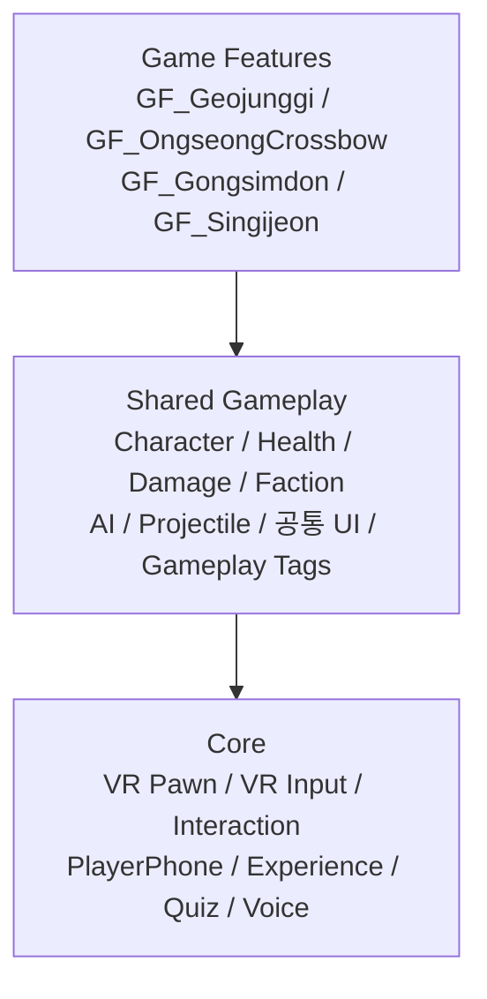
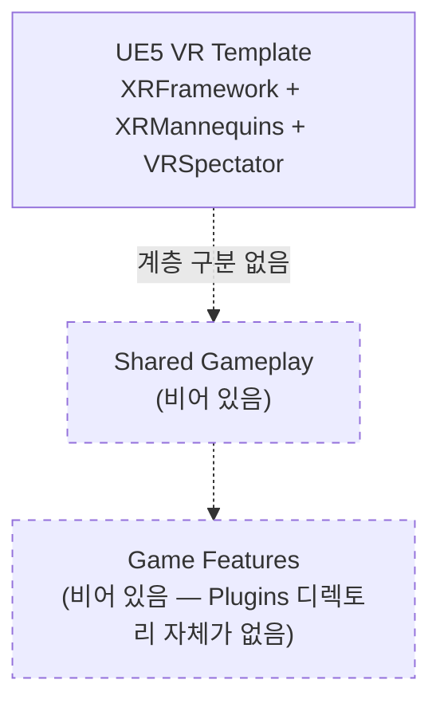
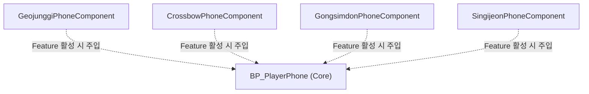
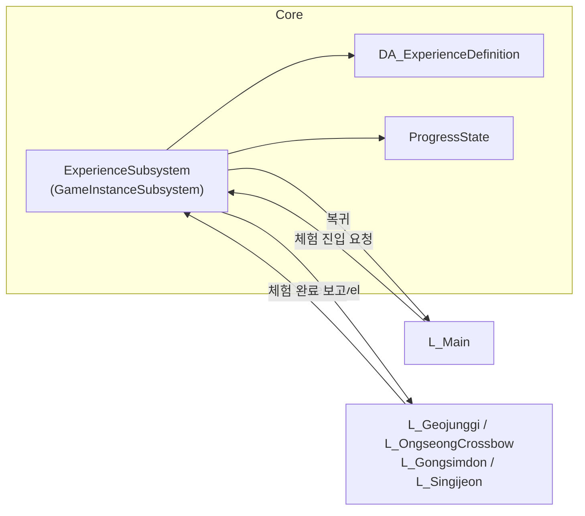
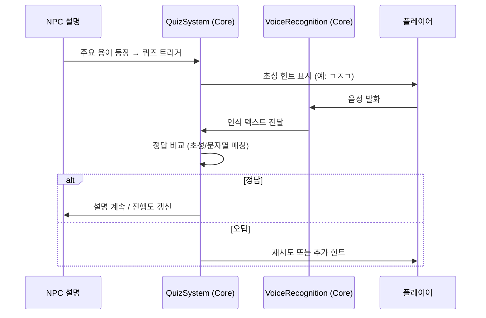
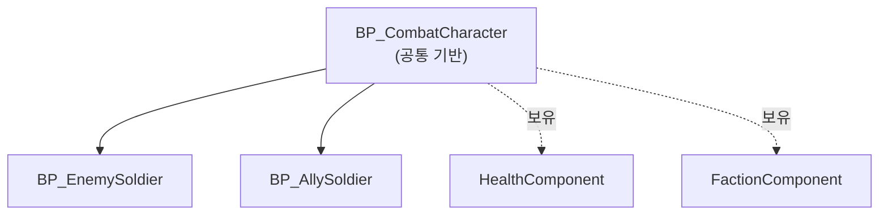
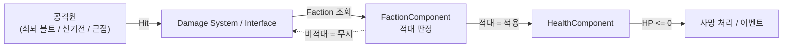
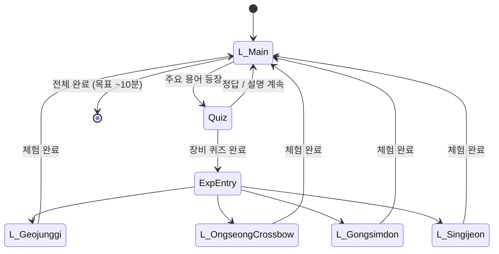
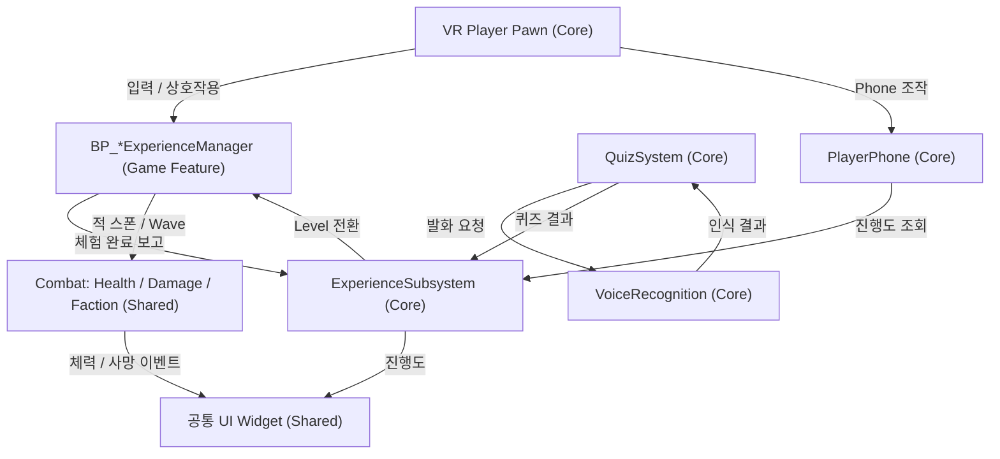

# ARCHITECTURE

**대상 프로젝트**: SuwonSiegeContestVR (Unreal Engine 5.8, VR 교육 콘텐츠)
**조사 기준일**: 2026-08-11 (최초 조사) / **갱신일**: 2026-08-12
**조사 기준 커밋**: `57dd875`

## 확정된 프로젝트 결정 사항

| 항목 | 결정 | 결정일 |
|---|---|---|
| **타깃 기기** | **Android 스탠드얼론.** 개발 중에는 PC에서 진행 | 2026-08-12 |
| **음성 인식** | **스탠드얼론(온디바이스)에서 동작.** 향후 **외부 서드파티 모듈을 임포트**해 사용 | 2026-08-12 |
| **Level 생성** | 사용자가 직접 생성 (이 문서 작업 범위 밖) | 2026-08-12 |
| **계층 골격** | `Content/Core`, `Content/Gameplay`, `Plugins/GameFeatures` 디렉토리 생성 완료 | 2026-08-12 |
| **Game Feature Plugin** | **사용 확정.** `.uplugin` 4개 생성, `.uproject`에 `GameFeatures`/`ModularGameplay` 활성화 | 2026-08-12 |
| **Git LFS** | 도입 완료. **과거 이력까지 마이그레이션 완료** | 2026-08-12 |
| **GAS 사용 여부** | 사용하지 않음 (`CLAUDE.md` 11절) | — |

---

## 0. 이 문서를 읽기 전에

이 문서의 모든 항목에는 상태 표기가 붙는다.

| 표기 | 의미 |
|---|---|
| `Status: Implemented` | 실제로 구현되어 있고 조사로 확인됨 |
| `Status: Partial` | 일부만 존재. 대부분 UE VR 템플릿 기본 구현 |
| `Status: Planned` | **존재하지 않음.** 앞으로 만들어야 함 |

> **중요**: 현재 이 프로젝트에는 **수원화성 콘텐츠 관련 게임플레이 구현이 전혀 없다.**
> 아래에서 `Implemented` / `Partial`로 표시된 것은 전부 **UE5 VR 템플릿이 기본 제공한 것**이며,
> 프로젝트 요구사항에 맞게 설계된 것이 아니다.

---

## 1. 콘텐츠 개요

플레이어는 수원화성에 새로 부임한 장교가 되어 인물·구조물·장비를 학습한다.
설명 중 주요 용어가 나오면 **음성인식 기반 초성 퀴즈**를 진행하고,
일부 장비 퀴즈를 완료하면 해당 장비의 **VR 체험 시뮬레이션**으로 이동한다.
목표 플레이 타임은 약 10분.

Level / Experience 구성 (전부 `Status: Planned`):

| Experience | Level | Game Feature |
|---|---|---|
| Main | `L_Main` | — (Core) |
| 거중기 | `L_Geojunggi` | `GF_Geojunggi` |
| 웅성 · 쇠뇌 | `L_OngseongCrossbow` | `GF_OngseongCrossbow` |
| 공심돈 | `L_Gongsimdon` | `GF_Gongsimdon` |
| 신기전 | `L_Singijeon` | `GF_Singijeon` |

---

## 2. 전체 계층 구조

### 2.1 목표 계층



역방향 의존(Core → GF, Shared → GF)은 금지한다. 상세 규칙은 `CLAUDE.md` 6절 참조.

### 2.2 현재 실제 계층



**현재 계층 구분이 존재하지 않는다.** `Content/` 아래는 템플릿 디렉토리 구조 그대로이며
Core / Shared Gameplay / Game Feature를 구분하는 폴더도 모듈도 없다.

---

## 3. Core 시스템

### 3.1 VR Player (VR Pawn)

`Status: Partial` — UE VR 템플릿의 `BP_XRPawn`이 그대로 사용 중이다.

* 경로: `Content/XRFramework/Blueprints/BP_XRPawn`
* 부모 클래스: `Pawn` (**`Character`가 아님** — CharacterMovement / Capsule 없음)
* `BP_XRGameMode`의 `DefaultPawnClass`로 지정됨
* `BPI_PawnAnim` 인터페이스 구현

확인된 컴포넌트 구성:

```text
BP_XRPawn (Pawn)
├─ RootComponent (Scene)
├─ Camera (CameraComponent)
├─ MotionControllerLeftGrip   (MotionControllerComponent)
├─ MotionControllerLeftAim    (MotionControllerComponent)
├─ MotionControllerRightGrip  (MotionControllerComponent)
├─ MotionControllerRightAim   (MotionControllerComponent)
├─ WidgetInteractionLeft      (WidgetInteractionComponent)
├─ WidgetInteractionRight     (WidgetInteractionComponent)
├─ TeleportTrace              (Niagara — NS_TeleportTrace)
└─ ArrowComponent
```

확인된 주요 함수 / 변수:

| 이름 | 내용 |
|---|---|
| `TryGrab` / `GetGrabComponentNearMotionController` | 잡기 처리. `GrabRadiusFromGripPosition` 반경 내 `BP_GrabComponent` 탐색 |
| `HeldComponentLeft` / `HeldComponentRight` | 손별 파지 중인 컴포넌트 |
| `StartTeleportTrace` / `EndTeleportTrace` / `TryTeleport` | 텔레포트 이동 |
| `IsValidTeleportLocation` / `ProjectedTeleportLocation` | NavMesh 투영 기반 목적지 유효성 검사 |
| `TeleportVisualizerReference` | `BP_TeleportVisualizer` 참조 |

**차이 기록**

```text
현재 위치: Content/XRFramework/Blueprints/BP_XRPawn
권장 위치: Content/Core/VR/Pawn/
차이:      템플릿 원본을 그대로 사용 중. 프로젝트 전용 VR Player 없음.
           이동 방식이 텔레포트로 고정되어 있고 Pawn 내부에 직접 구현되어 분리 불가.
           PlayerPhone / Experience / Quiz 연동 지점 없음.
향후 조치: Content/Core/VR/Pawn 에 프로젝트 전용 Pawn을 만들고
           BP_XRPawn을 부모로 상속하거나 필요한 기능만 이식한다.
           템플릿 원본은 이동하지 않는다(참조 파손 위험).
```

### 3.2 VR Input

`Status: Partial` — Enhanced Input이 템플릿 구성으로 동작 중이다.

`Config/DefaultInput.ini`가 다음 5개 IMC를 **프로젝트 전역 기본**으로 등록한다.

```text
/Game/XRFramework/Input/IMC_Default        (Priority 0)
/Game/XRFramework/Input/IMC_Hands          (Priority 0)
/Game/XRFramework/Input/IMC_Weapon_Left    (Priority 0)
/Game/XRFramework/Input/IMC_Weapon_Right   (Priority 0)
/Game/XRFramework/Input/IMC_Menu           (Priority 0)
```

Input Action 목록: `IA_Move`, `IA_Turn`, `IA_Grab_{Left,Right}_{Pressed,Released}`,
`IA_Shoot_{Left,Right}`, `IA_Menu_Cursor_*`, `IA_Menu_Interact_*`, `IA_Menu_Toggle_*`,
`Hands/IA_Hand_{Grasp,IndexCurl,Point,ThumbUp}_{Left,Right}`

**차이 기록**

```text
현재 위치: Content/XRFramework/Input/
권장 위치: Content/Core/VR/Input/
차이:      전부 템플릿 Action. 5개 IMC가 전역 Priority 0으로 무조건 활성화된다.
           체험별 입력 전환(예: 쇠뇌 조작 중 텔레포트 금지) 구조가 없다.
           IMC_Weapon_* 는 템플릿 총기용이라 이 콘텐츠와 무관하다.
향후 조치: Experience 전환 시 IMC를 Add/Remove 하는 Input 관리 계층이 필요하다.
           IMC 에셋을 옮기면 DefaultInput.ini의 5줄을 반드시 함께 수정해야 한다.
```

### 3.3 VR Interaction

`Status: Partial` — 잡기(Grab)만 존재한다.

* `BP_GrabComponent` — `SceneComponent` 파생. `E_GrabType` Enum으로 방식 구분, `AttachParentToMotionController`, `GrabHapticEffect` 사용
* `WidgetInteractionComponent` 2개로 3D UI 포인팅 지원

**없는 것**: 공통 Interaction Interface, Interaction Prompt UI, Focus/Highlight 시스템, 사용(Use)·조작(Manipulate) 개념.

```text
현재 위치: Content/XRFramework/Blueprints/BP_GrabComponent
권장 위치: Content/Core/VR/Interaction/
차이:      "잡기"만 있고 일반화된 상호작용 인터페이스가 없다.
향후 조치: BPI_Interactable 등 공통 인터페이스를 정의하고
           BP_GrabComponent는 그 구현체 중 하나로 둔다.
```

### 3.4 PlayerPhone

`Status: Planned` — **존재하지 않는다.**

목표 구조 (`CLAUDE.md` 8절):



PlayerPhone 본체는 Core에 두고, 체험별 기능은 각 Game Feature가 제공하는 Component/Extension으로 주입한다.
본체에 체험별 기능을 직접 추가하면 Core → Game Feature 역의존이 되어 금지된다.

**미결정 사항 (TODO)**: Phone의 실제 역할(퀴즈 UI 표시? 진행도? 힌트? 체험 이동?), 손 부착 방식, 표시 방법(World Space Widget vs Render Target).

### 3.5 Experience 관리 / 진행도

`Status: Planned` — **존재하지 않는다.**

목표: `UGameInstanceSubsystem` 기반 `ExperienceSubsystem`이 Level Travel을 넘어 진행도를 유지한다.



**설계 결정 필요 (TODO)**

* Level 전환 방식: `OpenLevel` vs Level Streaming vs World Partition Data Layer
* 진행도 저장: 메모리만(10분 세션) vs `SaveGame`
* 체험 완료 판정 주체: 각 Feature의 `BP_*ExperienceManager` → Subsystem 보고

### 3.6 초성 퀴즈 / 음성 인식

`Status: Planned` — **존재하지 않는다.**

목표 흐름:



**확정된 방침 (2026-08-12)**

* 음성 인식은 **스탠드얼론(온디바이스)에서 동작**한다. 클라우드 STT에 의존하지 않는다.
* 인식 엔진은 **외부 서드파티 모듈을 임포트**해 사용한다. 자체 구현하지 않는다.
* 배치 위치: `Content/Core/Quiz/VoiceRecognition/` (Blueprint 측), 서드파티 코드는 `Source/**/ThirdParty/` 또는 별도 플러그인.

**서드파티 모듈 임포트 시 준비 사항**

* **`ThirdParty/` 디렉토리에 배치해야 커밋된다.** `.gitignore`의 `*.so` / `*.a` / `*.lib` 규칙은
  `Source/**/ThirdParty/**`, `Plugins/**/Source/ThirdParty/**` 아래에서만 예외 처리되어 있다 (`docs/DIRECTORY_STRUCTURE.md` §4.2).
* 바이너리는 `.gitattributes`에 의해 **Git LFS로 관리**된다 (`.so` `.a` `.aar` `.jar` `.dylib` `.framework`).
* Android 타깃이므로 **`arm64-v8a` ABI 지원 여부**를 임포트 전에 확인해야 한다.
* UE 연동에 C++ 모듈이 필요하다 — `Build.cs`에 ThirdParty 링크 설정 및 `.uproject` Modules 선언이 선행되어야 한다.
* Android 권한(`RECORD_AUDIO`) 및 런타임 권한 요청 처리 필요.

**남은 TODO**

* 서드파티 모듈 **선정 미완** — 한국어 인식 정확도, arm64 지원, 라이선스, 오프라인 모델 크기를 기준으로 평가한다.
* 한글 초성 추출 로직 필요 (유니코드 한글 음절 분해, `0xAC00` 기반). **서드파티 선정과 무관하게 선행 구현 가능.** C++ Blueprint Function Library 권장.
* 정답 판정 방식: 인식 텍스트 완전 일치 / 초성 일치 / 유사도 임계값.
* 음성 인식 실패 시 대체 입력(버튼 선택 등) 제공 여부.
* 마이크 입력 캡처 경로 (UE `AudioCapture` 모듈 사용 여부).

---

## 4. Shared Gameplay 시스템

**이 계층은 현재 전부 `Status: Planned`이다. 하나도 구현되어 있지 않다.**

### 4.1 Character 계층

`Status: Planned`



**현재 존재하는 유일한 캐릭터성 에셋**은 `BP_MannequinsXR`(플레이어 손 표시용 마네킹)뿐이며,
이는 전투 캐릭터가 아니다. Enemy/Ally 병사는 존재하지 않는다.

**분류 결정**: 적 병사·아군 병사는 웅성/쇠뇌, 신기전, 공심돈 등 복수 체험에서 사용될 수 있으므로
**Game Feature가 아니라 Shared Gameplay에 둔다.** (`CLAUDE.md` 5절)

### 4.2 Health / Damage / Faction

`Status: Planned` — 전부 미구현.

목표 데미지 흐름 (구체 클래스 검사 금지, Faction 기반 판정):



**금지 패턴** (`CLAUDE.md` 9절):

```text
If Actor Is BP_EnemySoldier → Apply Damage    ← 금지
```

**권장 패턴**:

```text
Check Faction → Check Damage Policy → Apply Damage
```

**참고**: 템플릿 `BP_Projectile`을 조사한 결과 **데미지 적용 로직이 없다.**
`Actor` 파생에 머티리얼만 지정된 시각 샘플이므로, 공통 Projectile은 신규 설계해야 한다.

### 4.3 AI

`Status: Planned` — 미구현.

`AIModule`, `NavigationSystem`, `GameplayTasks`가 `Build.cs`에 포함되어 있지 않다.
Behavior Tree, Blackboard, AIController, Spawner 모두 존재하지 않는다.

**참고**: `DefaultEngine.ini`에 `bAllowClientSideNavigation=True`가 설정되어 있고,
`BP_XRPawn`의 텔레포트가 NavMesh 투영을 사용하므로 각 Level에 NavMeshBoundsVolume이 필요하다.

### 4.4 Projectile

`Status: Partial (템플릿 샘플만)`

```text
현재 위치: Content/XRFramework/Blueprints/BP_Projectile
권장 위치: Content/Gameplay/Combat/Projectiles/
차이:      Actor 파생 시각 샘플. 데미지/Faction/충돌 정책 없음.
           BP_Pistol이 발사하는 용도로만 쓰인다.
향후 조치: 공통 Projectile 기반 클래스를 신규 설계한다.
           쇠뇌 볼트 / 신기전 / 적 투사체가 이를 공유한다.
```

### 4.5 공통 UI

`Status: Planned` — 프로젝트 공통 Widget 없음.

현재 존재하는 위젯은 `WBP_Menu`(템플릿 VR 메뉴) 하나뿐이며,
`BP_Menu` 액터가 `NS_MenuLaser` + `M_VRCursor`로 포인팅한다.

필요한 공통 Widget (전부 Planned): Progress UI, Timer, 안내 Popup, Interaction Prompt, 체력 UI, World Space UI 기반 클래스.

공통 Widget이 특정 Game Feature를 직접 참조하는 것은 금지된다 (`CLAUDE.md` 10절).

### 4.6 Gameplay Tags

`Status: Planned` — 미구현.

`Config/` ini 어디에도 GameplayTag 관련 섹션이 없고, `GameplayTags` 모듈도 `Build.cs`에 없다.
Faction, Damage 정책, Experience 상태, Quiz 상태를 태그로 표현할 계획이라면 **구현 전에 태그 네이밍 체계를 먼저 설계**해야 한다.

---

## 5. Game Feature 시스템

`Status: Partial` — **플러그인 껍데기는 생성되었고 내용은 비어 있다.**

* `Plugins/GameFeatures/` 아래에 `.uplugin` 4개 생성 완료 (2026-08-12)
* `.uproject`에 `ModularGameplay`, `GameFeatures` 활성화 완료
* 활성 플러그인: ModularGameplay, GameFeatures, OpenXR, OpenXREyeTracker, OpenXRHandTracking, PICOController
* 공통 설정: `"CanContainContent": true`, `"ExplicitlyLoaded": true`, `"BuiltInInitialFeatureState": "Registered"`

> ⚠️ **미완**: 각 플러그인의 `UGameFeatureData` 에셋이 **아직 없다.** 바이너리 `.uasset`이라 에디터에서 생성해야 한다.
> 없으면 Game Features Subsystem이 해당 플러그인을 건너뛴다.
> 또한 손으로 작성한 `.uplugin`이므로 **에디터에서 실제 인식 여부 검증이 필요하다.**
> 절차와 검증 항목은 `Plugins/GameFeatures/README.md` 참조.

Feature 상태 전이는 `Registered → Loaded → Active` 순이다.
체험 진입 시 `Active`로 올리고 복귀 시 내리는 흐름은 `ExperienceSubsystem` 설계와 함께 확정한다. (`TODO`)

목표 Feature 및 담당 범위:

| Game Feature | 범위 | 상태 |
|---|---|---|
| `GF_Geojunggi` | 거중기 조작, 성벽 건축 체험, Geojunggi Phone 기능 | 플러그인 생성됨 / 내용 Planned |
| `GF_OngseongCrossbow` | 웅성, 쇠뇌, 충차, 적 Wave 연출, Crossbow Phone 기능 | 플러그인 생성됨 / 내용 Planned |
| `GF_Gongsimdon` | 공심돈, 침입 적 탐색/탐지, Gongsimdon Phone 기능 | 플러그인 생성됨 / 내용 Planned |
| `GF_Singijeon` | 신기전 발사, Target, Singijeon Phone 기능 | 플러그인 생성됨 / 내용 Planned |

**주의**: 적 병사·데미지·체력·투사체 기반은 여러 Feature가 공유하므로 Shared Gameplay에 둔다.
Feature에는 **그 체험에서만 쓰이는 것**(쇠뇌, 충차, 거중기, 신기전 발사대, 공심돈 탐지 로직)만 넣는다.

**결정 완료 (2026-08-12)**: Game Feature Plugin(모듈러 게임플레이)을 사용한다.
남은 작업은 `UGameFeatureData` 에셋 생성과 로딩/활성화 흐름 설계다.

---

## 6. Experience Flow / Level Flow

`Status: Planned` — 아래는 전부 목표 설계이며 구현되어 있지 않다.

**현재 실제 Level Flow**: `L_XRTemplate` 하나만 존재하고 전환이 없다.

목표 Flow:



각 체험 Level의 진행 로직은 **Level Blueprint가 아니라** 전용 Manager에 둔다 (`CLAUDE.md` 7절):

```text
BP_GeojunggiExperienceManager
BP_CrossbowExperienceManager
BP_GongsimdonExperienceManager
BP_SingijeonExperienceManager
```

Level Blueprint의 역할은 Level 초기화, 배치 객체 연결, 단순 이벤트 전달로 제한한다.

---

## 7. 주요 Data Flow (목표)

`Status: Planned`



의존 방향 원칙상 `CMB`, `UI`는 특정 `MGR`(Game Feature)을 직접 참조해서는 안 된다.
필요 시 Interface / Event Dispatcher / Gameplay Tag / Data Asset으로 역전한다.

---

## 8. 구현 상태 종합표

| 시스템 | 계층 | 상태 | 실제 위치 |
|---|---|---|---|
| VR Pawn | Core | `Partial` | `Content/XRFramework/Blueprints/BP_XRPawn` (템플릿) |
| VR Input (Enhanced Input) | Core | `Partial` | `Content/XRFramework/Input/` (템플릿) |
| VR Interaction (Grab만) | Core | `Partial` | `Content/XRFramework/Blueprints/BP_GrabComponent` (템플릿) |
| Teleport 이동 | Core | `Partial` | `BP_XRPawn` 내부 (템플릿) |
| GameMode | Core | `Partial` | `Content/XRFramework/Blueprints/BP_XRGameMode` (템플릿) |
| 손 표시 / 애니메이션 | Core | `Partial` | `Content/XRMannequins/` + `BPI_PawnAnim` (템플릿) |
| VR 관전자 | Core | `Partial` | `Content/VRSpectator/` (템플릿) |
| PlayerPhone | Core | `Planned` | — |
| ExperienceSubsystem | Core | `Planned` | — |
| 진행도 관리 | Core | `Planned` | — |
| 초성 퀴즈 | Core | `Planned` | — |
| 음성 인식 | Core | `Planned` | — (수단 미정) |
| 공통 Interface | Core | `Planned` | — |
| CombatCharacter | Shared | `Planned` | — |
| EnemySoldier / AllySoldier | Shared | `Planned` | — |
| HealthComponent | Shared | `Planned` | — |
| Damage System | Shared | `Planned` | — |
| FactionComponent | Shared | `Planned` | — |
| AI (BT / Blackboard / Spawner) | Shared | `Planned` | — |
| Projectile (전투용) | Shared | `Planned` | 템플릿 `BP_Projectile`은 데미지 없음 |
| 공통 UI Widget | Shared | `Planned` | `WBP_Menu`(템플릿 메뉴)만 존재 |
| Gameplay Tags | Shared | `Planned` | — |
| GF_Geojunggi | Feature | `Partial` | `.uplugin` 생성됨 / GameFeatureData·에셋 없음 |
| GF_OngseongCrossbow | Feature | `Partial` | `.uplugin` 생성됨 / GameFeatureData·에셋 없음 |
| GF_Gongsimdon | Feature | `Partial` | `.uplugin` 생성됨 / GameFeatureData·에셋 없음 |
| GF_Singijeon | Feature | `Partial` | `.uplugin` 생성됨 / GameFeatureData·에셋 없음 |
| L_Main 및 체험 Level 4종 | — | `Planned` | `L_XRTemplate`만 존재 |
| C++ 게임플레이 코드 | — | `Planned` | 모듈 스텁만 존재 |

---

## 9. Gameplay Ability System 방침

`Status: Not Used (의도된 결정)`

* `.uproject`에 GAS 관련 플러그인이 활성화되어 있지 않다. `Build.cs`에도 `GameplayAbilities`가 없다.
* 이는 `CLAUDE.md` 11절의 방침과 일치한다.
* 기본 전투 구조는 **Health Component + Faction Component + Damage Interface + Gameplay Tags**를 사용한다.
* GAS 도입은 프로젝트 전역 Architecture 변경이므로 **사용자 요청 없이 도입하지 않는다.**

---

## 10. 발견된 구조적 문제

| # | 문제 | 영향 | 권장 조치 |
|---|---|---|---|
| 1 | ~~계층 구분이 물리적으로 존재하지 않음~~ | — | **해결됨 (2026-08-12).** `Content/Core`, `Content/Gameplay`, `Plugins/GameFeatures` 골격 생성 완료 |
| 2 | 프로젝트 전용 Level이 하나도 없고 기본 맵이 `L_XRTemplate` | 여러 개발자가 같은 템플릿 맵을 수정하면 `.umap` 바이너리 충돌 | **사용자가 직접 생성 예정.** 생성 후 `GameDefaultMap` / `EditorStartupMap` 교체 필요 |
| 3 | `BP_XRPawn`이 `Pawn` 파생 (`Character` 아님) | CharacterMovement / Capsule 기반 이동·충돌·NavMesh 상호작용이 없음. 이동 방식이 텔레포트로 고정 | 체험별 이동 요구(고정 위치, 레일, 자유 이동)를 먼저 정리한 뒤 Pawn 설계 확정 |
| 4 | 5개 IMC가 Priority 0으로 전역 상시 활성 | 체험 중 입력 격리 불가 (예: 쇠뇌 조준 중 텔레포트 발동) | Experience 전환에 맞춰 IMC를 Add/Remove 하는 Input 관리 계층 도입 |
| 5 | 음성 인식 **서드파티 모듈 미선정** | Quiz가 전체 콘텐츠의 핵심. 방식(온디바이스 + 서드파티)은 확정됐으나 실제 모듈이 정해지지 않음 | **최우선 기술 검증(Spike) 대상.** arm64-v8a 지원 · 한국어 정확도 · 라이선스 기준으로 평가 |
| 6 | ~~Git LFS 미설정~~ | — | **해결됨 (2026-08-12).** 과거 이력까지 `git lfs migrate import`로 전환 완료 — `docs/DIRECTORY_STRUCTURE.md` §4.2 참조 |
| 7 | **`r.RayTracing=True`, `r.Substrate=True`** + Forward/MobileMultiView + Android 패키징 | **타깃이 Android로 확정된 이상 명확한 오설정.** RayTracing은 모바일에서 동작하지 않고, Substrate는 모바일 지원이 제한적이다. 셰이더 컴파일 시간과 패키지 용량만 증가 | `Config/DefaultEngine.ini` 정리 필요. 렌더링 결과 영향이 크므로 **별도 작업으로 분리** |
| 8 | `PICOController` 활성 + Android는 Quest 계열(quest2/questpro/quest3/quest3s) 명시 | 두 기기군을 모두 노리는 것인지, 한쪽이 잔재인지 불명확 | 실제 타깃 HMD 확정 필요 |
| 9 | `Content/Weapons/`(권총·소총·유탄) 잔존 | **Android 타깃에서는 패키지 용량이 곧 로딩·메모리 비용** | 사용 계획 없으면 제거 권장 |
| 10 | C++ 모듈 스텁만 존재하고 `.uproject`의 Modules 선언이 미커밋 | **서드파티 음성인식 모듈 임포트가 확정된 이상 C++ 모듈은 필수가 된다** | 모듈 사용을 전제로 `Build.cs` 의존 모듈 정리 및 `.uproject` Modules 커밋 |
| 11 | Android 타깃인데 성능 예산이 정의되지 않음 | 적 다수(웅성/쇠뇌) · 다연장 발사체(신기전)가 스탠드얼론에서 한계를 넘길 위험 | 동시 적 수 / 동시 투사체 수 / 드로우콜 상한을 **구현 전에** 정할 것 |

---

## 11. 확인이 필요한 사항 (Needs Verification)

### 해결됨 (2026-08-12)

* ~~최종 타깃 기기~~ → **Android 스탠드얼론** (개발 중에는 PC)
* ~~음성 인식 방식 및 오프라인 동작 요구 여부~~ → **온디바이스 + 외부 서드파티 모듈 임포트**
* ~~Game Feature Plugin 사용 여부~~ → **사용 확정.** `.uplugin` 4개 생성 완료

### 미해결

* **`UGameFeatureData` 에셋 4개 생성** (에디터 작업) — 이것 없이는 Game Feature가 동작하지 않는다
* 손으로 작성한 `.uplugin`의 **에디터 인식 여부 검증**
* Game Feature 활성화 흐름 (`Registered → Loaded → Active` 전이를 누가 언제 트리거하는가)
* 음성 인식 **서드파티 모듈 선정** (arm64-v8a 지원 · 한국어 정확도 · 라이선스 · 모델 크기)
* 실제 타깃 HMD — PICO / Meta Quest / 양쪽 모두
* Level 전환 방식 (`OpenLevel` / Level Streaming / World Partition)
* 진행도 영속화 필요 여부 (`SaveGame` 사용 여부)
* 각 체험의 플레이어 이동 방식 (고정 / 텔레포트 / 자유 이동)
* Android 성능 예산 (동시 적 수 / 동시 투사체 수 / 드로우콜 상한)
* `r.RayTracing` / `r.Substrate` 정리 시점
* 멀티플레이 계획 유무 (현재 구현은 전부 싱글 전제)
