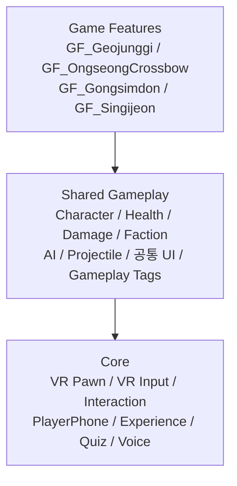
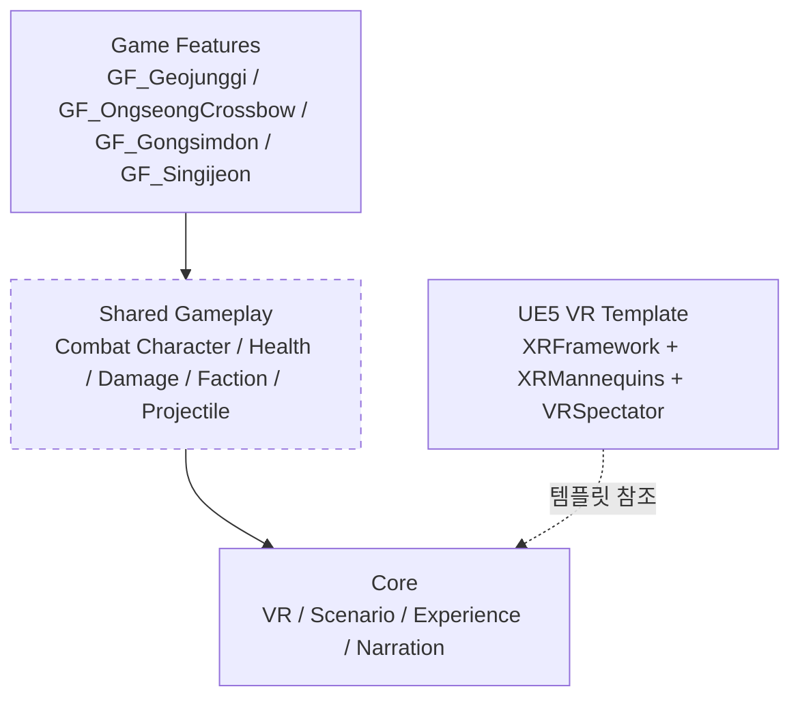
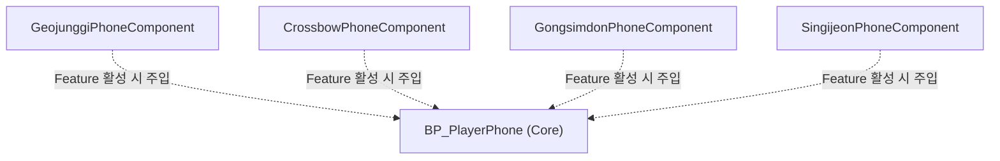
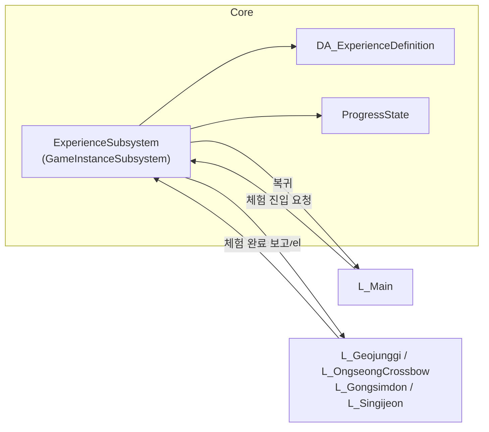
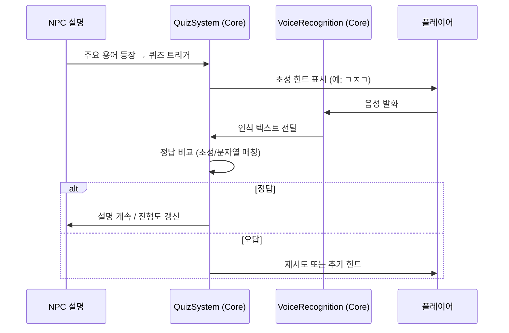
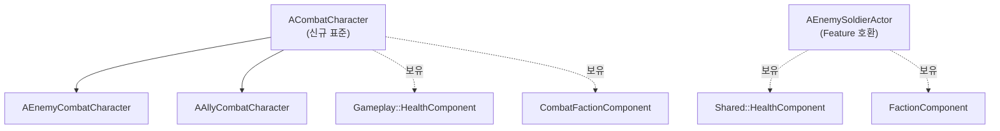
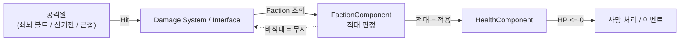
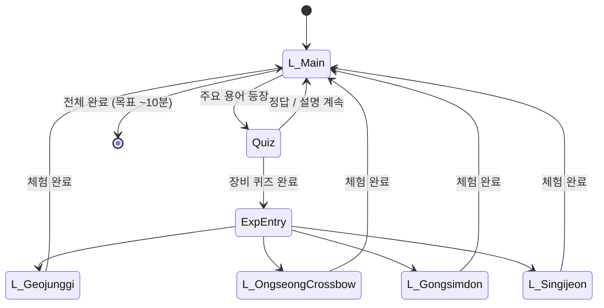
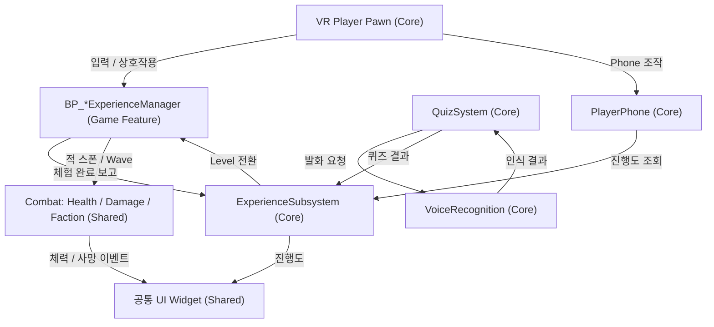

# ARCHITECTURE

**대상 프로젝트**: SuwonSiegeContestVR (Unreal Engine 5.8, VR 교육 콘텐츠)
**조사 기준일**: 2026-08-11 (최초 조사) / **갱신일**: 2026-08-18
**조사 기준 커밋**: `57dd875`

## 확정된 프로젝트 결정 사항

| 항목 | 결정 | 결정일 |
|---|---|---|
| **타깃 기기** | **Android 스탠드얼론.** 개발 중에는 PC에서 진행 | 2026-08-12 |
| **음성 인식** | **스탠드얼론(온디바이스)에서 동작.** 향후 **외부 서드파티 모듈을 임포트**해 사용 | 2026-08-12 |
| **Level 생성** | 사용자가 직접 생성 (이 문서 작업 범위 밖) | 2026-08-12 |
| **계층 골격** | `Content/Core`, `Content/Gameplay`, `Plugins/GameFeatures` 디렉토리 생성 완료 | 2026-08-12 |
| **Game Feature Plugin** | **사용 확정.** `.uplugin` 4개 생성, `.uproject`에 `GameFeatures`/`ModularGameplay` 활성화 | 2026-08-12 |
| **Git LFS** | 도입 완료. **과거 이력까지 마이그레이션 완료** | 2026-08-12 |
| **GAS 사용 여부** | 사용하지 않음 (`CLAUDE.md` 11절) | — |

---

## 0. 이 문서를 읽기 전에

이 문서의 모든 항목에는 상태 표기가 붙는다.

| 표기 | 의미 |
|---|---|
| `Status: Implemented` | 실제로 구현되어 있고 조사로 확인됨 |
| `Status: Partial` | 일부만 존재. 대부분 UE VR 템플릿 기본 구현 |
| `Status: Planned` | **존재하지 않음.** 앞으로 만들어야 함 |

> **중요**: 현재 이 프로젝트에는 **수원화성 콘텐츠 관련 게임플레이 구현이 전혀 없다.**
> 아래에서 `Implemented` / `Partial`로 표시된 것은 전부 **UE5 VR 템플릿이 기본 제공한 것**이며,
> 프로젝트 요구사항에 맞게 설계된 것이 아니다.

---

## 1. 콘텐츠 개요

플레이어는 수원화성에 새로 부임한 장교가 되어 인물·구조물·장비를 학습한다.
설명 중 주요 용어가 나오면 **음성인식 기반 초성 퀴즈**를 진행하고,
일부 장비 퀴즈를 완료하면 해당 장비의 **VR 체험 시뮬레이션**으로 이동한다.
목표 플레이 타임은 약 10분.

Level / Experience 구성 (전부 `Status: Planned`):

| Experience | Level | Game Feature |
|---|---|---|
| Main | `L_Main` | — (Core) |
| 거중기 | `L_Geojunggi` | `GF_Geojunggi` |
| 웅성 · 쇠뇌 | `L_OngseongCrossbow` | `GF_OngseongCrossbow` |
| 공심돈 | `L_Gongsimdon` | `GF_Gongsimdon` |
| 신기전 | `L_Singijeon` | `GF_Singijeon` |

---

## 2. 전체 계층 구조

### 2.1 목표 계층



역방향 의존(Core → GF, Shared → GF)은 금지한다. 상세 규칙은 `CLAUDE.md` 6절 참조.

### 2.2 현재 실제 계층



Core는 프로젝트 Runtime 모듈에 구현되어 있으며, Shared Gameplay의 공통 전투 기반도
`Source/SuwonSiegeContestVR/Gameplay/`에 구현되어 있다. Content 기반 Shared Gameplay
Blueprint와 AI/UI/Tags는 아직 없다. Game Feature 플러그인에는 신기전 구현이 존재하며,
나머지 Feature는 플러그인 골격 상태다.

---

## 3. Core 시스템

### 3.1 VR Player (VR Pawn)

`Status: Implemented` — 프로젝트 전용 `BP_VRPlayerPawn`이 나레이션 HUD와 핵심 VR 입력을 제공한다.

* 현재 사용 Pawn: `Content/Core/VR/Pawn/BP_VRPlayerPawn`
* 참조 템플릿 Pawn: `Content/XRFramework/Blueprints/BP_XRPawn`
* 둘 다 `Pawn` 계열이며 CharacterMovement / Capsule은 없다.
* `BP_XRGameMode`의 `DefaultPawnClass`는 `BP_VRPlayerPawn`이다.
* `LV_Singijeon`은 World Settings에서 `BP_XRGameMode`를 명시적으로 사용한다.

확인된 컴포넌트 구성:

```text
BP_XRPawn (Pawn)
├─ RootComponent (Scene)
├─ Camera (CameraComponent)
├─ MotionControllerLeftGrip   (MotionControllerComponent)
├─ MotionControllerLeftAim    (MotionControllerComponent)
├─ MotionControllerRightGrip  (MotionControllerComponent)
├─ MotionControllerRightAim   (MotionControllerComponent)
├─ WidgetInteractionLeft      (WidgetInteractionComponent)
├─ WidgetInteractionRight     (WidgetInteractionComponent)
├─ TeleportTrace              (Niagara — NS_TeleportTrace)
└─ ArrowComponent
```

확인된 주요 함수 / 변수:

| 이름 | 내용 |
|---|---|
| `TryGrab` / `GetGrabComponentNearMotionController` | 잡기 처리. `GrabRadiusFromGripPosition` 반경 내 `BP_GrabComponent` 탐색 |
| `HeldComponentLeft` / `HeldComponentRight` | 손별 파지 중인 컴포넌트 |
| `StartTeleportTrace` / `EndTeleportTrace` / `TryTeleport` | 텔레포트 이동 |
| `IsValidTeleportLocation` / `ProjectedTeleportLocation` | NavMesh 투영 기반 목적지 유효성 검사 |
| `TeleportVisualizerReference` | `BP_TeleportVisualizer` 참조 |

**차이 기록**

```text
현재 위치: Content/XRFramework/Blueprints/BP_XRPawn + Content/Core/VR/Pawn/BP_VRPlayerPawn
권장 위치: Content/Core/VR/Pawn/
차이:      프로젝트 전용 Pawn에 Narration, Grab, NavMesh Teleport,
           HMD 중심 Snap Turn 입력이 구현됨.
향후 조치: 체험별 이동 제한이 필요하면 입력 Context 관리 계층을 추가한다.
           템플릿 원본은 이동하지 않는다(참조 파손 위험).
```

**2026-08-12 구현 추가**

- `BP_VRPlayerPawn`: Camera, Grip/Aim Controller, Widget Interaction, 나레이션 Audio/HUD 구성
- `UNarrationSequenceComponent`: DT 기반 음성·자막·후속 이벤트 흐름
- `DT_Narration`: `NarrationSequenceRow` 기반 데이터

**2026-08-13 구현 추가**

- `BP_VRPlayerPawn`: `IA_Move`, `IA_Turn`, 좌우 Grab Press/Release 바인딩
- `BP_GrabComponent`의 기존 `TryGrab` / `TryRelease` 계약 재사용
- 투사체 경로 충돌과 NavMesh 투영 기반 Teleport, `BP_TeleportVisualizer` 재사용
- HMD 위치를 피벗으로 유지하는 45도 Snap Turn
- `LV_Singijeon`: `BP_XRGameMode` 명시, 기본 Pawn은 `BP_VRPlayerPawn`

### 3.1.1 Core Scenario System

`Status: Implemented` — Level 내부 교육 흐름을 `Interaction → Scene → Scenario`로 관리한다.

- `UScenarioManagerComponent`: ID 기반 순서·성공/실패 분기·상태·지연·디버그 이동
- `UScenarioDefinition`: 인라인 Stage/Interaction과 Narration Table을 한 Asset에서 정의
- `UScenarioInteractableComponent`: Feature Actor의 TargetID 기반 사건 보고
- `UScenarioObservationComponent`: HMD 응시 판정
- `UScenarioNarrationBridgeComponent`: 기존 `UNarrationSequenceComponent` 재사용
- `BP_ScenarioManager`: Level 배치용 Core Blueprint

책임 경계상 Scenario는 Level Travel이나 Level 간 진행도를 소유하지 않는다. 해당 책임은 `UExperienceSubsystem`이 가지며, `UScenarioExperienceBridgeComponent`가 `OnScenarioFinished`를 Experience 완료로 중계한다. 신기전 등 체험별 Gameplay는 Core Scenario를 호출할 수 있지만 Core는 Game Feature를 참조하지 않는다.

### 3.2 VR Input

`Status: Partial` — Enhanced Input이 템플릿 구성으로 동작 중이다.

`Config/DefaultInput.ini`가 다음 5개 IMC를 **프로젝트 전역 기본**으로 등록한다.

```text
/Game/XRFramework/Input/IMC_Default        (Priority 0)
/Game/XRFramework/Input/IMC_Hands          (Priority 0)
/Game/XRFramework/Input/IMC_Weapon_Left    (Priority 0)
/Game/XRFramework/Input/IMC_Weapon_Right   (Priority 0)
/Game/XRFramework/Input/IMC_Menu           (Priority 0)
```

Input Action 목록: `IA_Move`, `IA_Turn`, `IA_Grab_{Left,Right}_{Pressed,Released}`,
`IA_Shoot_{Left,Right}`, `IA_Menu_Cursor_*`, `IA_Menu_Interact_*`, `IA_Menu_Toggle_*`,
`Hands/IA_Hand_{Grasp,IndexCurl,Point,ThumbUp}_{Left,Right}`

**차이 기록**

```text
현재 위치: Content/XRFramework/Input/
권장 위치: Content/Core/VR/Input/
차이:      전부 템플릿 Action. 5개 IMC가 전역 Priority 0으로 무조건 활성화된다.
           체험별 입력 전환(예: 쇠뇌 조작 중 텔레포트 금지) 구조가 없다.
           IMC_Weapon_* 는 템플릿 총기용이라 이 콘텐츠와 무관하다.
향후 조치: Experience 전환 시 IMC를 Add/Remove 하는 Input 관리 계층이 필요하다.
           IMC 에셋을 옮기면 DefaultInput.ini의 5줄을 반드시 함께 수정해야 한다.
```

### 3.3 VR Interaction

`Status: Partial` — 잡기(Grab)만 존재한다.

* `BP_GrabComponent` — `SceneComponent` 파생. `E_GrabType` Enum으로 방식 구분, `AttachParentToMotionController`, `GrabHapticEffect` 사용
* `WidgetInteractionComponent` 2개로 3D UI 포인팅 지원

**없는 것**: 공통 Interaction Interface, Interaction Prompt UI, Focus/Highlight 시스템, 사용(Use)·조작(Manipulate) 개념.

```text
현재 위치: Content/XRFramework/Blueprints/BP_GrabComponent
권장 위치: Content/Core/VR/Interaction/
차이:      "잡기"만 있고 일반화된 상호작용 인터페이스가 없다.
향후 조치: BPI_Interactable 등 공통 인터페이스를 정의하고
           BP_GrabComponent는 그 구현체 중 하나로 둔다.
```

### 3.4 PlayerPhone

`Status: Planned` — **존재하지 않는다.**

목표 구조 (`CLAUDE.md` 8절):



PlayerPhone 본체는 Core에 두고, 체험별 기능은 각 Game Feature가 제공하는 Component/Extension으로 주입한다.
본체에 체험별 기능을 직접 추가하면 Core → Game Feature 역의존이 되어 금지된다.

**미결정 사항 (TODO)**: Phone의 실제 역할(퀴즈 UI 표시? 진행도? 힌트? 체험 이동?), 손 부착 방식, 표시 방법(World Space Widget vs Render Target).

### 3.5 Experience 관리 / 진행도

`Status: Implemented` — `UGameInstanceSubsystem` 기반 Level Travel과 세션 진행도를 구현했다.

- `UExperienceDefinition`: 체험 ID, 체험 Level, 선택형 복귀 Level, Travel Options
- `UExperienceSubsystem`: `StartExperience`, `CompleteCurrentExperience`, `ReturnToMain`, 세션 완료 목록
- `UScenarioExperienceBridgeComponent`: Scenario 종료 시 Experience 완료 및 설정된 복귀 Level 이동
- `DA_Experience_Singijeon`: `/Game/Maps/LV_Singijeon` 연결
- `DA_Experience_Main`, `DA_Scenario_MainEducation`: Main Level과 전체 교육 Stage 흐름 정의
- `AMainEducationScenarioManagerActor`: Main 표시/퀴즈/체험 Route를 Core Scenario/Experience에 연결
- `AExperienceTravelTriggerActor`: 이벤트 기반 체험 진입과 Main 복귀 체크포인트 저장
- Main 재진입 시 Scenario/Scene/Interaction 체크포인트와 이전 단계 완료 상태 복원
- 상태: `Inactive → Traveling → Active → Completed` 또는 `Failed`



**현재 결정 및 남은 TODO**

* Level 전환 방식은 `OpenLevelBySoftObjectPtr`로 확정했다.
* 진행도는 Level Travel 동안 유지되는 메모리 방식이다. 앱 재시작 후 영속화가 필요하면 `SaveGame`을 추가한다.
* Scenario 기반 체험은 `OnScenarioFinished`가 완료 판정이다. 별도 체험은 `CompleteCurrentExperience`를 직접 호출할 수 있다.
* `L_Main`과 신기전·공심돈·옹성 Definition의 `ReturnLevel` 연결은 완료됐다.
* 녹로와 거중기 Experience/Level 연결은 남아 있다.

Main 교육 Asset은 `Editor Flow(Stage → Steps)`를 편집 원본으로 사용한다. Stage/Step 배열 순서에서
Core `FScenarioStageDefinition`의 Start/Next ID와 `EducationContent` lookup을 자동 생성한다. 각 Step은
플레이어 행동, 완료 조건, UI 가이드, 선택적 World Guide, 나레이션 Row 또는 Experience Route를 함께 보관한다.
생성된 Runtime 배열은 직접 편집하지 않는다.

### 3.6 초성 퀴즈 / 음성 인식

`Status: Partial` — 네 개 초성 퀴즈의 데이터, 정답 정규화/판정, UI 이벤트가 구현됐다.
음성 캡처와 STT는 별도 담당자가 연결하도록 Blueprint Native Event만 비워 두었다.

Main 질문 나레이션은 `/Game/Audio/Narration/DT_Narration_Main`의 화면별 Row 구간을 먼저 재생한다.
구간 종료 후 Quiz Interaction이 시작되므로 STT 요청은 질문 음성과 겹치지 않는다. 현재 음원 연결은
01~33번(녹로 원리 설명)까지이며 거중기·최종 정리 음원은 미등록이다.

목표 흐름:



**확정된 방침 (2026-08-12)**

* 음성 인식은 **스탠드얼론(온디바이스)에서 동작**한다. 클라우드 STT에 의존하지 않는다.
* 인식 엔진은 **외부 서드파티 모듈을 임포트**해 사용한다. 자체 구현하지 않는다.
* 배치 위치: `Content/Core/Quiz/VoiceRecognition/` (Blueprint 측), 서드파티 코드는 `Source/**/ThirdParty/` 또는 별도 플러그인.

**서드파티 모듈 임포트 시 준비 사항**

* **`ThirdParty/` 디렉토리에 배치해야 커밋된다.** `.gitignore`의 `*.so` / `*.a` / `*.lib` 규칙은
  `Source/**/ThirdParty/**`, `Plugins/**/Source/ThirdParty/**` 아래에서만 예외 처리되어 있다 (`docs/DIRECTORY_STRUCTURE.md` §4.2).
* 바이너리는 `.gitattributes`에 의해 **Git LFS로 관리**된다 (`.so` `.a` `.aar` `.jar` `.dylib` `.framework`).
* Android 타깃이므로 **`arm64-v8a` ABI 지원 여부**를 임포트 전에 확인해야 한다.
* UE 연동에 C++ 모듈이 필요하다 — `Build.cs`에 ThirdParty 링크 설정 및 `.uproject` Modules 선언이 선행되어야 한다.
* Android 권한(`RECORD_AUDIO`) 및 런타임 권한 요청 처리 필요.

**남은 TODO**

* 서드파티 모듈 **선정 미완** — 한국어 인식 정확도, arm64 지원, 라이선스, 오프라인 모델 크기를 기준으로 평가한다.
* 한글 초성 추출 로직 필요 (유니코드 한글 음절 분해, `0xAC00` 기반). **서드파티 선정과 무관하게 선행 구현 가능.** C++ Blueprint Function Library 권장.
* 정답 판정 방식: 인식 텍스트 완전 일치 / 초성 일치 / 유사도 임계값.
* 음성 인식 실패 시 대체 입력(버튼 선택 등) 제공 여부.
* 마이크 입력 캡처 경로 (UE `AudioCapture` 모듈 사용 여부).

---

## 4. Shared Gameplay 시스템

Shared Gameplay에는 신규 표준인 `Gameplay/*` 전투 계층과 공심돈·신기전에서 계속
사용 중인 `Shared/*` 호환 계층이 함께 존재한다. 신규 Character / Health / Damage /
Faction / Projectile / AI LOD / Pooling 기반은 구현됐고, 기존 Feature의 표준 계층 이전과
공통 UI·Gameplay Tags는 아직 남아 있다.

### 4.1 Character 계층

`Status: Implemented (신규 C++ 기반) / Partial (기존 Feature 이전)`



`ACombatCharacter`는 `UHealthComponent`, `UCombatFactionComponent`를 보유하고
`IDamageReceiverInterface`를 구현한다. `AEnemyCombatCharacter`,
`AAllyCombatCharacter`는 각각 Enemy/Ally 진영을 기본값으로 지정한 Blueprintable
기반 클래스다. 메시, 애니메이션, AI, 사망 연출은 Feature가 추가한다.

`AEnemySoldierActor`는 기존 `Shared/Characters` 계층의 호환 Character이며 별도
`Shared/Combat/ULegacyHealthComponent`, `UFactionComponent`를 가진다. 현재 공심돈의 7명
Enemy Group과 신기전의 근거리 Enemy Wave가 이 클래스를 사용한다. Manny Mesh는
교체용 임시 표시 자산이다. 동작 중인 Feature를 깨지 않도록 유지하되 신규 Feature는
`AEnemyCombatCharacter` 계층을 우선 사용하고 기존 Feature는 별도 마이그레이션 후
호환 계층을 제거한다.

**분류 결정**: 적 병사·아군 병사는 웅성/쇠뇌, 신기전, 공심돈 등 복수 체험에서
사용될 수 있으므로 **Game Feature가 아니라 Shared Gameplay에 둔다.** (`CLAUDE.md` 5절)

### 4.2 Health / Damage / Faction

`Status: Implemented (신규 표준) / Implemented (기존 Feature 호환)`

신규 `Gameplay/Combat` 계층에는 `UHealthComponent`, `UCombatFactionComponent`,
`FCombatDamageSpec`, `IDamageReceiverInterface`, `UCombatDamageLibrary`가 구현됐다.
`UCombatDamageLibrary::ApplyCombatDamage`는 대상의 Interface를 우선 사용하고,
없으면 Health Component로 적용한다. 양쪽에 Faction Component가 있을 때에는
Enemy와 Player/Ally 사이의 적대 관계에만 피해를 허용하며, Neutral 및 같은 편은
기본적으로 보호한다. 환경·스크립트 피해는 Damage Spec의 `bIgnoreFaction`으로
명시적으로 우회할 수 있다.

기존 `Shared/Combat` 계층의 `ULegacyHealthComponent`, `UFactionComponent`도 공심돈·신기전
호환을 위해 유지한다. 이 계층은 표준 Unreal `ApplyDamage`를 소비하지만 신규
`FCombatDamageSpec` 정책과 자동 통합되지는 않는다. 두 계층을 혼용할 때에는 구체
Enemy Class 검사가 아니라 Damage Interface 또는 Faction Component 존재 여부를 사용한다.

목표 데미지 흐름 (구체 클래스 검사 금지, Faction 기반 판정):



**금지 패턴** (`CLAUDE.md` 9절):

```text
If Actor Is BP_EnemySoldier → Apply Damage    ← 금지
```

**권장 패턴**:

```text
Check Faction → Check Damage Policy → Apply Damage
```

**참고**: 템플릿 `BP_Projectile`에는 데미지 적용 로직이 없다. 해당 시각 샘플은 유지하고,
신규 체험 투사체는 아래 공통 기반을 사용한다.

### 4.3 AI

`Status: Implemented (공통 기반) / Planned (Feature별 행동 데이터)`

`AEnemyCombatCharacter`는 `UEnemyAILODComponent`,
`UEnemySimpleMovementComponent`, `UEnemyBehaviorStateComponent`를 기본 보유한다.

- 원거리: 0.5초 기본 평가/이동 주기, 메시 숨김, BT 중지, NavMesh 없이 목표점으로 직접 이동
- 근거리: 메시 표시, Actor Tick 정상 주기, 단순 이동 중지, 선택형 `AEnemyAIController`의 Behavior Tree 실행
- StateTree를 사용할 Feature는 Controller의 `OnHighDetailAIChanged` 이벤트를 Blueprint로 구독한다.
- `EnterNearDistance` / `ExitNearDistance`는 히스테리시스로 왕복 전환을 방지한다.

`AActorPool`은 미리 Actor를 생성하고 재사용한다. 기본적으로 확장을 금지해 시나리오별
동시 생성 상한을 강제하며, `IPoolableActorInterface`로 재사용 시 타이머·상태를 초기화한다.
재호출되는 `PrewarmPool`도 Active와 Available의 합계를 기준으로 용량을 계산해 상한을 넘지 않는다.
적은 반납 시 공격 타이머·목표·고정밀 AI·이동 상태를 모두 정리하고, 공통 Projectile도
Poolable 계약을 구현해 선택적으로 재사용할 수 있다.
Spawner와 구체 Behavior Tree/StateTree Asset은 Feature가 소유한다.

### 4.3.1 Combat AI 후속 기반

`UCombatAttackComponent`는 목표 Actor에 사거리 내 주기 피해를 적용하고,
`UCombatThreatComponent`는 Health 피해의 공격원을 짧게 기억한다.
`UCombatTargetingComponent`는 Faction/Health Component를 통해 살아 있는 적대 Actor만
검색한다. 이들은 구체 적 클래스 검사를 하지 않으며, 성문·총통·충차 등 어느 전략 목표에도
붙일 수 있다.

`AEnemyCombatCharacter.SetObjectiveTarget`은 원거리 단순 이동을 설정하고 목표 도착 시
`Advance → Assault` 및 공격 Component 활성화로 전환한다.
`SetRetreatTargetLocation`은 신규 Feature에서 `Retreat` 상태와 탈출 목표를 지정할 때
사용할 수 있다. 현재 공심돈은 기존 `AEnemySoldierActor`와 전용 Group Spline을 사용하므로
이 API로 아직 이전하지 않았다.

공통 AI 빌드 의존성인 `AIModule`, `NavigationSystem`, `GameplayTasks`는
`SuwonSiegeContestVR.Build.cs`에 등록되어 있다.

**참고**: `DefaultEngine.ini`에 `bAllowClientSideNavigation=True`가 설정되어 있고,
`BP_XRPawn`의 텔레포트가 NavMesh 투영을 사용하므로 각 Level에 NavMeshBoundsVolume이 필요하다.

### 4.4 Projectile

`Status: Implemented (공통 기반) / Partial (기존 Feature 연결)`

```text
현재 위치: Content/XRFramework/Blueprints/BP_Projectile
권장 위치: Content/Gameplay/Combat/Projectiles/
차이:      Actor 파생 시각 샘플. 데미지/Faction/충돌 정책 없음.
           BP_Pistol이 발사하는 용도로만 쓰인다.
공통 기반: `AGameplayProjectileActor`는 충돌, 수명, 발사, Faction-aware damage,
Impact Event를 제공한다. Feature는 시각 요소와 발사 정책을 파생 Blueprint/C++로
구현한다. 기존 `BP_Projectile`와 신기전 전용 투사체는 아직 이 기반으로 이전하지
않았으므로 기존 동작에는 영향이 없다.
```

### 4.5 공통 UI

`Status: Partial` — VR 공용 HUD 상태 계약과 Native fallback Widget 구현.

현재 존재하는 위젯은 `WBP_Menu`(템플릿 VR 메뉴) 하나뿐이며,
`BP_Menu` 액터가 `NS_MenuLaser` + `M_VRCursor`로 포인팅한다.

구현된 공통 기반:

- `UVRHUDComponent`: Objective, Progress, Prompt, Notification 채널의 Feature-neutral 상태 관리
- `UVRHUDWidget`: Blueprint 없이 동작하는 World Space 기본 표시와 Blueprint 확장 이벤트
- `/Game/Gameplay/UI/Common/WBP_VRHUD`: `UVRHUDWidget` 자식 Widget Blueprint
- `AVRPlayerPawn.StatusHUD`: 카메라 부착 공용 HUD 슬롯. 자막·나레이션 후속 Widget과 독립
- `BP_VRPlayerPawn.StatusHUD.WidgetClass`: `WBP_VRHUD` 지정
- 웅성 총통 장전/쑤시개/Wave/성문 경고를 첫 적용 사례로 연결

남은 공통 Widget: Timer, 체력 UI, 상호작용 가능한 Modal/선택 UI, World Anchor/손목 UI 변형.

공통 Widget이 특정 Game Feature를 직접 참조하는 것은 금지된다 (`CLAUDE.md` 10절).

### 4.6 Gameplay Tags

`Status: Planned` — 미구현.

`Config/` ini 어디에도 GameplayTag 관련 섹션이 없고, `GameplayTags` 모듈도 `Build.cs`에 없다.
Faction, Damage 정책, Experience 상태, Quiz 상태를 태그로 표현할 계획이라면 **구현 전에 태그 네이밍 체계를 먼저 설계**해야 한다.

---

## 5. Game Feature 시스템

`Status: Partial` — 네 개 Feature 플러그인과 `UGameFeatureData`가 존재한다.
공심돈·신기전·웅성은 Runtime/Level 기반이 구현됐고 거중기는 콘텐츠 구현 전이다.

* `Plugins/GameFeatures/` 아래에 `.uplugin` 4개와 `UGameFeatureData` 4개 존재
* `.uproject`에 `ModularGameplay`, `GameFeatures` 활성화 완료
* 활성 플러그인: ModularGameplay, GameFeatures, OpenXR, OpenXREyeTracker, OpenXRHandTracking, PICOController
* 공통 설정: `"CanContainContent": true`, `"ExplicitlyLoaded": true`, `"BuiltInInitialFeatureState": "Registered"`

Feature 상태 전이는 `Registered → Loaded → Active` 순이다.
`UExperienceSubsystem`이 Definition의 Feature URL을 활성화한 뒤 Level을 열고,
복귀 시 활성 Feature를 내리는 흐름을 제공한다. 공심돈·신기전은 Experience Definition과
연결됐으며 나머지 Feature는 Definition/Level 연결이 필요하다.

목표 Feature 및 담당 범위:

| Game Feature | 범위 | 상태 |
|---|---|---|
| `GF_Geojunggi` | 거중기 조작, 성벽 건축 체험, Geojunggi Phone 기능 | 플러그인/데이터 생성 / 콘텐츠 Planned |
| `GF_OngseongCrossbow` | 웅성, 쇠뇌, 충차, 적 Wave 연출, Crossbow Phone 기능 | Shared Combat/AI, 총통, Enemy Pool·Wave, `LV_Ongseong` 기능 프로토타입 |
| `GF_Gongsimdon` | 공심돈 야간 경계, 탐지·보고·퇴각 사격 | Scenario, 7명 Enemy Group, Main 왕복 구현 / 콘텐츠 Partial |
| `GF_Singijeon` | 장전, 점화, 연속 발사, 양손 화차 운반, 45명 자동 돌진 Wave | C++ 핵심 상호작용·Enemy Wave 구현 / 콘텐츠 Partial |

**주의**: 적 병사·데미지·체력·투사체 기반은 여러 Feature가 공유하므로 Shared Gameplay에 둔다.
Feature에는 **그 체험에서만 쓰이는 것**(쇠뇌, 충차, 거중기, 신기전 발사대, 공심돈 탐지 로직)만 넣는다.

**결정 완료 (2026-08-12)**: Game Feature Plugin(모듈러 게임플레이)을 사용한다.
남은 작업은 거중기·웅성의 Experience 연결과 Feature별 최종 콘텐츠 완성이다.

---

## 6. Experience Flow / Level Flow

`Status: Partial` — Main의 신기전→공심돈→옹성→녹로→거중기→정리 순서와 세션
체크포인트 복원은 구현됐다. 녹로·거중기 Level/Experience와 SaveGame 영속화는 미구현이다.

**현재 실제 Level Flow**: `DA_Scenario_MainEducation`과 `AMainEducationScenarioManagerActor`가
`UExperienceSubsystem.StartExperience`를 호출해 연결된 체험 Level에 진입한다.
Scenario 완료는 세션 진행도에 기록되며 `ReturnLevel=L_Main`으로 복귀한 뒤
`AFTER_GONGSIMDON` 등 저장된 체크포인트 다음부터 이어진다. 신기전·공심돈은 기존 Scenario 완료로,
옹성은 Feature의 완료 보고 연결 후 왕복할 수 있다. 녹로·거중기는 현재 미연결 이벤트에서 멈춘다.

목표 Flow:



각 체험 Level의 진행 로직은 **Level Blueprint가 아니라** 전용 Manager에 둔다 (`CLAUDE.md` 7절):

```text
BP_GeojunggiExperienceManager
BP_CrossbowExperienceManager
BP_GongsimdonExperienceManager
BP_SingijeonExperienceManager
```

Level Blueprint의 역할은 Level 초기화, 배치 객체 연결, 단순 이벤트 전달로 제한한다.

---

## 7. 주요 Data Flow

`Status: Partial` — Experience/Scenario 경로는 구현, Phone/Quiz/Voice/Shared Combat 경로는 목표 설계다.



의존 방향 원칙상 `CMB`, `UI`는 특정 `MGR`(Game Feature)을 직접 참조해서는 안 된다.
필요 시 Interface / Event Dispatcher / Gameplay Tag / Data Asset으로 역전한다.

---

## 8. 구현 상태 종합표

| 시스템 | 계층 | 상태 | 실제 위치 |
|---|---|---|---|
| VR Pawn | Core | `Implemented` | `Content/Core/VR/Pawn/BP_VRPlayerPawn` |
| VR Input (Enhanced Input) | Core | `Partial` | `Content/XRFramework/Input/` (템플릿) |
| VR Interaction (Grab만) | Core | `Partial` | `Content/XRFramework/Blueprints/BP_GrabComponent` (템플릿) |
| Teleport 이동 | Core | `Implemented` | `BP_VRPlayerPawn` + `BP_TeleportVisualizer` |
| GameMode | Core | `Partial` | `BP_XRGameMode`가 `BP_VRPlayerPawn` 사용, `LV_Singijeon`에 명시됨 |
| 손 표시 / 애니메이션 | Core | `Partial` | `Content/XRMannequins/` + `BPI_PawnAnim` (템플릿) |
| VR 관전자 | Core | `Partial` | `Content/VRSpectator/` (템플릿) |
| PlayerPhone | Core | `Planned` | — |
| ExperienceSubsystem | Core | `Implemented` | `Source/SuwonSiegeContestVR/*/Core/Experience/` |
| Scenario System | Core | `Implemented` | `Source/SuwonSiegeContestVR/*/Core/Scenario/` + `Content/Core/Scenario/Managers/BP_ScenarioManager` |
| 진행도 관리 | Core | `Partial` | Level Travel 간 세션 메모리 완료 목록 구현, SaveGame 미구현 |
| 초성 퀴즈 | Core | `Planned` | — |
| 음성 인식 | Core | `Planned` | — (수단 미정) |
| 공통 Interface | Core | `Planned` | — |
| CombatCharacter | Shared | `Implemented (C++ base)` | `Source/SuwonSiegeContestVR/*/Gameplay/Characters/` |
| EnemySoldier / AllySoldier | Shared | `Partial` | 신규 C++ 기반 구현, Blueprint 메시·애니메이션 미작성 |
| Legacy EnemySoldier | Shared | `Implemented (호환)` | `Shared/Characters/AEnemySoldierActor`, 공심돈·신기전 사용 중 |
| HealthComponent | Shared | `Implemented` | 신규 `Gameplay/Combat` + 기존 `Shared/Combat` 병행 |
| Damage System | Shared | `Implemented` | Damage Spec / Interface / Library 구현 |
| FactionComponent | Shared | `Implemented` | 신규 적대 규칙 + 기존 Feature용 Faction Component 병행 |
| AI (BT / StateTree / Spawner) | Shared | `Partial` | Controller·LOD·단순 이동 기반 구현, Feature 행동 Asset·Spawner 미작성 |
| Actor Pool | Shared | `Implemented (C++ base)` | 고정 용량 사전 생성과 Enemy/Projectile 재사용 계약 구현 |
| Projectile (전투용) | Shared | `Partial` | 공통 C++ 기반·풀 계약 구현, Feature Blueprint 시각 요소 일부 미작성 |
| 공통 UI Widget | Shared | `Planned` | `WBP_Menu`(템플릿 메뉴)만 존재 |
| Gameplay Tags | Shared | `Planned` | — |
| GF_Geojunggi | Feature | `Partial` | `.uplugin` 생성됨 / GameFeatureData·에셋 없음 |
| GF_OngseongCrossbow | Feature | `Partial` | Runtime 총통, Shared Enemy Pool·Wave, `LV_Ongseong` 기능 프로토타입 |
| GF_Gongsimdon | Feature | `Partial` | Runtime 모듈, Scenario, 7명 Enemy Group, Main 왕복 구현 |
| GF_Singijeon | Feature | `Partial` | Runtime C++ 상호작용, 45명 Enemy Wave, GameFeatureData 구현 / 최종 적군 시각 자산 미완료 |
| L_Main 및 체험 Level 4종 | — | `Partial` | `L_Main`, 공심돈, 신기전 왕복 구현. 웅성 Level은 기능 프로토타입, 거중기 Level/연결 미완료 |
| C++ 게임플레이 코드 | — | `Partial` | Core Scenario/Experience, Shared Combat/AI/Pooling, 신기전·총통 Runtime 구현 |

---

## 9. Gameplay Ability System 방침

`Status: Not Used (의도된 결정)`

* `.uproject`에 GAS 관련 플러그인이 활성화되어 있지 않다. `Build.cs`에도 `GameplayAbilities`가 없다.
* 이는 `CLAUDE.md` 11절의 방침과 일치한다.
* 현재 기본 전투 구조는 **Health Component + Faction Component + Damage Interface**를 사용한다.
  Gameplay Tags는 네이밍 체계를 확정한 뒤 추가할 계획이다.
* GAS 도입은 프로젝트 전역 Architecture 변경이므로 **사용자 요청 없이 도입하지 않는다.**

---

## 10. 발견된 구조적 문제

| # | 문제 | 영향 | 권장 조치 |
|---|---|---|---|
| 1 | ~~계층 구분이 물리적으로 존재하지 않음~~ | — | **해결됨 (2026-08-12).** `Content/Core`, `Content/Gameplay`, `Plugins/GameFeatures` 골격 생성 완료 |
| 2 | 프로젝트 전용 Level이 하나도 없고 기본 맵이 `L_XRTemplate` | 여러 개발자가 같은 템플릿 맵을 수정하면 `.umap` 바이너리 충돌 | **사용자가 직접 생성 예정.** 생성 후 `GameDefaultMap` / `EditorStartupMap` 교체 필요 |
| 3 | `BP_XRPawn`이 `Pawn` 파생 (`Character` 아님) | CharacterMovement / Capsule 기반 이동·충돌·NavMesh 상호작용이 없음. 이동 방식이 텔레포트로 고정 | 체험별 이동 요구(고정 위치, 레일, 자유 이동)를 먼저 정리한 뒤 Pawn 설계 확정 |
| 4 | 5개 IMC가 Priority 0으로 전역 상시 활성 | 체험 중 입력 격리 불가 (예: 쇠뇌 조준 중 텔레포트 발동) | Experience 전환에 맞춰 IMC를 Add/Remove 하는 Input 관리 계층 도입 |
| 5 | 음성 인식 **서드파티 모듈 미선정** | Quiz가 전체 콘텐츠의 핵심. 방식(온디바이스 + 서드파티)은 확정됐으나 실제 모듈이 정해지지 않음 | **최우선 기술 검증(Spike) 대상.** arm64-v8a 지원 · 한국어 정확도 · 라이선스 기준으로 평가 |
| 6 | ~~Git LFS 미설정~~ | — | **해결됨 (2026-08-12).** 과거 이력까지 `git lfs migrate import`로 전환 완료 — `docs/DIRECTORY_STRUCTURE.md` §4.2 참조 |
| 7 | **`r.RayTracing=True`, `r.Substrate=True`** + Forward/MobileMultiView + Android 패키징 | **타깃이 Android로 확정된 이상 명확한 오설정.** RayTracing은 모바일에서 동작하지 않고, Substrate는 모바일 지원이 제한적이다. 셰이더 컴파일 시간과 패키지 용량만 증가 | `Config/DefaultEngine.ini` 정리 필요. 렌더링 결과 영향이 크므로 **별도 작업으로 분리** |
| 8 | `PICOController` 활성 + Android는 Quest 계열(quest2/questpro/quest3/quest3s) 명시 | 두 기기군을 모두 노리는 것인지, 한쪽이 잔재인지 불명확 | 실제 타깃 HMD 확정 필요 |
| 9 | `Content/Weapons/`(권총·소총·유탄) 잔존 | **Android 타깃에서는 패키지 용량이 곧 로딩·메모리 비용** | 사용 계획 없으면 제거 권장 |
| 10 | C++ 모듈 스텁만 존재하고 `.uproject`의 Modules 선언이 미커밋 | **서드파티 음성인식 모듈 임포트가 확정된 이상 C++ 모듈은 필수가 된다** | 모듈 사용을 전제로 `Build.cs` 의존 모듈 정리 및 `.uproject` Modules 커밋 |
| 11 | Android 타깃인데 성능 예산이 정의되지 않음 | 적 다수(웅성/쇠뇌) · 다연장 발사체(신기전)가 스탠드얼론에서 한계를 넘길 위험 | 동시 적 수 / 동시 투사체 수 / 드로우콜 상한을 **구현 전에** 정할 것 |

---

## 11. 확인이 필요한 사항 (Needs Verification)

### 해결됨 (2026-08-12)

* ~~최종 타깃 기기~~ → **Android 스탠드얼론** (개발 중에는 PC)
* ~~음성 인식 방식 및 오프라인 동작 요구 여부~~ → **온디바이스 + 외부 서드파티 모듈 임포트**
* ~~Game Feature Plugin 사용 여부~~ → **사용 확정.** `.uplugin` 4개 생성 완료

### 미해결

* **`UGameFeatureData` 에셋 4개 생성** (에디터 작업) — 이것 없이는 Game Feature가 동작하지 않는다
* 손으로 작성한 `.uplugin`의 **에디터 인식 여부 검증**
* Game Feature 활성화 흐름 (`Registered → Loaded → Active` 전이를 누가 언제 트리거하는가)
* 음성 인식 **서드파티 모듈 선정** (arm64-v8a 지원 · 한국어 정확도 · 라이선스 · 모델 크기)
* 실제 타깃 HMD — PICO / Meta Quest / 양쪽 모두
* Level 전환 방식 (`OpenLevel` / Level Streaming / World Partition)
* 진행도 영속화 필요 여부 (`SaveGame` 사용 여부)
* 각 체험의 플레이어 이동 방식 (고정 / 텔레포트 / 자유 이동)
* Android 성능 예산 (동시 적 수 / 동시 투사체 수 / 드로우콜 상한)
* `r.RayTracing` / `r.Substrate` 정리 시점
* 멀티플레이 계획 유무 (현재 구현은 전부 싱글 전제)
