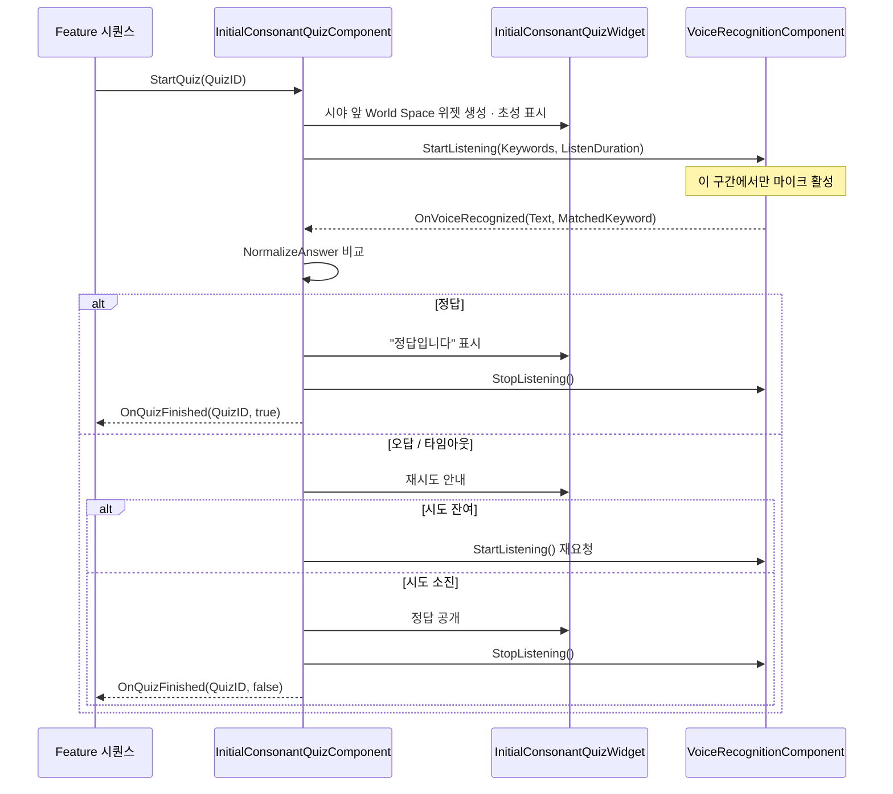

# 초성 퀴즈 시스템 (Initial Consonant Quiz)

**계층**: Core
**최초 작성일**: 2026-08-27
**상태**: `Status: Implemented` (음성 인식 백엔드는 Mock)

---

## 1. 목적

음성 인식으로 정답을 말하는 **초성 퀴즈**를 Core 기능으로 제공한다.
특정 체험(옹성·거중기·공심돈·신기전)에 종속되지 않으며,
어떤 개발자든 자신의 시퀀스 중간에 3줄 이내로 퀴즈를 삽입할 수 있어야 한다.

기존 `UMainEducationScenarioDefinition`의 퀴즈는 **Main 체험 전용 프레젠테이션 데이터**이며
음성 캡처·판정·위젯을 갖고 있지 않다. 본 시스템은 그 빈 자리를 채우는 **런타임**이고,
Main 교육 흐름은 추후 이 런타임을 사용하도록 전환할 수 있다(이번 범위 아님).

---

## 2. 계층 및 의존성

```text
Game Feature (GF_OngseongCrossbow / GF_Geojunggi / ...)
        ↓  (퀴즈 데이터 + 시작/종료 시점만 제공)
Core/Quiz     UInitialConsonantQuizComponent
        ↓
Core/Voice    UVoiceRecognitionComponent (추상 베이스)
        ↓
              UMockVoiceRecognitionComponent  ← 현재
              USherpaVoiceRecognitionComponent ← 향후 (동일 인터페이스)
```

Core는 어떤 Game Feature도 참조하지 않는다. Feature는 퀴즈 **데이터**와 **시작 시점**만 준다.

---

## 3. 구성 요소

| 클래스 | 위치 | 역할 |
|---|---|---|
| `UHangulTextLibrary` | `Core/Text` | 한글 초성 추출·정답 정규화 유틸리티 (Blueprint Function Library) |
| `FInitialConsonantQuizDefinition` | `Core/Quiz` | 퀴즈 1건의 데이터(질문·초성·정답·별칭·제한시간·시도 횟수) |
| `UInitialConsonantQuizSet` | `Core/Quiz` | 퀴즈 묶음 Data Asset (`DA_`). 여러 Feature가 공유·재활용 |
| `UInitialConsonantQuizComponent` | `Core/Quiz` | 런타임 구동: 위젯 표시 → 음성 인식 On → 판정 → 음성 인식 Off |
| `UInitialConsonantQuizWidget` | `Core/Quiz` | 네이티브 World Space 위젯. "초성 퀴즈" 문구 + 큰 초성 + 상태 |
| `UScenarioQuizBridgeComponent` | `Core/Quiz` | `EScenarioInteractionType::Quiz` 인터랙션 ↔ 퀴즈 컴포넌트 자동 연결 |
| `FVoiceRecognitionRequest/Result` | `Core/Voice` | 백엔드 무관 요청·결과 구조체 |
| `UVoiceRecognitionComponent` | `Core/Voice` | 음성 인식 베이스. 시작/종료/키워드 매칭/타임아웃 |
| `UMockVoiceRecognitionComponent` | `Core/Voice` | 목 구현. 기본은 수동 입력(`ssv.voice.submit`), 무인 테스트용 자동 정답/오답 모드 제공 |

---

## 4. 데이터 정의

```cpp
FInitialConsonantQuizDefinition
{
    FName   QuizID;              // 예: QUIZ_ONGSEONG
    FText   PromptTitle;         // 기본값 "초성 퀴즈"
    FText   QuestionText;        // "성문 바깥을 둘러싼 이 방어시설의 이름은?"
    FText   InitialConsonants;   // 비워두면 Answer에서 자동 추출 ("옹성" → "ㅇ ㅅ")
    FText   Answer;              // 정답(정본)
    TArray<FText> AcceptedAnswers; // 별칭. 인식 오차 흡수용
    FText   HintText;
    float   ListenDuration;      // 1회 발화 대기 시간(초). 기본 8
    int32   MaxAttempts;         // 0 = 무제한
    bool    bRevealAnswerOnFail; // 시도 소진 시 정답 공개 후 진행
    float   ResultDisplayDuration; // 결과 표시 유지 시간(초). 기본 3
}
```

**초성 자동 추출**이 핵심 편의 기능이다. 작성자는 정답만 넣으면 되고,
`ㅇ ㅅ` 같은 표시는 `UHangulTextLibrary::ExtractInitialConsonants()`가 만든다.
쌍자음은 `ㄲ ㄸ ㅃ ㅆ ㅉ`을 그대로 사용한다(표준 초성 19자).

**정답 판정**은 `UHangulTextLibrary::NormalizeAnswer()`로 공백·문장부호·대소문자를 제거한 뒤
`Answer` 및 `AcceptedAnswers`와 완전 일치를 확인한다. 부분 일치는 인정하지 않는다.

---

## 5. 런타임 흐름



**마이크 수명 규칙**: `StartQuiz` 시점에만 `StartListening`을 호출하고,
정답·포기·취소·`EndPlay` 어느 경로로 끝나든 반드시 `StopListening`을 호출한다.
퀴즈가 실행 중이 아닐 때 음성 인식이 켜져 있는 상태는 허용하지 않는다.

---

## 6. 위젯 표시 규칙

* World Space `UWidgetComponent`를 **퀴즈 시작 시점의 시야 정면**에 배치한다.
  기본 거리 200cm, 눈높이 대비 -15cm.
* 위치는 고정하고 회전만 플레이어를 향해 갱신한다(30Hz).
  헤드 락(Head-lock)은 VR 멀미를 유발하므로 사용하지 않는다.
* 표시 요소 (위→아래)
  1. `초성 퀴즈` 라벨 (강조색)
  2. 질문 문구
  3. **초성** — 가장 큰 글자 (기본 폰트 크기 150)
  4. 상태 문구 — "정답을 말해보세요" / "듣는 중..." / "다시 말해보세요" / "정답입니다"
* 네이티브 위젯이 기본값이며, `QuizWidgetClass`에 WBP를 지정하면 교체된다.
  교체 위젯은 `UInitialConsonantQuizWidget`을 상속하거나 동일 이름 함수를 노출하면 된다.

---

## 7. 다른 개발자가 자기 시퀀스에 넣는 방법

### 7.1 Scenario 프레임워크를 쓰는 경우 (권장)

1. 시나리오 매니저 Actor에 `ScenarioQuizBridgeComponent`와
   `InitialConsonantQuizComponent`를 추가한다.
2. `InitialConsonantQuizComponent`의 `Quizzes` 배열 또는 `QuizSet` 에셋에 퀴즈를 넣는다.
3. Stage의 Interaction을 `InteractionType = Quiz`, `TargetID = QuizID`로 만든다.

브리지가 `OnInteractionRequested`를 받아 퀴즈를 시작하고,
결과를 `ReportInteractionResult(TargetID, Quiz, bSuccess)`로 돌려준다. 추가 코드가 없다.

### 7.2 자체 매니저를 쓰는 경우 (옹성 · Main 방식)

```cpp
QuizComponent->OnQuizFinished.AddDynamic(this, &AMyManager::HandleQuizFinished);
QuizComponent->StartQuiz(TEXT("QUIZ_ONGSEONG"));
```

Blueprint에서도 동일하게 `Start Quiz` 노드 + `On Quiz Finished` 이벤트만 연결하면 된다.

### 7.3 자기 데이터로 퀴즈를 만드는 경우 (Main 방식)

퀴즈 데이터를 이미 갖고 있다면 `StartQuizDefinition()`으로 런타임 퀴즈를 만들어 넘긴다.
데이터가 두 곳으로 갈라지지 않는다.

```cpp
FInitialConsonantQuizDefinition Quiz;
Quiz.QuizID = Content.ContentID;
Quiz.QuestionText = Content.Body;
Quiz.Answer = Content.AcceptedAnswers[0];   // 초성은 여기서 자동 추출된다
QuizComponent->StartQuizDefinition(Quiz);
```

`AMainEducationScenarioManagerActor`가 이 방식으로 `FMainEducationContent`를 그대로 사용한다
(`QUIZ_HWACHA` "ㅎ ㅊ", `QUIZ_ONGSEONG` "ㅇ ㅅ"). 상세는 `docs/Main/specs/MAIN_EDUCATION_FLOW.md`.

---

## 8. 음성 인식 백엔드 교체 지점

`UVoiceRecognitionComponent`가 계약이다. 백엔드는 다음 두 가지만 구현한다.

| 함수 | 의미 |
|---|---|
| `BeginBackendListening(Request)` | 마이크 캡처 시작. `BlueprintNativeEvent` |
| `EndBackendListening()` | 마이크 캡처 종료 |

인식 결과는 어느 백엔드든 `ReportRecognizedText(Text, Confidence)` 한 곳으로 들어온다.
따라서 목 구현, 콘솔 디버그 입력, 향후 sherpa-onnx 구현이 모두 같은 경로를 쓴다.

백엔드 후보 조사는 `docs/Core/specs/VOICE_RECOGNITION_BACKEND_SURVEY.md`를 참조한다.

---

## 9. 검증

| 항목 | 방법 |
|---|---|
| 초성 추출 · 정답 정규화 · 판정 | `Suwon.Core.Hangul.InitialConsonants` 자동화 테스트 |
| 마이크 수명 | `Suwon.Core.Quiz.VoiceLifetime` — 퀴즈 시작 전/후 `IsListening()` 검사 |
| 옹성 통합 | `SuwonSiegeContestVR.Ongseong.Defense.GatedAssaultStart` |

---

## 10. 사용처

| 사용처 | 퀴즈 | 방식 |
|---|---|---|
| Main 교육 흐름 | `QUIZ_HWACHA`(화차), `QUIZ_ONGSEONG`(옹성) | Main Content → `StartQuizDefinition()` (7.3) |
| `GF_OngseongCrossbow` | `QUIZ_ONGSEONG` | 컴포넌트 내장 퀴즈 → `StartQuiz()` (7.2). **기본 꺼짐** — Main이 같은 질문을 낸다 |

## 11. 남은 문제

* 마이크 권한(Android `RECORD_AUDIO`) 요청 흐름은 미설계다.
* 퀴즈 패널의 최종 아트(WBP)와 정답/오답 사운드는 미제작이다. 네이티브 패널이 기본값으로 동작한다.
