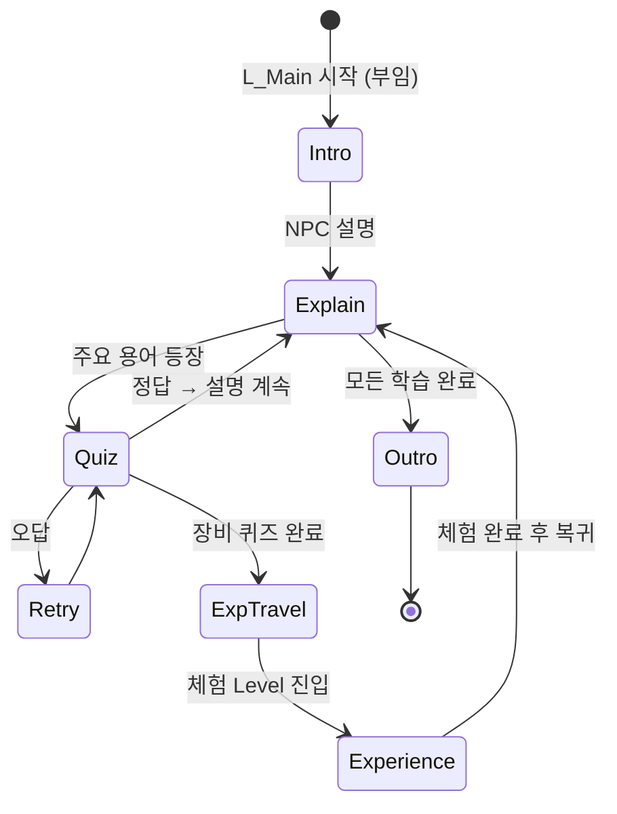

# Main — 현재 상태

**조사 기준일**: 2026-08-11 · **조사 기준 커밋**: `57dd875`
**계층**: Core (Game Feature Plugin 없음)
**전체 상태**: `Status: Partial` — VR Pawn, Scenario/Experience 기반, 전체 Main 교육 흐름 베이스와 세션 진행 복원 구현

Shared 전투·AI·풀링 현황과 Editor 통합 계획은 [Gameplay/README.md](Gameplay/README.md)를 참고한다.

---

## 1. 담당 범위

* 전체 Tutorial Flow (수원화성 부임 장교 시나리오)
* NPC 설명 진행
* 초성 퀴즈
* 음성 인식
* Experience 전환 (체험 Level 진입 / 복귀)
* 진행도 관리

Main은 Game Feature가 아니라 **Core에 속한다.** 다른 네 체험 전부가 Main에 의존한다.

---

## 2. 현재 구현 상태 (실제 조사 결과)

| 요소 | 상태 | 실제 확인 내용 |
|---|---|---|
| `L_Main` Level | `Implemented` | `/Game/Maps/Main/L_Main`. Main Manager, PlayerStart, 공심돈·신기전 순차 이동 Trigger 배치. `/Game/Maps/Main/L_NamhansanseongLandscape`를 Always Loaded 지형 서브레벨로 연결 |
| Main Landscape | `Implemented` | `Demo_Namhansanseong`의 Landscape 1개 + Streaming Proxy 121개와 `MI_Landscape`를 지형 전용 서브레벨로 분리 이식. 기존 평면 Landscape 제거, Demo PlayerStart 안전 지점으로 Main 시작 위치·체험 Trigger 정렬 |
| Tutorial Flow | `Partial` | `DA_Scenario_MainEducation.01 Editor Flow`에서 순서·화면·행동·완료 조건·가이드를 편집하고 Runtime 흐름을 자동 생성. 2026-08-27 기준 4 Stage — 인사 → 신기전(설명·퀴즈·체험) → 옹성(설명·퀴즈·체험) → 마무리. 거중기·녹로·공심돈 구간은 흐름에서 제외 |
| NPC | `Partial` | NPC Actor/애니메이션은 없으나 DT 기반 음성·자막 진행 구조 구현 |
| 초성 퀴즈 | `Implemented` | `QUIZ_HWACHA`("ㅎ ㅊ"/화차), `QUIZ_ONGSEONG`("ㅇ ㅅ"/옹성)을 각 체험 이동 직전에 출제. Core `UInitialConsonantQuizComponent`가 패널·시도·마이크를 담당하고 Main은 질문 데이터만 소유. 최종 Quiz Widget 아트는 남음 |
| 음성 인식 | `Implemented` | sherpa-onnx 온디바이스 한국어 인식. `RequestVoiceRecognition`/`CancelVoiceRecognition`이 Core 퀴즈 런타임에 연결되어 있고 `SubmitQuizAnswer` 수동 경로도 유지. Android `RECORD_AUDIO` 권한 흐름은 남음 |
| Experience 전환 | `Implemented` | `UExperienceSubsystem`의 Soft Level `OpenLevel`, 상태 전이, Scenario 완료 Bridge 구현 |
| 진행도 관리 | `Partial` | Experience 완료 목록과 Main Scenario 복귀 체크포인트를 세션 동안 복원. SaveGame 영속화는 없음 |
| 공통 UI (진행도/안내) | `Partial` | VR 자막 HUD와 `UVRHUDComponent` 채널 구현. Main Step별 Interaction Guide Text를 HUD에 반영하며 최종 교육 Widget은 남음 |

메인 전용 나레이션은 `/Game/Audio/Narration/DT_Narration_Main`에 01~33번이 등록되어 있으며,
`DA_Scenario_MainEducation`의 부임부터 녹로 원리 설명까지 14개 재생 구간으로 연결되어 있다.
`/Game/Art/MainEducation/Examples`의 5개 예시 Texture가 12개 화면 슬롯에 연결되어 있다.

남한산성 공용 지형은 `/Game/Maps/Main/L_NamhansanseongLandscape`에서 독립 편집한다. 이 맵은
`Demo_Namhansanseong`의 지형만 보유하며 성벽·조명·게임플레이 Blueprint·Foliage는 포함하지 않는다.
`L_Main`에서는 Always Loaded 서브레벨로 사용하며, 다른 레벨에서도 에디터 콘솔의
`Suwon.AttachNamhansanseongLandscape`로 같은 공용 지형을 연결할 수 있다. 연결 뒤 대상 레벨을 저장한다.

### 새로 구현된 Core 요소

- `Content/Core/VR/Pawn/BP_VRPlayerPawn`
- `Content/Core/Experience/Definitions/DT_Narration`
- `UNarrationSequenceComponent`
- `FNarrationSequenceRow`
- `USubtitleWidget`
- Grab / NavMesh Teleport / HMD 중심 Snap Turn 입력
- `UScenarioManagerComponent`, Scenario/Scene Primary Data Asset
- `UScenarioInteractableComponent`, `UScenarioObservationComponent`
- 기존 나레이션을 연결하는 `UScenarioNarrationBridgeComponent`
- `Content/Core/Scenario/Managers/BP_ScenarioManager`
- `UExperienceDefinition`, `UExperienceSubsystem`, `UScenarioExperienceBridgeComponent`
- `Content/Core/Experience/Definitions/DA_Experience_Singijeon`
- `Content/Core/Experience/Definitions/DA_Experience_Gongsimdon`
- `Content/Data/DA_Scenario_Main` 인라인 Stage/Interaction
- `Content/Core/Experience/Definitions/DA_Experience_Main`
- `AExperienceTravelTriggerActor`, Interaction 순서 가드, Main Scenario 체크포인트 복원
- Experience 하나만 Level Manager에 지정하는 자동 Scenario/Narration 해석
- `UMainEducationScenarioDefinition`, `AMainEducationScenarioManagerActor`
- `Content/Data/DA_Scenario_MainEducation` 전체 교육 흐름
- `Content/Core/Experience/Definitions/DA_Experience_Ongseong`

나레이션은 `docs/Main/specs/NARRATION_SYSTEM.md`, Scenario 제작은 `docs/Main/specs/SCENARIO_SYSTEM.md`를 참고한다. `BP_XRGameMode`는 `BP_VRPlayerPawn`을 기본 Pawn으로 사용하며 `LV_Singijeon`에도 명시적으로 지정되어 있다.

### 유일하게 존재하는 관련 요소

* `BP_XRGameMode` — `DefaultPawnClass = BP_VRPlayerPawn`
* `Config/DefaultEngine.ini`의 `GameDefaultMap`, `EditorStartupMap`은 `L_Main`이다.

---

## 3. 목표 Flow (Core 전환 기반 구현 / Main 콘텐츠 미구현)

목표 총 플레이 타임 약 10분. 4개 체험 전부를 한 세션에서 도는지, 일부만 도는지는 미결정이다.

---

## 4. 설계 결정 필요 사항 (TODO)

### 4.1 음성 인식 — **해결됨 (2026-08-27)**

sherpa-onnx 온디바이스 한국어 Zipformer로 구현되어 Main 퀴즈에 연결되었다.
상세는 `docs/Core/specs/SHERPA_ONNX_INTEGRATION.md`,
`docs/Main/completed/2026-08-27_MAIN_VOICE_QUIZ_EXPERIENCE_FLOW.md`.
남은 것은 **Android `RECORD_AUDIO` 권한 흐름과 arm64 실기 검증**뿐이다.
아래 내용은 선정 당시의 판단 근거로 남겨 둔다.

**확정된 방침 (2026-08-12)**

* **스탠드얼론(온디바이스)에서 동작**한다. 클라우드 STT에 의존하지 않는다.
* **외부 서드파티 모듈을 임포트**해 사용한다. 자체 구현하지 않는다.
* 타깃 기기는 **Android 스탠드얼론** (개발 중에는 PC).

**임포트 시 준비 사항**

* 서드파티 바이너리는 반드시 **`ThirdParty/` 디렉토리에 배치**해야 커밋된다
  (`.gitignore` 예외 규칙 — `docs/DIRECTORY_STRUCTURE.md` §4.2).
* 바이너리는 Git LFS로 관리된다.
* **`arm64-v8a` ABI 지원 여부를 임포트 전에 확인**해야 한다. Android 실기 동작의 전제 조건이다.
* UE 연동에 **C++ 모듈이 필요**하다 — `Build.cs` 링크 설정과 `.uproject` Modules 선언이 선행되어야 한다.
* Android `RECORD_AUDIO` 권한 및 런타임 권한 요청 처리 필요.
* 배치 위치: Blueprint 측은 `Content/Core/Quiz/VoiceRecognition/`.

**남은 TODO**

* **서드파티 모듈 선정 미완** — 한국어 인식 정확도, arm64 지원, 라이선스, 오프라인 모델 크기로 평가
* 마이크 입력 캡처 경로 (UE `AudioCapture` 모듈 사용 여부)
* 인식 지연 시간이 퀴즈 흐름에 미치는 영향
* 인식 실패 시 대체 입력(버튼 선택 등) 제공 여부

**권장**: 다른 기능보다 먼저 최소 Spike를 만들어 **실제 Android 기기에서** 한국어 인식이 되는지 확인한다.
PC에서만 검증하면 arm64 빌드 단계에서 문제가 드러날 수 있다.

### 4.2 초성 퀴즈 — **해결됨 (2026-08-27)**

| 결정 사항 | 결과 |
|---|---|
| 초성 분해 | `UHangulTextLibrary` (유니코드 `0xAC00` 기반 C++ Function Library) |
| 정답 판정 | 공백·문장부호 제거 후 **완전 일치**. 부분 일치는 인정하지 않는다 |
| 데이터 형식 | 공용은 `UInitialConsonantQuizSet` Data Asset, Main은 자기 Content에서 런타임 생성 |
| 오답 허용 | 기본 3회. 소진하면 정답을 공개하고 진행한다 (`QuizMaxAttempts`) |

남은 것은 최종 Quiz Widget 아트와 정답/오답 사운드다.

### 4.3 Experience 전환

* 전환 방식은 `OpenLevelBySoftObjectPtr`로 구현 완료
* 전환 중 로딩 화면 / 페이드 처리 (VR에서 급격한 전환은 멀미 유발)
* 공심돈·신기전 `ReturnLevel=L_Main` 연결 완료. 다른 체험 Definition 생성 시 동일하게 연결 필요

### 4.4 진행도 관리

* 현재 메모리만 유지한다. 앱 재시작 후 유지가 필요하면 `SaveGame` 영속화 추가
* Scenario 기반 체험은 `OnScenarioFinished` Bridge, 별도 체험은 `CompleteCurrentExperience` 직접 호출

### 4.5 NPC

* NPC 수, 대사 분량, 음성(TTS/녹음) 사용 여부
* 립싱크 / 애니메이션 요구 수준
* 대사 데이터와 자막 흐름은 `DT_Narration` + `NarrationSequenceRow`로 확정
* NPC 애니메이션은 `CompletionEvents`를 Manager가 받아 실행하는 방식으로 연동

---

## 5. 다른 Feature에 미치는 영향

Main의 다음 요소는 **네 체험 전부가 의존**하므로 우선 확정되어야 한다.

| 요소 | 영향 |
|---|---|
| `ExperienceSubsystem` 인터페이스 | 각 `BP_*ExperienceManager`가 체험 완료를 보고하는 방식 |
| 체험 완료 판정 규약 | 모든 Feature의 완료 조건 구현 형태 |
| PlayerPhone 확장 방식 | 모든 Feature의 Phone Component 구조 |
| Level 전환 방식 | 각 체험 Level 구성 방식 |
| VR Player Pawn 확정 | 각 체험의 이동/상호작용 전제 |

---

## 6. 다음 단계 제안

1. ~~`Content/Core/` 골격 디렉토리 생성 및 커밋~~ → **완료 (2026-08-12)**
2. ~~음성 인식 서드파티 모듈 선정~~ → **완료 (2026-08-27, sherpa-onnx)**.
   남은 것은 **Android 실기(arm64) Spike + `RECORD_AUDIO` 권한 흐름** (**최우선**)
3. ~~`L_Main` + Main→공심돈→Main→신기전→Main 왕복 + 기본 Map 교체~~ → **완료 (2026-08-19)**
4. ~~`ExperienceSubsystem` 인터페이스 및 신기전 연결~~ → **완료 (2026-08-15)**
5. ~~초성 분해 Function Library 구현~~ → **완료 (2026-08-27, `UHangulTextLibrary`)**
6. Main 전체 흐름 HMD 실기 플레이 검증 (나레이션 → 퀴즈 → 이동 → 복귀)
7. PlayerPhone 역할 정의 및 기본 구조 설계
