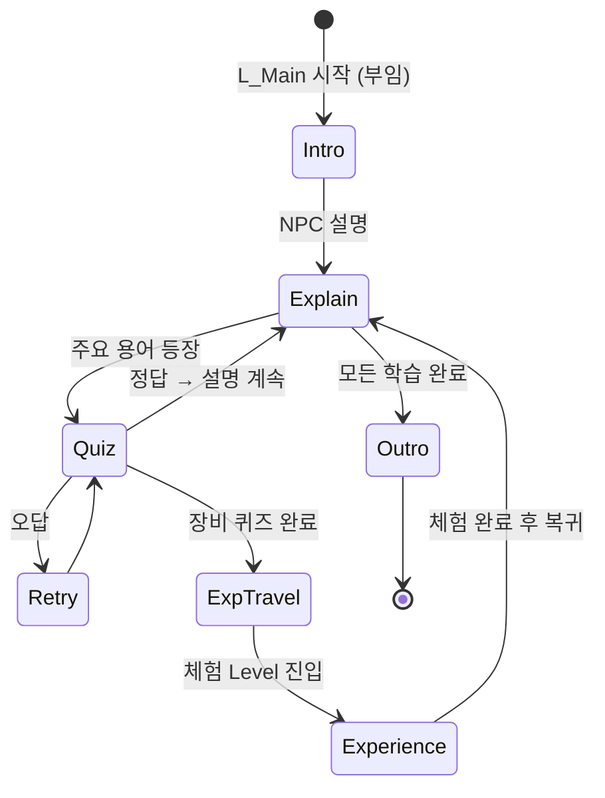

# Main — 현재 상태

**조사 기준일**: 2026-08-11 · **조사 기준 커밋**: `57dd875`
**계층**: Core (Game Feature Plugin 없음)
**전체 상태**: `Status: Partial` — VR Pawn, Scenario, Main→공심돈→Main→신기전→Main 흐름과 세션 진행 복원 구현

---

## 1. 담당 범위

* 전체 Tutorial Flow (수원화성 부임 장교 시나리오)
* NPC 설명 진행
* 초성 퀴즈
* 음성 인식
* Experience 전환 (체험 Level 진입 / 복귀)
* 진행도 관리

Main은 Game Feature가 아니라 **Core에 속한다.** 다른 네 체험 전부가 Main에 의존한다.

---

## 2. 현재 구현 상태 (실제 조사 결과)

| 요소 | 상태 | 실제 확인 내용 |
|---|---|---|
| `L_Main` Level | `Implemented` | `/Game/Maps/Main/L_Main`. Main Manager, PlayerStart, 공심돈·신기전 순차 이동 Trigger 배치 |
| Tutorial Flow | `Partial` | `DA_Scenario_Main`에 공심돈 복귀 후 신기전으로 이어지는 인라인 흐름 구현. 전체 NPC/퀴즈 콘텐츠는 미작성 |
| NPC | `Partial` | NPC Actor/애니메이션은 없으나 DT 기반 음성·자막 진행 구조 구현 |
| 초성 퀴즈 | `Planned` | Quiz Blueprint / Widget / Data Table 없음 |
| 음성 인식 | `Planned` | **관련 플러그인·SDK·C++ 모듈이 전혀 없다.** 기술 선정 자체가 미완 |
| Experience 전환 | `Implemented` | `UExperienceSubsystem`의 Soft Level `OpenLevel`, 상태 전이, Scenario 완료 Bridge 구현 |
| 진행도 관리 | `Partial` | Experience 완료 목록과 Main Scenario 복귀 체크포인트를 세션 동안 복원. SaveGame 영속화는 없음 |
| 공통 UI (진행도/안내) | `Partial` | VR 자막 HUD와 후속 World Widget 표시 영역 구현 |

### 새로 구현된 Core 요소

- `Content/Core/VR/Pawn/BP_VRPlayerPawn`
- `Content/Core/Experience/Definitions/DT_Narration`
- `UNarrationSequenceComponent`
- `FNarrationSequenceRow`
- `USubtitleWidget`
- Grab / NavMesh Teleport / HMD 중심 Snap Turn 입력
- `UScenarioManagerComponent`, Scenario/Scene Primary Data Asset
- `UScenarioInteractableComponent`, `UScenarioObservationComponent`
- 기존 나레이션을 연결하는 `UScenarioNarrationBridgeComponent`
- `Content/Core/Scenario/Managers/BP_ScenarioManager`
- `UExperienceDefinition`, `UExperienceSubsystem`, `UScenarioExperienceBridgeComponent`
- `Content/Core/Experience/Definitions/DA_Experience_Singijeon`
- `Content/Core/Experience/Definitions/DA_Experience_Gongsimdon`
- `Content/Data/DA_Scenario_Main` 인라인 Stage/Interaction
- `Content/Core/Experience/Definitions/DA_Experience_Main`
- `AExperienceTravelTriggerActor`, Interaction 순서 가드, Main Scenario 체크포인트 복원
- Experience 하나만 Level Manager에 지정하는 자동 Scenario/Narration 해석

나레이션은 `docs/Main/specs/NARRATION_SYSTEM.md`, Scenario 제작은 `docs/Main/specs/SCENARIO_SYSTEM.md`를 참고한다. `BP_XRGameMode`는 `BP_VRPlayerPawn`을 기본 Pawn으로 사용하며 `LV_Singijeon`에도 명시적으로 지정되어 있다.

### 유일하게 존재하는 관련 요소

* `BP_XRGameMode` — `DefaultPawnClass = BP_VRPlayerPawn`
* `Config/DefaultEngine.ini`의 `GameDefaultMap`, `EditorStartupMap`은 `L_Main`이다.

---

## 3. 목표 Flow (Core 전환 기반 구현 / Main 콘텐츠 미구현)

목표 총 플레이 타임 약 10분. 4개 체험 전부를 한 세션에서 도는지, 일부만 도는지는 미결정이다.

---

## 4. 설계 결정 필요 사항 (TODO)

### 4.1 음성 인식 — **최우선 기술 검증 대상**

**확정된 방침 (2026-08-12)**

* **스탠드얼론(온디바이스)에서 동작**한다. 클라우드 STT에 의존하지 않는다.
* **외부 서드파티 모듈을 임포트**해 사용한다. 자체 구현하지 않는다.
* 타깃 기기는 **Android 스탠드얼론** (개발 중에는 PC).

**임포트 시 준비 사항**

* 서드파티 바이너리는 반드시 **`ThirdParty/` 디렉토리에 배치**해야 커밋된다
  (`.gitignore` 예외 규칙 — `docs/DIRECTORY_STRUCTURE.md` §4.2).
* 바이너리는 Git LFS로 관리된다.
* **`arm64-v8a` ABI 지원 여부를 임포트 전에 확인**해야 한다. Android 실기 동작의 전제 조건이다.
* UE 연동에 **C++ 모듈이 필요**하다 — `Build.cs` 링크 설정과 `.uproject` Modules 선언이 선행되어야 한다.
* Android `RECORD_AUDIO` 권한 및 런타임 권한 요청 처리 필요.
* 배치 위치: Blueprint 측은 `Content/Core/Quiz/VoiceRecognition/`.

**남은 TODO**

* **서드파티 모듈 선정 미완** — 한국어 인식 정확도, arm64 지원, 라이선스, 오프라인 모델 크기로 평가
* 마이크 입력 캡처 경로 (UE `AudioCapture` 모듈 사용 여부)
* 인식 지연 시간이 퀴즈 흐름에 미치는 영향
* 인식 실패 시 대체 입력(버튼 선택 등) 제공 여부

**권장**: 다른 기능보다 먼저 최소 Spike를 만들어 **실제 Android 기기에서** 한국어 인식이 되는지 확인한다.
PC에서만 검증하면 arm64 빌드 단계에서 문제가 드러날 수 있다.

### 4.2 초성 퀴즈

* 한글 음절 → 초성 분해 로직 필요 (유니코드 `0xAC00` 기반 계산). C++ Blueprint Function Library 권장
* 정답 판정: 인식 텍스트 완전 일치 / 초성 일치 / 유사도 임계값 중 무엇을 쓸지
* 퀴즈 데이터 형식: Data Table vs Data Asset
* 오답 허용 횟수, 힌트 단계

### 4.3 Experience 전환

* 전환 방식은 `OpenLevelBySoftObjectPtr`로 구현 완료
* 전환 중 로딩 화면 / 페이드 처리 (VR에서 급격한 전환은 멀미 유발)
* 공심돈·신기전 `ReturnLevel=L_Main` 연결 완료. 다른 체험 Definition 생성 시 동일하게 연결 필요

### 4.4 진행도 관리

* 현재 메모리만 유지한다. 앱 재시작 후 유지가 필요하면 `SaveGame` 영속화 추가
* Scenario 기반 체험은 `OnScenarioFinished` Bridge, 별도 체험은 `CompleteCurrentExperience` 직접 호출

### 4.5 NPC

* NPC 수, 대사 분량, 음성(TTS/녹음) 사용 여부
* 립싱크 / 애니메이션 요구 수준
* 대사 데이터와 자막 흐름은 `DT_Narration` + `NarrationSequenceRow`로 확정
* NPC 애니메이션은 `CompletionEvents`를 Manager가 받아 실행하는 방식으로 연동

---

## 5. 다른 Feature에 미치는 영향

Main의 다음 요소는 **네 체험 전부가 의존**하므로 우선 확정되어야 한다.

| 요소 | 영향 |
|---|---|
| `ExperienceSubsystem` 인터페이스 | 각 `BP_*ExperienceManager`가 체험 완료를 보고하는 방식 |
| 체험 완료 판정 규약 | 모든 Feature의 완료 조건 구현 형태 |
| PlayerPhone 확장 방식 | 모든 Feature의 Phone Component 구조 |
| Level 전환 방식 | 각 체험 Level 구성 방식 |
| VR Player Pawn 확정 | 각 체험의 이동/상호작용 전제 |

---

## 6. 다음 단계 제안

1. ~~`Content/Core/` 골격 디렉토리 생성 및 커밋~~ → **완료 (2026-08-12)**
2. 음성 인식 **서드파티 모듈 선정 + Android 실기 Spike** (**최우선**)
3. ~~`L_Main` + Main→공심돈→Main→신기전→Main 왕복 + 기본 Map 교체~~ → **완료 (2026-08-19)**
4. ~~`ExperienceSubsystem` 인터페이스 및 신기전 연결~~ → **완료 (2026-08-15)**
5. 초성 분해 Function Library 구현 (**서드파티 선정과 무관하게 지금 착수 가능**)
6. PlayerPhone 역할 정의 및 기본 구조 설계
