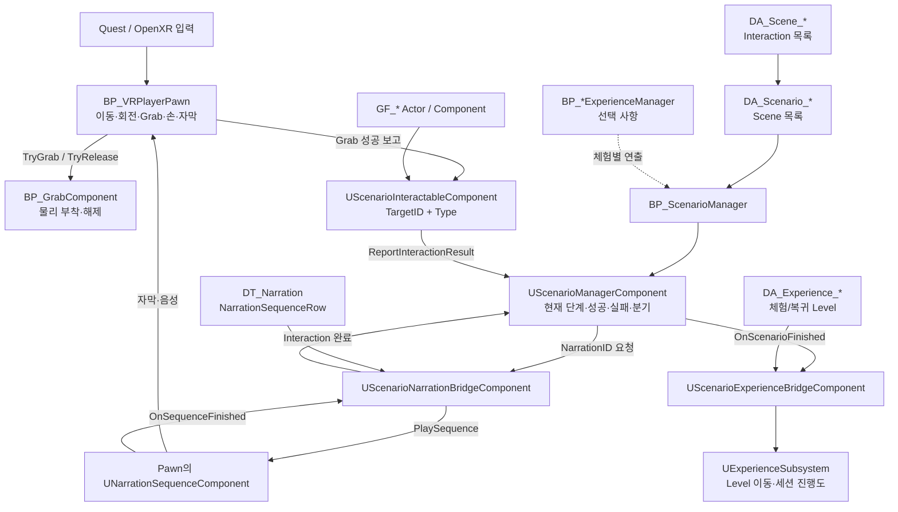
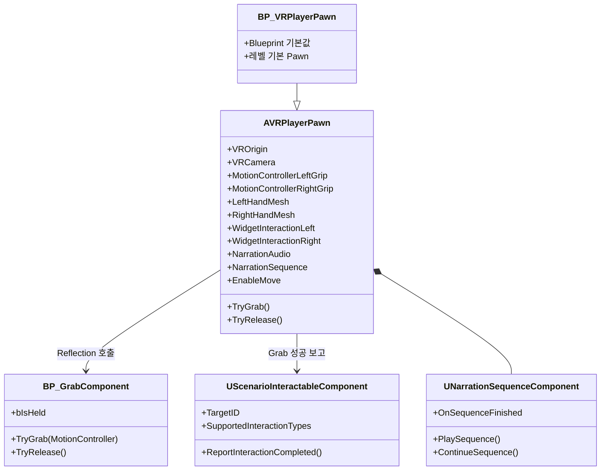
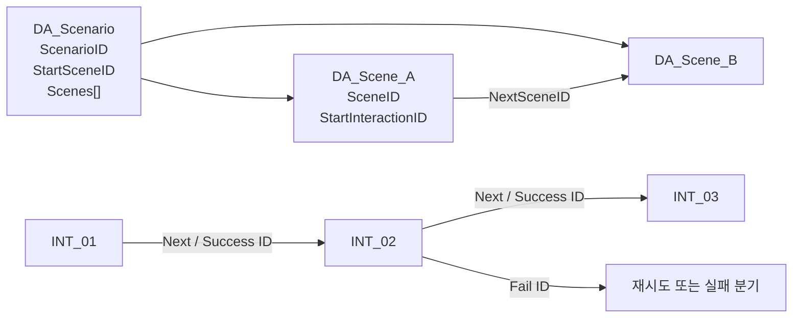

# Player Pawn · Scenario Manager 인수인계

> **2026-08-18 구조 변경:** 별도 `DA_Scene_*` 제작 방식은 폐기됐다. 현재는 `DA_Scenario_*.Stages[]` 안에서 Interaction 전체를 편집하고, Level Manager에는 `DA_Experience_*` 하나만 지정한다. 아래의 Scene/직접 Scenario 지정 설명은 과거 API 호환 참고용이며 신규 제작 절차는 `docs/Main/specs/SCENARIO_SYSTEM.md`를 우선한다.

> 기준일: 2026-08-15  
> 대상: VR Pawn, Grab, Scenario, Narration 작업을 처음 맡는 작업자  
> 엔진: Unreal Engine 5.8

## 1. 문서 목적

이 문서는 현재 구현된 VR 플레이어와 Scenario 시스템을 이어서 작업하기 위한 실무 인수인계서다.

이 프로젝트에서 `BP_ScenarioManager`는 **현재 Level 안의 Scenario → Scene → Interaction 진행**을 담당한다. Level 이동과 여러 체험의 전역 진행은 `UExperienceSubsystem`이 담당하며, 두 계층은 `UScenarioExperienceBridgeComponent`로 연결된다.

PlayerPhone은 이번 인수인계 범위가 아니다. 핵심은 `BP_VRPlayerPawn`이다.

## 2. 전체 구조



### 의존성 원칙

```text
Game Feature → Core
Core -X→ Game Feature
GF_A -X→ GF_B
```

- Pawn, Scenario, Narration 기반은 Core가 소유한다.
- 신기전 화차·횃불·탄약 같은 구체 기능은 `GF_Singijeon`이 소유한다.
- Level Blueprint에는 초기 연결 이상의 게임플레이 로직을 넣지 않는다.
- 체험 전용 연출은 향후 `BP_*ExperienceManager`에 둔다.

## 3. 현재 진행 상태

| 기능 | 상태 | 실제 위치 |
|---|---|---|
| VR Pawn | 구현 | `Content/Core/VR/Pawn/BP_VRPlayerPawn` |
| Pawn 기반 C++ | 구현 | `AVRPlayerPawn` |
| Quest/OpenXR 손 표시 | 구현 | `LeftHandMesh`, `RightHandMesh` |
| Trigger Grab | 구현 | 좌·우 Index Curl Input → Grab/Release |
| Grab 대상 탐색 | 구현 | 손 Grip 위치 반경 검색, 기본 15 cm |
| Snap Turn | 구현 | 왼쪽 조이스틱, 기본 45도 |
| Smooth Move | 구현 | 오른쪽 조이스틱, `Enable Move`로 On/Off |
| PC PIE 이동 | 구현 | WASD/QE fallback |
| Teleport | 구현 | 기존 `IA_Move` 기반 로직 보유. Smooth Move와 입력 정책 확인 필요 |
| 손 애니메이션 | 부분 구현 | Grab 입력 시 Grasp Alpha 0/1 전달 |
| Narration/Subtitle | 구현 | Pawn의 Audio·Widget·NarrationSequence |
| Scenario Manager | 구현 | C++ Component + `BP_ScenarioManager` |
| Scenario Data Asset | 구현 | `DA_Scenario_*`, `DA_Scene_*` |
| Actor 결과 보고 | 구현 | `UScenarioInteractableComponent` |
| Scene 간 이동 | 구현 | 같은 Scenario 내부 `NextSceneID` 기반 |
| Level 간 이동 | 구현 | `UExperienceSubsystem`, `UExperienceDefinition` |
| 세션 진행도 | 구현 | `UGameInstanceSubsystem` 메모리 완료 목록 |
| Feature Experience Manager | 미구현 | `BP_*ExperienceManager` 예정 |
| 신기전 전체 진행 | 부분 구현 | 조준·횃불 점화 완료 보고가 없음 |

## 4. BP_VRPlayerPawn 핵심 구조



### Pawn 주요 입력

| 입력 | 처리 |
|---|---|
| 왼쪽 Trigger | `HandleGrabLeft` / `HandleReleaseLeft` |
| 오른쪽 Trigger | `HandleGrabRight` / `HandleReleaseRight` |
| 왼쪽 Stick | Snap Turn |
| 오른쪽 Stick | Smooth Move |
| `Enable Move` | Smooth Move만 활성/비활성. Turn·Grab에는 영향 없음 |
| WASD | Editor PIE Smooth Move fallback |
| Q/E | Editor PIE Turn fallback |

Input Action은 OpenXR 등록 문제를 피하기 위해 기존 XR Template Asset을 재사용한다. 경로를 임의로 옮기면 `ConstructorHelpers`, `DefaultInput.ini`, IMC 참조도 같이 바꿔야 한다.

## 5. Grab 이벤트와 성공 판별

### 실행 순서

```mermaid
sequenceDiagram
    actor Player as 플레이어
    participant Pawn as BP_VRPlayerPawn
    participant Grab as BP_GrabComponent
    participant Actor as Grab 대상 Actor
    participant Interactable as ScenarioInteractable
    participant Manager as ScenarioManager

    Player->>Pawn: Trigger Started
    Pawn->>Pawn: 손 위치 15cm 안 GrabComponent 탐색
    Pawn->>Grab: TryGrab(MotionController)
    Grab->>Actor: 물리 해제·손에 Attach
    Grab-->>Pawn: bool 반환 또는 bIsHeld=true
    alt 물리 Grab 성공
        Pawn->>Interactable: ReportInteractionCompleted(Grab)
        Interactable->>Manager: TargetID + Grab + true
        Manager->>Manager: 현재 Interaction과 비교
    else Grab 실패
        Pawn->>Pawn: HeldComponent를 설정하지 않음
    end
```

### 물리 Grab 성공 조건

Pawn의 `InvokeGrabFunction`은 다음 순서로 성공을 판단한다.

1. `BP_GrabComponent.TryGrab`에 bool 반환값이 있으면 그 값을 사용한다.
2. bool 반환값이 없으면 `bIsHeld == true`인지 확인한다.
3. 성공하면 좌/우 `HeldComponent`에 저장한다.

### Scenario Grab 성공 조건

물리적으로 잡혔다고 Scenario가 항상 성공하는 것은 아니다. Manager에서 다음 조건이 전부 맞아야 한다.

```text
현재 Interaction State == Running
현재 Interaction.InteractionType == Grab
현재 Interaction.TargetID == 잡은 Actor의 ScenarioInteractable.TargetID
```

하나라도 다르면 `ReportInteractionResult`는 `false`를 반환하고 Scenario 단계는 그대로 유지된다.

예:

```text
현재 단계: INT_04 / Grab / Singijeon_Torch
횃불 보고: Grab / Singijeon_Torch
결과: 완료

현재 단계: INT_03 / Custom / Hwacha_Aim
횃불 보고: Grab / Singijeon_Torch
결과: 무시, INT_03 유지
```

### Grab 가능한 Actor 설정법

1. Actor에 `BP_GrabComponent`를 추가한다.
2. Grab Component 위치를 실제 손으로 잡을 위치에 둔다.
3. `Attach Parent To Motion Controller` 등 Grab Component 기본값을 확인한다.
4. Scenario에 사용할 Actor라면 `UScenarioInteractableComponent`도 추가한다.
5. `TargetID`를 DA Interaction의 `TargetID`와 완전히 동일하게 입력한다.
6. `SupportedInteractionTypes`에 `Grab`을 추가한다.
7. `Auto Report To Scenario Manager`를 켠다.

현재 Pawn은 Actor에서 Grab을 지원하는 모든 `UScenarioInteractableComponent`를 찾아 자동 보고한다. 동일 Actor에 Grab Interactor를 중복 배치하지 않는다.

### 현재 Grab 관련 주의사항

횃불 Grab 시 다음 HMD Late Update ensure가 확인됐다.

```text
SceneComponents that use absolute location or rotation are not supported by the LateUpdateManager
```

약 28초 동안 Editor가 멈춘 기록이 있다. 저장된 Pawn·횃불 컴포넌트의 Absolute Location/Rotation은 모두 `false`였으므로, `BP_GrabComponent`가 컨트롤러에 붙이는 런타임 과정에서 절대 Transform 상태가 만들어지는지 우선 추적해야 한다.

## 6. Scenario Manager 구성

### Level 배치

Level에 다음 Actor를 하나만 배치한다.

```text
/Game/Core/Scenario/Managers/BP_ScenarioManager
```

Details 설정:

| 변수 | 설정 |
|---|---|
| `Scenario Definition` | `DA_Scenario_*` 지정. `DA_Scene_*`를 직접 넣지 않음 |
| `Narration Table` | 해당 Scenario가 사용하는 `DT_Narration` |
| `Auto Start Scenario` | BeginPlay 자동 시작이면 true |

`BP_ScenarioManager` 내부 구성:

```text
BP_ScenarioManager
├─ UScenarioManagerComponent
└─ UScenarioNarrationBridgeComponent
```

### Data 계층



배열 순서는 실행 순서를 결정하지 않는다. 반드시 ID 링크로 연결한다.

## 7. 다음 Interaction과 다음 Scene으로 넘어가는 법

### 같은 Scene의 다음 Interaction

현재 Interaction이 완료되면 Manager는 다음 순서로 이동 대상을 선택한다.

```text
SuccessInteractionID가 있으면 → SuccessInteractionID
없으면 → NextInteractionID
둘 다 없으면 → 현재 Scene 완료 시도
```

- 성공 분기가 필요 없으면 `NextInteractionID`만 사용한다.
- 실패 시 재시도하려면 `FailInteractionID`에 현재 Interaction ID를 넣는다.
- `FailInteractionID`가 비어 있는 상태에서 실패 보고가 들어오면 Scenario 전체가 Failed가 된다.
- `DelayAfterComplete`가 있으면 그 시간 뒤 다음 단계가 시작된다.

### 다음 Scene

1. 새 `ScenarioSceneData` Asset을 만든다.
2. 고유한 `SceneID`를 지정한다.
3. 첫 Interaction ID를 `StartInteractionID`에 넣는다.
4. 현재 Scene의 `NextSceneID`에 새 Scene ID를 넣는다.
5. `DA_Scenario_*`의 `Scenes` 배열에 새 Scene Asset을 추가한다.

현재 Scene의 필수 Interaction이 모두 완료되고 `NextInteractionID`가 비어 있으면:

```text
현재 Scene.NextSceneID 있음 → 다음 Scene StartInteractionID 실행
현재 Scene.NextSceneID 없음 → EndScenario → OnScenarioFinished
```

주의: `NextSceneID`는 같은 `DA_Scenario`의 `Scenes` 배열에 있는 Scene만 가리킬 수 있다. 다른 Level로 이동하는 기능이 아니다.

### 다른 Level로 넘어가기

`BP_ScenarioManager`에 `OpenLevel`을 직접 넣지 않는다.

진입하는 Blueprint에서 다음 순서로 호출한다.

```text
Get Game Instance Subsystem (ExperienceSubsystem)
→ Start Experience(DA_Experience_*)
```

체험 Level의 `BP_ScenarioManager`에는 다음을 지정한다.

```text
Experience Definition = DA_Experience_*
Activate Experience When Opened Directly = true
Complete Experience On Scenario Finished = true
```

Scenario가 끝나면 Bridge가 완료를 기록하고, Definition의 `Return Level`이 설정돼 있으면 자동 복귀한다. 현재 `DA_Experience_Singijeon`은 `LV_Singijeon` 진입까지 설정됐고 `L_Main`이 없어서 `Return Level`은 비어 있다.

## 8. Narration 설정법

### 1단계 — Data Table 생성

Data Table Row Struct는 반드시 다음 타입을 사용한다.

```text
NarrationSequenceRow
```

현재 사용 경로:

```text
/Game/Data/DT_Narration
```

### Row 변수

| 변수 | 역할 |
|---|---|
| `SpeakerName` | 자막 화자 이름 |
| `Subtitle` | 표시할 자막 |
| `NarrationSound` | 재생할 Sound Wave/Sound Cue. Soft Reference |
| `PreviewDuration` | Sound가 없을 때 Row가 유지되는 시간 |
| `NextRow` | 같은 나레이션 Sequence의 다음 Row Name |
| `AdvanceMode` | `Auto`, `WaitForContinue`, `Stop` |
| `AdvanceDelay` | Row 종료 후 다음 Row까지 지연 |
| `CompletionEvents` | Row 종료 후 Feature Manager에 전달할 이름 목록 |
| `PostNarrationWidgetClass` | Row 종료 후 Pawn이 표시할 선택형 Widget |

### 나레이션 연속 재생

Scenario가 전체 순서를 소유하는 현재 신기전 구성에서는 각 Row를 다음처럼 둔다.

```text
NA_01
├─ NextRow = None
└─ AdvanceMode = Stop
```

다음 나레이션은 `DA_Scene_*`의 다음 Narration Interaction이 요청한다. `NextRow + Auto`는 Scenario와 무관한 독립 대사 묶음에서만 사용한다. 두 곳에서 순서를 동시에 연결하면 DA 흐름을 건너뛰고 DT가 연속 재생된다.

`WaitForContinue`이면 `ContinueSequence()`가 호출될 때까지 멈춘다. Pawn의 후속 Widget을 닫으면서 진행하려면 `DismissNarrationWidget(true)`를 사용한다.

### Scenario와 나레이션 연결

`DA_Scene_*`에 Narration Interaction을 만든다.

```text
InteractionID = 고유 ID
InteractionType = Narration
NarrationID = DT_Narration에서 시작할 Row Name
NextInteractionID = 나레이션 전체 종료 후 갈 Interaction
FailInteractionID = 재시도할 ID 또는 실패 분기 ID
```

`NarrationID`가 가리키는 Row의 재생이 끝나 `OnSequenceFinished`가 발생하면 Narration Bridge가 Scenario Interaction을 완료한다.

### CompletionEvents 연결

`CompletionEvents`는 Scenario를 자동 완료하는 값이 아니다. 나레이션 Row가 끝날 때 Pawn의 `NarrationSequence.OnSequenceEvent(EventName, SourceRow)`로 전달되는 연출 이벤트다.

향후 `BP_*ExperienceManager`에서 다음처럼 처리한다.

```text
Get Player Pawn
→ Get Narration Sequence
→ Bind OnSequenceEvent
→ Switch on Name(EventName)
→ Actor 활성화 / Niagara / 안내 UI / Spawn 실행
```

## 9. Interaction 설정법

### Interaction 공통 변수

| 변수 | 역할 |
|---|---|
| `InteractionID` | Scene 내부 고유 ID |
| `InteractionType` | Grab, Trigger, Narration 등 완료 판정 종류 |
| `TargetID` | 결과를 보고하는 Actor/System의 논리 ID |
| `ObjectiveText` | 목표 UI 표시용 문구 |
| `NarrationID` | Narration Type에서 사용할 DT Row Name |
| `DelayBeforeStart` | Running 상태가 되기 전 지연 |
| `DelayAfterComplete` | 완료 후 다음 단계까지 지연 |
| `Duration` | Wait Type 자동 완료 시간 |
| `Required` | Scene 완료에 필수인지 여부 |
| `CompleteOnStart` | 시작 즉시 완료할지 여부 |
| `NextInteractionID` | 일반 완료 후 다음 단계 |
| `SuccessInteractionID` | 성공 시 우선 이동할 단계 |
| `FailInteractionID` | 실패 시 이동할 단계. 비어 있으면 Scenario 실패 |

### Type별 완료 방법

| Type | 완료 주체와 방법 |
|---|---|
| `Narration` | Bridge가 Pawn의 `OnSequenceFinished`를 받아 완료 |
| `Grab` | Pawn이 실제 Grab 성공 후 Actor Interactable에 보고 |
| `Trigger` | Actor가 조건 충족 시 `ReportInteractionCompleted(Trigger)` |
| `Custom` | Feature 코드/Blueprint가 직접 완료 보고 |
| `Combat` | 발사·처치 등 Feature 시스템 완료 시 보고 |
| `Wait` | `Duration` 후 Manager가 자동 완료 |
| `Objective` | UI 요청 발생. 즉시 단계면 `CompleteOnStart=true` |
| `Observe` | `UScenarioObservationComponent`가 시야 조건 완료 보고 |
| `Sequence`, `Spawn` | `OnInteractionRequested`를 Feature Manager가 받아 처리 후 완료 보고 |

### Actor와 Interaction 연결 예

```text
DA Interaction
├─ InteractionID = INT_04
├─ InteractionType = Grab
└─ TargetID = Singijeon_Torch

BP_SingijeonTorch
└─ ScenarioInteractableComponent
   ├─ TargetID = Singijeon_Torch
   ├─ SupportedInteractionTypes = [Grab]
   └─ AutoReportToScenarioManager = true
```

문자열 대소문자와 철자를 동일하게 유지한다.

## 10. 현재 신기전 Scenario

```mermaid
flowchart LR
    Intro["NAR_01~05"] --> I1["INT_01<br/>탄약 Grab"]
    I1 --> LoadGuide["NAR_06~08"] --> I2["INT_02<br/>화차 장전"]
    I2 --> AimGuide["NAR_09~10"] --> I3["INT_03<br/>화차 조준"]
    I3 --> TorchGuide["NAR_11~12"] --> I4["INT_04<br/>횃불 Grab"]
    I4 --> N13["NAR_13"] --> I5["INT_05<br/>횃불 점화"]
    I5 --> FuseGuide["NAR_14~15"] --> I6["INT_06<br/>도화선 점화"]
    I6 --> N16["NAR_16"] --> I7["INT_07<br/>신기전 발사 완료"]
    I7 --> Outro["NAR_17~21"]
```



| ID | Type / Target | 현재 완료 보고 | 상태 |
|---|---|---|---|
| `NAR_01~NAR_21` | Narration / `NA_01~NA_21` | Narration Bridge | DA 순서로 동작 |
| `INT_01` | Grab / `Singijeon_Ammo` | `ASingijeonProjectileActor` + Pawn | 동작 |
| `INT_02` | Custom / `Hwacha_Load` | 화차 Slot의 `HandleSlotChanged` | 동작 |
| `INT_03` | Custom / `Hwacha_Aim` | 없음 | **여기서 진행 정지** |
| `INT_04` | Grab / `Singijeon_Torch` | `AIgnitionSourceActor` + Pawn | 단계가 활성화된 뒤에는 동작 |
| `INT_05` | Trigger / `Torch_Ignite` | 없음 | **미구현** |
| `INT_06` | Trigger / `Hwacha_Fuse` | `HandleFuseIgnited` | 동작 |
| `INT_07` | Combat / `Hwacha_Fire` | 마지막 탄 발사 후 보고 | 동작 |

현재 화차 장전 직후 횃불을 잡아도 Scenario가 넘어가지 않는 이유는 현재 단계가 `INT_03 / Hwacha_Aim / Custom`인데 횃불이 `Singijeon_Torch / Grab`을 보고하기 때문이다.

## 11. 다음 작업 우선순위

1. 횃불 Grab 시 HMD Late Update ensure 원인 컴포넌트를 런타임에서 특정하고 Absolute Transform을 제거한다.
2. `INT_03 / Hwacha_Aim` 성공 조건을 정의한다.
   - 목표 Transform Actor 또는 Box Trigger 배치
   - 위치·회전 허용 오차 정의
   - 조건 충족 시 `Hwacha_Aim / Custom` 완료 보고
3. 횃불을 처음부터 켜진 상태로 둘지, 별도 불씨로 점화할지 결정한다.
4. 별도 점화라면 `Torch_Ignite / Trigger` 완료 보고를 구현한다.
5. `INT_01~INT_07` 전체를 Quest 3 VR Preview에서 순서대로 검증한다.
6. 이후 두 번째 Scene을 추가해 `NextSceneID` 전환을 검증한다.

## 12. 디버깅 방법

### Manager 현재 상태

Blueprint에서 다음 함수를 호출할 수 있다.

```text
PrintDebugState
GetDebugSnapshot
RestartScenario
RestartScene
RestartInteraction
SkipCurrentInteraction
CompleteCurrentInteraction
GoToScene
GoToInteraction
```

진행이 멈추면 먼저 `GetDebugSnapshot`으로 다음 값을 확인한다.

```text
Current SceneID
Current InteractionID
InteractionType
TargetID
Scenario / Scene / Interaction State
```

### 증상별 점검

| 증상 | 확인 순서 |
|---|---|
| 물체가 안 잡힘 | Trigger Input → 손과 GrabPoint 거리 → TryGrab 결과 → `bIsHeld` |
| 잡히지만 Scenario가 안 넘어감 | 현재 Interaction Type/TargetID와 Actor 보고값 비교 |
| 나레이션이 시작 안 됨 | Manager Narration Table → Interaction NarrationID → DT Row 존재 여부 |
| 다음 나레이션이 안 나옴 | Row `NextRow`, `AdvanceMode`, Sound 종료 이벤트 |
| 나레이션 후 Interaction이 안 넘어감 | `OnSequenceFinished`, Narration Bridge, `FailInteractionID` |
| Scene 완료가 안 됨 | Required Interaction 중 미완료 항목 확인 |
| 다음 Scene이 안 열림 | `NextSceneID`, Scenario `Scenes[]`, SceneID 철자 확인 |
| 실패 즉시 전체 종료 | `FailInteractionID`가 비어 있는지 확인 |
| 횃불 Grab 시 Editor 정지 | LateUpdateManager Absolute Location/Rotation ensure 확인 |

## 13. 주요 파일

### 반드시 먼저 읽을 문서

```text
CLAUDE.md
docs/ARCHITECTURE.md
docs/DIRECTORY_STRUCTURE.md
docs/COLLABORATION.md
docs/Main/specs/SCENARIO_SYSTEM.md
docs/Main/specs/NARRATION_SYSTEM.md
docs/Singijeon/specs/VR_INTERACTION.md
```

### 핵심 코드

```text
Source/SuwonSiegeContestVR/Public/Core/VR/VRPlayerPawn.h
Source/SuwonSiegeContestVR/Private/Core/VR/VRPlayerPawn.cpp
Source/SuwonSiegeContestVR/Public/Core/Narration/NarrationTypes.h
Source/SuwonSiegeContestVR/Private/Core/Narration/NarrationSequenceComponent.cpp
Source/SuwonSiegeContestVR/Public/Core/Scenario/ScenarioTypes.h
Source/SuwonSiegeContestVR/Private/Core/Scenario/ScenarioManagerComponent.cpp
Source/SuwonSiegeContestVR/Private/Core/Scenario/ScenarioNarrationBridgeComponent.cpp
Source/SuwonSiegeContestVR/Private/Core/Scenario/ScenarioInteractableComponent.cpp
```

### 신기전 연결 코드

```text
Plugins/GameFeatures/GF_Singijeon/Source/GF_Singijeon/Private/Singijeon/SingijeonProjectileActor.cpp
Plugins/GameFeatures/GF_Singijeon/Source/GF_Singijeon/Private/Singijeon/SingijeonHwachaActor.cpp
Plugins/GameFeatures/GF_Singijeon/Source/GF_Singijeon/Private/Interaction/IgnitionSourceActor.cpp
```

## 14. 작업 완료 체크리스트

```text
[ ] C++ 빌드 성공
[ ] 수정 Blueprint Compile 오류 없음
[ ] LV_Singijeon에 BP_ScenarioManager가 정확히 하나 있음
[ ] ScenarioDefinition과 NarrationTable 지정됨
[ ] 모든 ID 링크가 존재하며 중복 ID가 없음
[ ] Actor TargetID와 DA TargetID가 일치함
[ ] Grab 물리 성공과 Scenario 성공을 각각 확인함
[ ] Narration Auto / WaitForContinue를 각각 확인함
[ ] 마지막 Interaction 후 NextScene 또는 OnScenarioFinished 확인함
[ ] Quest 3 VR Preview 로그에 Ensure / Blueprint Runtime Error 없음
[ ] 관련 docs/STATUS, plans, completed 문서 갱신
```
