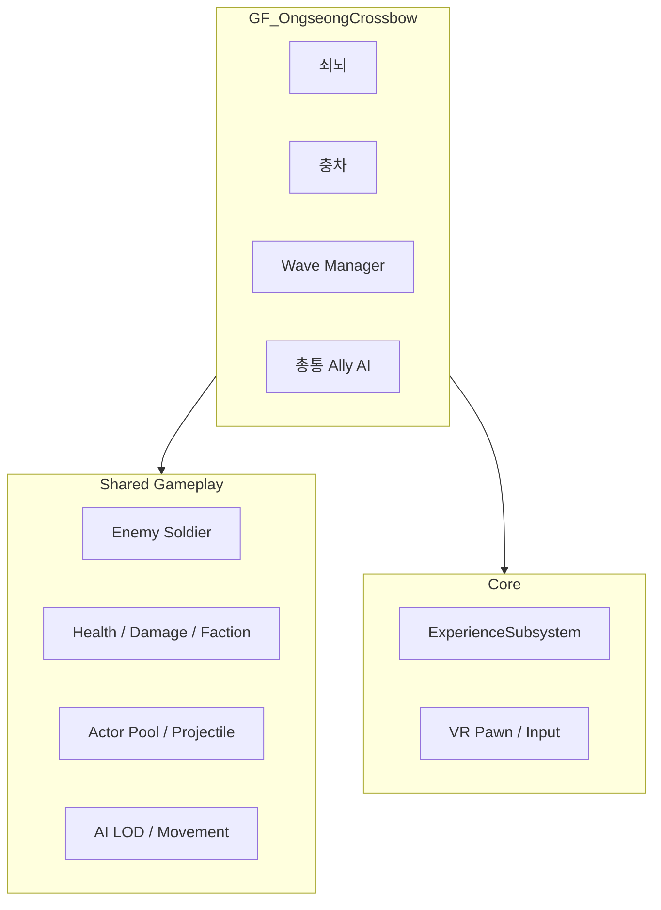
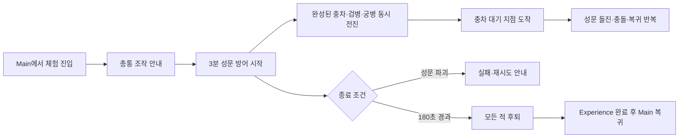

# OngseongCrossbow (옹성 · 쇠뇌) 아키텍처

**이 브랜치의 단일 기준 문서(SSOT)**: 옹성 · 쇠뇌 작업을 할 때는 이 문서만 설계 기준으로 사용한다.
공용 `docs/ARCHITECTURE.md`는 이 브랜치에서 수정하거나 참조하지 않는다.

**대상 Feature**: `GF_OngseongCrossbow`  
**대상 Level**: `LV_Ongseong`  
**플랫폼**: Android 스탠드얼론 VR (개발은 PC 가능)  
**상태**: `Partial (functional prototype)`

---

## 1. 범위와 책임 경계

| 요소 | 소유 계층 | 이 브랜치에서의 규칙 |
|---|---|---|
| 옹성 구조물, 쇠뇌, 충차 | `GF_OngseongCrossbow` | Feature 내부에 구현 |
| 적 Wave 구성·연출, 체험 완료 조건 | `GF_OngseongCrossbow` | Feature 내부에 구현 |
| 총통 Ally AI, 총통 투사체 | `GF_OngseongCrossbow` | Feature 내부에 구현 |
| Phone 확장 기능 | `GF_OngseongCrossbow/Content/Phone/` | Core Phone이 준비된 뒤 확장 Component로 제공 |
| 적 병사·아군 병사 | Shared Gameplay | Feature 내부에 복제하거나 새로 만들지 않음 |
| Health, Damage, Faction | Shared Gameplay | 구체 Actor 클래스 검사 없이 공용 계약 사용 |
| AI LOD, Pool, 투사체 기반 | Shared Gameplay | Feature가 소비만 하며 Shared가 Feature를 참조하면 안 됨 |
| VR Pawn, 입력, Experience 전환 | Core | Core 구현을 직접 변경하지 않음; 필요한 계약만 사용 |



의존 방향은 **Feature → Shared → Core**다. `Core` 또는 `Shared Gameplay`에서
`GF_OngseongCrossbow`를 참조하는 역의존은 금지한다.

---

## 2. 현재 구현 기준

| 요소 | 상태 | 확인된 구성 |
|---|---|---|
| Feature 플러그인 | `Partial` | 콘텐츠 플러그인 및 Runtime C++ 모듈 존재 |
| `LV_Ongseong` | `Implemented (base)` | `/GF_OngseongCrossbow/Maps/LV_Ongseong` |
| 옹성 성문 목표 | `Implemented (runtime + placed)` | `BP_OngseongGate`, 기존 지화문 메시, Shared Health 1000/Faction/Damage, Health·파괴 이벤트 |
| 적 Wave | `Implemented (prototype)` | 공용 Enemy Pool 기반 유한 Wave(기본 5명), 진행/전원 퇴치 이벤트 제공 |
| Enemy Pool | `Implemented` | 고정 크기 8, 자동 확장 비활성; Wave 최대 활성 적 6 |
| 총통 플레이어 조작 | `Implemented (runtime)` | 화약 → 쑤시개 3회 → 대포알 상태 머신, 양손 조준, 양손 트리거 발사, 5발 완료 |
| 총통 Ally AI | `Implemented (optional)` | 기존 자동 표적 사격을 `bEnableAutomaticFire` 옵션으로 보존; 플레이어 모드 기본값은 비활성 |
| 총통 투사체 | `Implemented (runtime)` | 곡사, 직접 명중 + 350cm 범위 피해, 교체 가능한 임시 Niagara/사운드 |
| 교관 나레이션 | `Implemented (event-driven)` | 총통 기본 컴포넌트가 공용 Pawn 나레이션 플레이어를 재사용하며 진행/상황 이벤트를 큐 재생 |
| 쇠뇌 Actor | `Planned` | 아직 없음 |
| 충차 Actor | `Implemented (runtime)` | `AOngseongRamActor`, 접근·주기 공격·피해/파괴 정지; 임시 메시 사용 |
| 체험 완료 조건 | `Implemented (runtime + placed)` | `BP_OngseongDefenseScenarioManager`, 180초 성공/성문 파괴 실패/퇴각 후 Experience 완료/재시도 |
| Android VR 검증 | `Planned` | 성능 및 실제 HMD 테스트 필요 |

공용 Enemy Blueprint의 현재 위치는 `/Game/Gameplay/Characters/BP_EnemySoldier`다.
옹성에서는 이를 부모로 하는 `/GF_OngseongCrossbow/Blueprints/BP_OngseongEnemySoldier`를 사용한다.
공통 AI·전투·풀링 계약은 Shared 부모에 유지하고, 옹성 전용 외형·애니메이션·밸런스는 Feature 자식에서 교체한다.
임시 Manny 메시/애니메이션을 사용하므로 최종 아트로 간주하지 않는다.

---

## 3. 공용 시스템 사용 계약

### 전투

- 피해 대상은 `Damage Interface` 또는 Health Component 계약을 통해 처리한다.
- 진영은 Faction Component로 판정한다. 같은 편과 Neutral에는 기본적으로 피해를 주지 않는다.
- 환경·스크립트 피해만 `bIgnoreFaction`을 명시적으로 사용할 수 있다.
- `BP_EnemySoldier` 같은 구체 클래스 검사로 피해를 분기하지 않는다.

```text
올바른 흐름: Faction 확인 → Damage Policy 확인 → Damage 적용 → Health/사망 처리
금지:          특정 Actor Class인지 확인 → Damage 적용
```

### 적과 목표

- `AEnemyCombatCharacter.SetObjectiveTarget`으로 성문/충차 등 목표 Actor를 지정한다.
- 적은 공용 Pool에서 획득하고 사망 또는 Wave 종료 시 반드시 Pool에 반환한다.
- 가까운 거리의 BT 사용은 선택 사항이다. 짧은 VR 체험에서는 스플라인 또는 단순 이동이 우선이다.

### Experience와 입력

- 체험 진입/완료는 `UExperienceSubsystem` 계약을 사용한다.
- 완료 시 `CompleteCurrentExperience` 또는 Scenario-Experience Bridge를 통해 Main 복귀를 요청한다.
- 쇠뇌 조작 중 이동을 제한해야 하면 Feature에서 전역 입력을 직접 변경하지 말고, Core 입력 관리 계약 확장 여부를 먼저 협의한다.

---

## 4. 목표 체험 흐름



### 4.1 확정된 종료 규칙

- 체험 시작과 함께 **180초 방어 타이머**를 시작한다. HUD에는 남은 방어 시간 또는 경과 시간을 명확히 표시한다.
- 적 충차의 공격으로 `AOngseongGateActor`의 Health가 0이 되면 즉시 타이머를 중단하고 **실패**로 전환한다.
- 타이머가 끝날 때 성문이 생존해 있으면 **성공**이다. 살아 있는 모든 적은 `Retreat` 상태로 전환해 지정된 퇴각 지점으로 이동한 뒤 Pool에 반환한다.
- 성공 또는 실패를 `UExperienceSubsystem`에 보고한다. 성공은 Main 복귀를 진행하고, 실패는 교육 흐름에 맞게 재시도 또는 보조 안내를 제공한다.
- 기존 총통의 5발 `OnExperienceCompleted` 이벤트는 전체 체험 완료 신호로 사용하지 않는다. 총통 조작 숙련/진행도 이벤트로만 유지하거나 이름을 분리한다.

### 4.2 적 역할과 구현 계약

| 유형 | 역할 | 필수 상태/행동 | 현재 상태 |
|---|---|---|---|
| 충차 | 성문 파괴 | 병력과 함께 전진 → 성문 앞 대기 지점 → 돌진·충돌 피해·대기 지점 복귀 반복 | 구현 |
| 검병 | 장식·압박 연출 | `BP_OngseongSwordsman`, `SwordsmanAdvance` 상태로 대열 간격을 유지하며 성문 방향으로 전진 | 구현(공용 임시 모델) |
| 궁병 | 총통 견제 | `BP_OngseongArcher`, `ArcherAdvance` 상태와 전용 Pool로 전진 | 부분 구현(발사체 전투는 후속) |

#### 충차

- 방어 시작 시 `RamSpawnPoint`에서 완성된 `AOngseongRamActor`를 즉시 생성하고 검병·궁병 Wave와 함께 전진시킨다.
- 충차는 성문 전방 `StagingDistance` 지점에 도착한 뒤 `Charging → Returning` 상태를 반복한다.
- `Charging`에서 성문 충돌 지점에 도달할 때마다 Shared Damage 계약으로 한 번 피해를 주고, 대기 지점으로 완전히 복귀한 뒤 다시 돌진한다.
- 성문 파괴, 방어 성공 또는 충차 자신의 파괴 시 왕복을 즉시 중단한다.

#### 검병

- 검병은 장식용 적이다. Spawn 순서에 따른 열/행 오프셋을 사용해 대열을 만들고 성문 쪽으로 전진한다.
- 성문 또는 총통에 피해를 주지 않으며, 전투 AI·근접 BT는 이 유형에 요구하지 않는다.

#### 궁병

- 궁병은 살아 있는 아군 총통을 우선 표적으로 삼고, 표적이 없을 때만 지정된 보조 목표를 사용한다.
- 각 발사마다 명중 확률을 판정한다. 명중 시 총통에 피해를 주고, 실패 시 총통 주변의 무작위 편차 지점으로 화살 투사체를 발사해 빗나감을 시각적으로 보인다.
- 명중률, 사거리, 발사 간격, 편차 반경, 피해량은 Blueprint/데이터에서 조절 가능한 값으로 둔다.

### 4.3 성문 Actor 계약

- `AOngseongGateActor`(또는 이를 부모로 하는 `BP_OngseongGate`)를 Feature에 만든다. 현재 레벨의 구조물 Mesh에 임시로 붙은 Health/Faction 설정을 이 Actor로 이전한다.
- 성문 Actor는 Shared `UHealthComponent`, `UCombatFactionComponent`, `IDamageReceiverInterface`를 사용한다. 피해·진영 판정을 자체 구현하거나 특정 적 클래스 검사로 분기하지 않는다.
- Health 변경과 파괴 이벤트를 외부에 제공한다. HUD 성문 경고, 나레이션 이벤트, 충차의 공격, 실패 판정 Manager가 이 이벤트를 구독한다.
- 파괴 시 충차 공격을 중지하고, Wave/궁병/검병을 정리하며 실패 UI를 표시한다. Actor 파괴 자체는 연출 정책에 따라 선택하며, Health 0 이벤트가 실패 판정의 단일 기준이다.

### 4.4 시나리오 제어 Actor

`AOngseongDefenseScenarioManager`(Blueprint 가능)를 Feature에 두어 다음을 한 곳에서 소유한다.

- 180초 타이머, 성공/실패 상태 전이, 재시도·Main 복귀 요청
- 적 유형별 Wave 구성, Spawn 위치, 최대 동시 개체 수와 퇴각 지점
- 완성 충차의 시작 Spawn과 돌진·복귀 활성화
- 성문 파괴, 타이머 만료, 적 퇴각 완료 이벤트의 중복 처리 방지
- `UExperienceSubsystem` 완료/실패 보고 및 최종 HUD/나레이션 트리거

`AOngseongEnemyWaveManager`는 공용 Pool에서 적을 획득·반납하는 저수준 역할을 유지한다. 종료 규칙과 유형별 연출은 이 시나리오 Manager가 담당한다.

### 4.5 남은 구현 순서

1. `[구현]` `AOngseongGateActor`와 `AOngseongDefenseScenarioManager`: 성문 Health/파괴, 180초 성공·실패, 재시도.
2. `[구현]` `AOngseongRamActor`: 병력과 동시 출발, 대기 지점 접근, 성문 돌진·충돌·복귀 반복. 최종 아트 연결은 남음.
3. `[부분 구현]` 검병/궁병 구성과 유형별 행동 상태를 추가했다. 궁병 화살 투사체·명중률·총통 피해는 후속 구현한다.
4. `[구현]` 성공 시 전체 적 퇴각→Pool 반환, 실패 시 전투 중지, 성공 시 `ExperienceSubsystem` 완료→Main 복귀.
5. `[완료]` BP/레벨 연결, PIE에서 `Defending` 전환 및 5명 Spawn 확인, 옹성 Automation 3종 통과. 이후 Android HMD 성능을 측정한다.

---

## 5. 구현 전 결정할 항목

1. 쇠뇌 조작: 양손 파지 조준 또는 거치형 회전 조작, 장전 방식, 탄약 유무
2. 쇠뇌 발사: 실제 투사체 사용을 기본안으로 한다. 비행 궤적이 교육·연출 요소다.
3. Wave: 수, Wave당 적 수, 스폰 위치, 경로, 난이도 곡선
4. 충차: 파괴 대상인지, 성문 도달 시 실패인지, 병사가 미는 연출이 필요한지
5. 완료·실패: 총통은 5발 발사 시 완료 이벤트를 제공. Experience/Main 복귀 연결 시점은 별도 결정
6. 이동: 성벽 위 고정 위치인지, 제한된 지점 텔레포트인지
7. 성능 예산: Android에서 동시 적 수·동시 투사체 수·드로우콜 상한

---

## 6. 이 브랜치 작업 규칙

1. 설계·작업 전 이 문서를 먼저 확인하고, 변경 사항도 이 문서에만 기록한다.
2. `docs/ARCHITECTURE.md`는 수정하지 않는다.
3. Shared/Core 변경이 꼭 필요하면 이 문서의 **공용 시스템 사용 계약**과 충돌하지 않는지 검토한 뒤, 별도 담당자와 조율한다.
4. Feature 전용 구현은 `GF_OngseongCrossbow`에 두며, 다른 체험에서 재사용될 가능성이 큰 구현은 바로 Feature에 넣지 않는다.
5. 실제 구현 상태 변경은 `docs/OngseongCrossbow/STATUS.md`에 기록할 수 있으나, 설계 기준은 항상 이 문서다.

## 7. 관련 작업 기록

- `docs/OngseongCrossbow/STATUS.md`: 현재 구현 상태 세부 기록
- `docs/OngseongCrossbow/plans/2026-08-19_CHONGTONG_COMBAT_AI.md`: 총통 전투 AI 계획
- `docs/OngseongCrossbow/2026-08-20_CONTENT_LINKING_RESULT.md`: Level 콘텐츠 연결 결과

## 8. 나레이션 이벤트 계약

- `UOngseongNarrationComponent`는 Feature 전용 이벤트-나레이션 어댑터다. Core는 이 Feature를 참조하지 않는다.
- 모든 의미 이벤트는 먼저 `OnScenarioEvent(EventName, SourceActor)`로 방송되고, `EventBindings`가 선택적으로 DataTable Row에 연결한다.
- 기본 이벤트는 `ScenarioStarted`, `WaveStarted`, `EnemyAssault`, `PowderLoaded`, `RammingCompleted`, `ReadyToAim`, `ReloadRequired`, `AlliesUnderAttack`, `GateUnderAttack`, `DefenseSucceeded`, `GateDestroyed`다.
- 총통 장전 상태, Wave 시작/적 출현/전원 퇴치, Health 피격/사망 델리게이트가 위 이벤트를 보고한다.
- 상황 이벤트는 현재 음성을 중단하지 않고 FIFO 큐로 재생한다. `bPlayOnce`인 경고는 반복 피격에도 한 번만 재생한다.
- 대사는 `/GF_OngseongCrossbow/Data/DT_OngseongNarration`의 `ON_01~ON_23`에 저장한다. 녹음된 `SoundWave`를 각 Row의 `NarrationSound`에 연결하면 공용 `NarrationSequenceComponent`가 비공간화 음성으로 재생한다.
