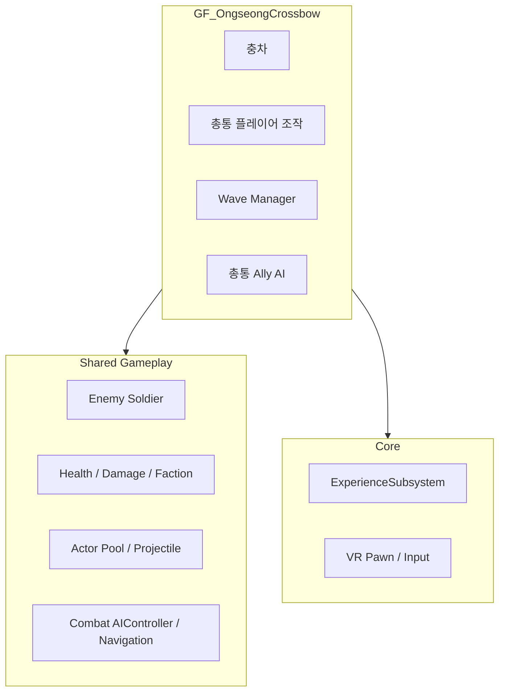
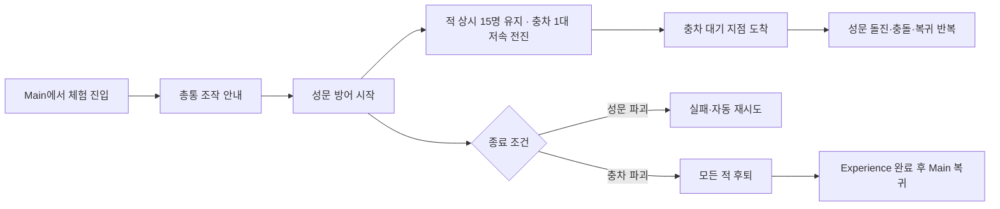

# OngseongCrossbow (옹성 · 쇠뇌) 아키텍처

**이 브랜치의 단일 기준 문서(SSOT)**: 옹성 · 쇠뇌 작업을 할 때는 이 문서만 설계 기준으로 사용한다.
공용 `docs/ARCHITECTURE.md`는 이 브랜치에서 수정하거나 참조하지 않는다.

**대상 Feature**: `GF_OngseongCrossbow`  
**대상 Level**: `LV_Ongseong`  
**플랫폼**: Android 스탠드얼론 VR (개발은 PC 가능)  
**상태**: `Implemented (final content/HMD verification pending)`
**2026-08-24 개정 반영**: 비VR 전투 테스트 GameMode, 적 상시 유지 스폰(Wave 폐지), 파티클 포함 전면 풀링, **클리어 조건을 충차 파괴로 변경**. 구현·자동화 테스트 완료. §9 참조.

> **2026-08-24 쇠뇌 폐지**: 쇠뇌는 총통으로 대체되어 **레거시**가 되었다.
> `AOngseongCrossbowActor`, `UOngseongCrossbowGripComponent`, `BP_OngseongCrossbow`와
> 레벨 배치 인스턴스를 모두 제거했다. 플러그인 이름 `GF_OngseongCrossbow`와 문서 제목은
> 참조 파손을 피하기 위해 그대로 둔다. 플레이어 무기는 **총통 하나뿐이다.**
> 물리 화살 `AOngseongBoltProjectileActor`는 **적 궁병 전용**으로 남는다.

---

## 1. 범위와 책임 경계

| 요소 | 소유 계층 | 이 브랜치에서의 규칙 |
|---|---|---|
| 옹성 구조물, 충차 | `GF_OngseongCrossbow` | Feature 내부에 구현 |
| 적 Wave 구성·연출, 체험 완료 조건 | `GF_OngseongCrossbow` | Feature 내부에 구현 |
| 총통 Ally AI, 총통 투사체 | `GF_OngseongCrossbow` | Feature 내부에 구현 |
| Phone 확장 기능 | `GF_OngseongCrossbow/Content/Phone/` | Core Phone이 준비된 뒤 확장 Component로 제공 |
| 적 병사·아군 병사 | Shared Gameplay | Feature 내부에 복제하거나 새로 만들지 않음 |
| Health, Damage, Faction | Shared Gameplay | 구체 Actor 클래스 검사 없이 공용 계약 사용 |
| AIController, Pool, 투사체 기반 | Shared Gameplay | Feature가 소비만 하며 Shared가 Feature를 참조하면 안 됨 |
| VR Pawn, 입력, Experience 전환 | Core | Core 구현을 직접 변경하지 않음; 필요한 계약만 사용 |



의존 방향은 **Feature → Shared → Core**다. `Core` 또는 `Shared Gameplay`에서
`GF_OngseongCrossbow`를 참조하는 역의존은 금지한다.

---

## 2. 현재 구현 기준

| 요소 | 상태 | 확인된 구성 |
|---|---|---|
| Feature 플러그인 | `Implemented` | 콘텐츠 플러그인 및 Runtime C++ 모듈 존재 |
| `LV_Ongseong` | `Implemented (base)` | `/GF_OngseongCrossbow/Maps/LV_Ongseong` |
| 옹성 성문 목표 | `Implemented (runtime + placed)` | `BP_OngseongGate`, 기존 지화문 메시, Shared Health 1000/Faction/Damage, Health·파괴 이벤트 |
| 적 Wave | `Implemented` | 공용 Enemy Pool 기반 반복 Wave(검병 10·궁병 10·충차 1), 보병과 충차 전멸 3초 후 180초 종료까지 재시작 |
| Enemy Pool | `Implemented` | 고정 크기 8, 자동 확장 비활성; Wave 최대 활성 적 6 |
| 총통 플레이어 조작 | `Implemented (runtime)` | 화약 → 쑤시개 3회 → 대포알 상태 머신, 양손 조준, 양손 트리거 발사, 5발 완료 |
| 총통 Ally AI | `Implemented` | `BP_AllyChongtong`은 `UChongtongAutomaticFireComponent`를 통해 5초 간격으로 자동 사격; `BP_PlayableChongtong`은 자동 사격을 끄고 VR 장전·양손 조작 사용 |
| 총통 투사체 | `Implemented (runtime)` | 곡사, 직접 명중 + 350cm 범위 피해, 교체 가능한 임시 Niagara/사운드 |
| 교관 나레이션 | `Implemented (event-driven)` | 총통 기본 컴포넌트가 공용 Pawn 나레이션 플레이어를 재사용하며 진행/상황 이벤트를 큐 재생 |
| 쇠뇌 Actor | `Removed (2026-08-24)` | 총통으로 대체된 레거시. 클래스·Blueprint·배치 인스턴스 모두 삭제 |
| 충차 Actor | `Implemented (runtime)` | `AOngseongRamActor`, 접근·주기 공격·피해/파괴 정지; 임시 메시 사용 |
| 체험 완료 조건 | `Implemented (runtime + placed)` | `BP_OngseongDefenseScenarioManager`, 180초 성공/성문 파괴 실패/퇴각 후 Experience 완료/재시도 |
| Android VR 검증 | `Excluded from this pass` | 실제 HMD 성능·조작 검증은 별도 수행 |

공용 Enemy Blueprint의 현재 위치는 `/Game/Gameplay/Characters/BP_EnemySoldier`다.
옹성에서는 이를 부모로 하는 `/GF_OngseongCrossbow/Blueprints/BP_OngseongEnemySoldier`를 사용한다.
공통 AI·전투·풀링 계약은 Shared 부모에 유지하고, 옹성 전용 외형·애니메이션·밸런스는 Feature 자식에서 교체한다.
임시 Manny 메시/애니메이션을 사용하므로 최종 아트로 간주하지 않는다.

---

## 3. 공용 시스템 사용 계약

### 전투

- 피해 대상은 `Damage Interface` 또는 Health Component 계약을 통해 처리한다.
- 진영은 Faction Component로 판정한다. 같은 편과 Neutral에는 기본적으로 피해를 주지 않는다.
- 환경·스크립트 피해만 `bIgnoreFaction`을 명시적으로 사용할 수 있다.
- `BP_EnemySoldier` 같은 구체 클래스 검사로 피해를 분기하지 않는다.

```text
올바른 흐름: Faction 확인 → Damage Policy 확인 → Damage 적용 → Health/사망 처리
금지:          특정 Actor Class인지 확인 → Damage 적용
```

### 적과 목표

- `AEnemyCombatCharacter.SetObjectiveTarget`으로 성문/충차 등 목표 Actor를 지정한다.
- 적은 공용 Pool에서 획득하고 사망 또는 Wave 종료 시 반드시 Pool에 반환한다.
- Pawn AI는 공용 `ACombatAIController`를 사용한다. 궁병만 Feature 전용 Behavior Tree를 지정하고 검병은 Wave Manager의 직접 이동 요청을 사용한다.

### Experience와 입력

- 체험 진입/완료는 `UExperienceSubsystem` 계약을 사용한다.
- 완료 시 `CompleteCurrentExperience` 또는 Scenario-Experience Bridge를 통해 Main 복귀를 요청한다.
- 이동 제한은 Core 계약으로 처리한다. `AVRPlayerPawn::SetLocomotionEnabled(bMove, bTeleport)`를 사용하며 Feature가 전역 입력을 직접 변경하지 않는다. 옹성은 성벽 위 고정이므로 둘 다 잠근다.

---

## 4. 목표 체험 흐름



### 4.1 확정된 종료 규칙 (2026-08-24 개정)

- **클리어 조건은 적 충차의 파괴다.** `AOngseongRamActor`의 Health가 0이 되면 즉시 **성공**으로 전환한다.
- 충차는 **단 한 대**이며 **파괴되면 다시 투입하지 않는다.** 병사와 달리 리스폰 대상이 아니다.
- 성공 시 살아 있는 모든 적은 `Retreat` 상태로 전환해 지정된 퇴각 지점으로 이동한 뒤 Pool에 반환하고, 적 리스폰을 중단한다.
- 충차의 공격으로 `AOngseongGateActor`의 Health가 0이 되면 **실패**로 전환하고, 안내 후 자동 재시도한다.
- 시간 제한은 기본적으로 사용하지 않는다(`bUseDefenseTimeLimit=false`). 필요할 때만 켜서 `DefenseDuration` 경과 시 실패로 처리한다.
- 적 병사는 체험이 끝날 때까지 상시 인원을 유지하며 계속 리스폰한다. 병사 처치는 클리어 조건이 아니다.
- 성공 또는 실패를 `UExperienceSubsystem`에 보고한다. 성공은 Main 복귀를 진행하고, 실패는 교육 흐름에 맞게 재시도 또는 보조 안내를 제공한다.
- 기존 총통의 5발 `OnExperienceCompleted` 이벤트는 전체 체험 완료 신호로 사용하지 않는다. 총통 조작 숙련/진행도 이벤트로만 유지하거나 이름을 분리한다.

### 4.2 적 역할과 구현 계약

| 유형 | 역할 | 필수 상태/행동 | 현재 상태 |
|---|---|---|---|
| 충차 | 성문 파괴 · **체험 클리어 목표** | 저속 전진 → 성문 앞 대기 지점 → 돌진·충돌 피해·대기 지점 복귀 반복. 파괴 시 성공, 재투입 없음 | 구현 |
| 검병 | 장식·압박 연출 | `BP_OngseongSwordsman`, `SwordsmanAdvance` 상태로 대열 간격을 유지하며 성문 방향으로 전진 | 구현(공용 임시 모델) |
| 궁병 | 총통 견제 | `BP_OngseongArcher`, `ArcherAdvance/ArcherFiring`, 물리 화살과 전용 Pool | 구현 |

#### 충차

- 방어 시작 시 `RamSpawnPoint`에서 `AOngseongRamActor` 1대를 획득(Pool)하고 병력과 함께 전진시킨다.
- 첫 접근은 **의도적으로 느리다**(`MoveSpeed` 기본 35 cm/s). 플레이어가 총통으로 조준·파괴할 시간을 확보하기 위한 값이다.
- 충차는 성문 전방 `StagingDistance` 지점에 도착한 뒤 `Charging → Returning` 상태를 반복한다.
- `Charging`에서 성문 충돌 지점에 도달할 때마다 Shared Damage 계약으로 한 번 피해를 주고, 대기 지점으로 완전히 복귀한 뒤 다시 돌진한다.
- 성문 파괴, 방어 성공 또는 충차 자신의 파괴 시 왕복을 즉시 중단한다. 파괴된 충차는 Pool에 반환되며 재투입되지 않는다.

#### 검병

- 검병은 장식용 적이다. Spawn 순서에 따른 열/행 오프셋을 사용해 대열을 만들고 성문 쪽으로 전진한다.
- 성문 또는 총통에 피해를 주지 않으며, 전투 AI·근접 BT는 이 유형에 요구하지 않는다.

#### 궁병

- 궁병은 살아 있는 아군 총통을 우선 표적으로 삼고, 표적이 없을 때만 지정된 보조 목표를 사용한다.
- 각 발사마다 명중 확률을 판정한다. 명중 시 총통에 피해를 주고, 실패 시 총통 주변의 무작위 편차 지점으로 화살 투사체를 발사해 빗나감을 시각적으로 보인다.
- 명중률, 사거리, 발사 간격, 편차 반경, 피해량은 Blueprint/데이터에서 조절 가능한 값으로 둔다.

### 4.3 성문 Actor 계약

- `AOngseongGateActor`(또는 이를 부모로 하는 `BP_OngseongGate`)를 Feature에 만든다. 현재 레벨의 구조물 Mesh에 임시로 붙은 Health/Faction 설정을 이 Actor로 이전한다.
- 성문 Actor는 Shared `UHealthComponent`, `UCombatFactionComponent`, `IDamageReceiverInterface`를 사용한다. 피해·진영 판정을 자체 구현하거나 특정 적 클래스 검사로 분기하지 않는다.
- Health 변경과 파괴 이벤트를 외부에 제공한다. HUD 성문 경고, 나레이션 이벤트, 충차의 공격, 실패 판정 Manager가 이 이벤트를 구독한다.
- 파괴 시 충차 공격을 중지하고, Wave/궁병/검병을 정리하며 실패 UI를 표시한다. Actor 파괴 자체는 연출 정책에 따라 선택하며, Health 0 이벤트가 실패 판정의 단일 기준이다.

### 4.4 시나리오 제어 Actor

`AOngseongDefenseScenarioManager`(Blueprint 가능)를 Feature에 두어 다음을 한 곳에서 소유한다.

- 180초 타이머, 성공/실패 상태 전이, 재시도·Main 복귀 요청
- 적 유형별 Wave 구성, Spawn 위치, 최대 동시 개체 수와 퇴각 지점
- 완성 충차의 시작 Spawn과 돌진·복귀 활성화
- 성문 파괴, 타이머 만료, 적 퇴각 완료 이벤트의 중복 처리 방지
- `UExperienceSubsystem` 완료/실패 보고 및 최종 HUD/나레이션 트리거

`AOngseongEnemyWaveManager`는 공용 Pool에서 적을 획득·반납하는 저수준 역할을 유지한다. 종료 규칙과 유형별 연출은 이 시나리오 Manager가 담당한다.

### 4.5 구현 완료 기록

1. `[구현]` `AOngseongGateActor`와 `AOngseongDefenseScenarioManager`: 성문 Health/파괴, 180초 성공·실패, 재시도.
2. `[구현]` `AOngseongRamActor`: 병력과 동시 출발, 대기 지점 접근, 성문 돌진·충돌·복귀 반복. 최종 아트 연결은 남음.
3. `[구현]` 검병/궁병 구성과 유형별 행동 상태, 궁병 물리 화살·총통 우선 표적·명중률/빗나감·피해를 연결하고 전멸 후 3초 간격 반복 Wave를 추가했다.
4. `[구현]` 성공 시 전체 적 퇴각→Pool 반환, 실패 시 전투 중지, 성공 시 `ExperienceSubsystem` 완료→Main 복귀.
5. `[완료]` 궁병 표적/화살 Pool을 레벨에 연결하고 자산 검증 및 옹성 Automation을 통과했다. (당시 함께 연결했던 쇠뇌/볼트 Pool은 2026-08-24 쇠뇌 폐지로 제거됐다.) Android HMD 성능 측정은 별도 범위다.

---

## 5. 확정된 구현 정책과 별도 범위

1. ~~쇠뇌는 거치형 양손 조준, 실제 물리 볼트, 12발 탄약, 발사 후 1.25초 자동 재장전을 사용한다.~~ **폐지(2026-08-24)**. 플레이어 무기는 총통뿐이며, 조작은 화약 → 쑤시개 3회 → 대포알 → 양손 조준 → 양손 트리거다.
2. 적 병사는 동시 15명(검병 8·궁병 7)을 상시 유지하며 처치 시 5초 ± 1.5초 후 같은 유형으로 리스폰한다. 궁병은 총통 우선/보조 목표 순서와 65% 명중률을 사용한다.
3. 충차는 1대이며 파괴 가능하다. 지정 성문에 반복 충돌 피해를 주고, 성문 Health 0이 실패의 단일 기준이다.
4. 성공은 충차 파괴 후 적 퇴각과 Main 복귀, 실패는 명확한 HUD 안내 후 6초 자동 재시도다.
5. 동시 적과 투사체는 고정 Pool로 제한한다. Android 실측 예산, 최종 메시·애니메이션·VFX·SFX·녹음 음성 교체는 별도 범위다.

---

## 6. 이 브랜치 작업 규칙

1. 설계·작업 전 이 문서를 먼저 확인하고, 변경 사항도 이 문서에만 기록한다.
2. `docs/ARCHITECTURE.md`는 수정하지 않는다.
3. Shared/Core 변경이 꼭 필요하면 이 문서의 **공용 시스템 사용 계약**과 충돌하지 않는지 검토한 뒤, 별도 담당자와 조율한다.
4. Feature 전용 구현은 `GF_OngseongCrossbow`에 두며, 다른 체험에서 재사용될 가능성이 큰 구현은 바로 Feature에 넣지 않는다.
5. 실제 구현 상태 변경은 `docs/OngseongCrossbow/STATUS.md`에 기록할 수 있으나, 설계 기준은 항상 이 문서다.

## 7. 관련 작업 기록

- `docs/OngseongCrossbow/STATUS.md`: 현재 구현 상태 세부 기록
- `docs/OngseongCrossbow/plans/2026-08-19_CHONGTONG_COMBAT_AI.md`: 총통 전투 AI 계획
- `docs/OngseongCrossbow/plans/2026-08-24_NON_VR_COMBAT_TEST_GAMEMODE.md`: 비VR 전투 테스트 GameMode 계획
- `docs/OngseongCrossbow/plans/2026-08-24_SUSTAINED_ENEMY_POPULATION.md`: 적 상시 유지 스폰 계획
- `docs/OngseongCrossbow/plans/2026-08-24_POOLED_INSTANCES_AND_FX.md`: 인스턴스·파티클 풀링 계획
- `docs/OngseongCrossbow/2026-08-20_CONTENT_LINKING_RESULT.md`: Level 콘텐츠 연결 결과

## 8. 나레이션 이벤트 계약

- `UOngseongNarrationComponent`는 Feature 전용 이벤트-나레이션 어댑터다. Core는 이 Feature를 참조하지 않는다.
- 모든 의미 이벤트는 먼저 `OnScenarioEvent(EventName, SourceActor)`로 방송되고, `EventBindings`가 선택적으로 DataTable Row에 연결한다.
- 기본 이벤트는 `ScenarioStarted`, `WaveStarted`, `EnemyAssault`, `PowderLoaded`, `RammingCompleted`, `ReadyToAim`, `ReloadRequired`, `AlliesUnderAttack`, `GateUnderAttack`, `DefenseSucceeded`, `GateDestroyed`다.
- 총통 장전 상태, Wave 시작/적 출현/전원 퇴치, Health 피격/사망 델리게이트가 위 이벤트를 보고한다.
- 상황 이벤트는 현재 음성을 중단하지 않고 FIFO 큐로 재생한다. `bPlayOnce`인 경고는 반복 피격에도 한 번만 재생한다.
- 대사는 `/GF_OngseongCrossbow/Data/DT_OngseongNarration`의 `ON_01~ON_23`에 저장한다. 녹음된 `SoundWave`를 각 Row의 `NarrationSound`에 연결하면 공용 `NarrationSequenceComponent`가 비공간화 음성으로 재생한다.

## 9. 계획된 설계 변경 (2026-08-24)

아래 항목은 **구현과 자동화 검증까지 완료했다.** Game/Editor 타깃 빌드 성공, Automation 24/24 통과,
비VR 테스트 레벨 헤드리스 구동 확인. 남은 것은 사람이 하는 PIE 육안 확인, Sound Concurrency 에셋,
Android 실측이다. 세부 내용은 각 계획 문서의 "진행 상태" 절과 `STATUS.md` 7절에 있다.

### 9.1 비VR 전투 테스트 GameMode

* Core에 `ADebugFreeCameraGameMode` / `ADebugFreeCameraPawn`을 추가한다. 어떤 Game Feature도 참조하지 않는다. `[구현]`
* 자유 카메라 입력은 축 매핑/IMC 없이 PlayerController 폴링으로 처리하므로 프로젝트 입력 설정에 의존하지 않는다. `[구현]`
* HMD 비활성화는 XRBase 플러그인 헤더 대신 `GEngine->StereoRenderingDevice`를 사용한다. Core가 플러그인 모듈에 의존하지 않게 하기 위함이다. `[구현]`
* 옹성은 이를 상속한 `BP_OngseongCombatTestGameMode`와 테스트 레벨 `LV_Ongseong_CombatTest`만 소유한다.
* 플레이어는 VR Pawn·게임플레이 Actor에 빙의하지 않고 자유 카메라만 조작한다.
* 본편 `LV_Ongseong`과 `Config/DefaultEngine.ini`의 전역 GameMode는 변경하지 않는다.
* 계획: `plans/2026-08-24_NON_VR_COMBAT_TEST_GAMEMODE.md`

### 9.2 적 상시 유지 스폰 (Wave 폐지)

* Wave 단위 전멸/재시작을 폐지하고, 옹성 내 적 인원을 **최대 15명(검병 8 · 궁병 7)** 으로 상시 유지한다.
* 적이 처치되면 `RespawnDelay`(기본 5초 ± 1.5초) 후 스폰 지점에서 같은 유형으로 리스폰해 다시 전진한다.
* 충차는 1대이며 **리스폰하지 않는다.** 첫 접근 속도는 35 cm/s로 느리다. `[구현]`
* **충차 파괴가 클리어 조건이다.** 성문 파괴는 실패, 시간 제한은 선택 기능(`bUseDefenseTimeLimit`, 기본 off)이다. `[구현]`
* 자동 재시도와 성공 시 전원 퇴각·Experience 완료는 그대로 유지한다.
* `AOngseongEnemyWaveManager` 클래스 이름은 유지하고 내부 동작만 교체한다. (레벨 참조 보존) `[구현]`
* 델리게이트는 `OnSpawningStarted` / `OnEnemySpawned` / `OnEnemyDefeated` / `OnPopulationChanged` / `OnAllEnemiesRetreated`다. `[구현]`
* HUD 진행 표시는 "옹성 내 적 (현재/최대)"이며, 누적 처치 수는 `GetTotalDefeatedEnemies()`로 조회한다. `[구현]`
* 계획: `plans/2026-08-24_SUSTAINED_ENEMY_POPULATION.md`

### 9.3 인스턴스·파티클 오브젝트 풀링

* 적 병사·화살·포탄·볼트는 이미 `AActorPool` 기반이다. 충차와 폭발 파티클, 전투 사운드가 남아 있다.
* Shared에 `UCombatFXLibrary`를 추가해 Niagara 원샷 이펙트를 엔진 Component Pool(`AutoRelease`)로 재생한다.
* `AOngseongRamActor`가 `IPoolableActorInterface`를 구현하고 `Ram_ActorPool`에서 획득/반환된다.
* `AActorPool`에 고갈 경고 로그와 `OnPoolExhausted`를 추가한다. 기존 시그니처는 바꾸지 않는다.
* 동시 15명 기준으로 Pool 크기를 재산정하고 `bAllowPoolExpansion=false`를 유지한다. `[LV_Ongseong_CombatTest 반영 완료 · 본편 레벨 대기]`
* `AActorPool`은 첫 획득 시점에 아직 Prewarm되지 않았다면 그 자리에서 Prewarm한다. Actor `BeginPlay` 순서가 보장되지 않기 때문이다. `[구현]`
* `RamPool`이 지정되지 않은 레벨은 기존 Spawn/Destroy 경로로 계속 동작한다. (하위 호환) `[구현]`
* 계획: `plans/2026-08-24_POOLED_INSTANCES_AND_FX.md`

### 9.4 구현 순서

실제 진행 순서는 다음과 같았다.

```text
9.3 Pool 고갈 로그 + FX 라이브러리
        ↓
9.2 적 상시 유지 스폰 + 종료 규칙 개정
        ↓
9.1 비VR 테스트 GameMode·테스트 레벨
        ↓
헤드리스 구동으로 Pool Prewarm 순서 버그 발견 → 9.3에 반영
```

Pool 고갈 경고를 먼저 넣은 덕분에 구동 첫 시도에서 Prewarm 순서 문제를 바로 특정할 수 있었다.
