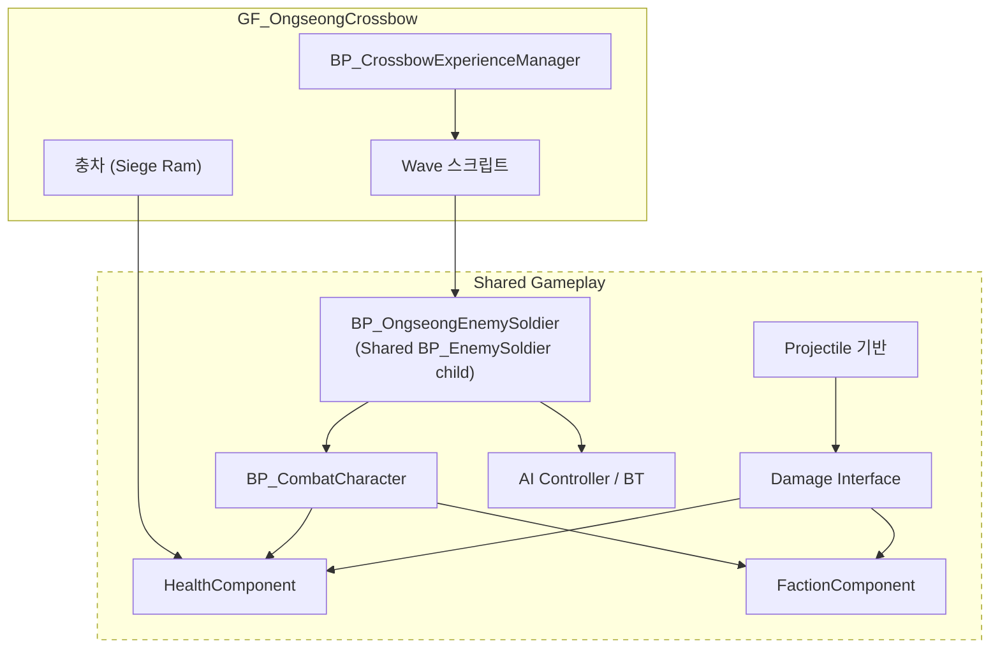

# OngseongCrossbow (옹성 · 쇠뇌) — 현재 상태

**조사 기준일**: 2026-08-22 (구현 상태) / 2026-08-24 (계획 갱신) · **코드 기준**: 현재 작업 트리
**계층**: Game Feature — `GF_OngseongCrossbow` (+ Shared Gameplay 의존)
**전체 상태**: `Status: Implemented (final content/HMD verification pending)` — 총통·검병/궁병 상시 유지 스폰·충차·성문·방어/실패 재시도 흐름과 레벨 연결이 완료되었다. **쇠뇌는 2026-08-24 폐지되어 플레이어 무기는 총통뿐이다.** 최종 메시·애니메이션·VFX/SFX·녹음 음성 교체 및 실제 HMD 검증만 별도 범위로 남아 있다.

**2026-08-24 개정**: 비VR 전투 테스트 GameMode, 적 상시 유지 스폰(Wave 폐지), 전면 오브젝트 풀링을 구현했고 **클리어 조건을 "충차 파괴"로 변경**했다. 7절 참조.

**2026-08-24 2차 개정**: 검증된 전투 배치를 **본편 `LV_Ongseong`에 적용**했고, 충차 접근을 3분(42cm/s)으로 맞췄으며, `SC_OngseongCombat` 생성·연결, 임시 파티클 교체, **플레이어 성벽 고정 확정**, **인터랙션 지점 발광(Core `UInteractionHighlightComponent`)**을 구현했다. 8절 참조.

**2026-08-25 개정**: **쇠뇌 폐지**, 여분 충차 제거, **아군 총통은 적 궁병과만 교전**,
**어택 슬롯(총통당 2명)**, 충차 회전 보정, 포탄 곡사 탄도, 포신 조준 회전, 포구 화염·포격음,
검병 Run 애니메이션 루프 수정. 9절 참조.

**2026-08-25 후속 개정**: 궁병 사거리를 **2000cm**로 조정하고, 검병 Run의 시퀀스와
컴파일된 Sequence Player가 모두 루프임을 검증했다. 아군 총통 조준은 포신 단독 3축 회전에서
**포신+화차 전체 어셈블리의 Yaw 전용 회전**으로 교체했다.

**2026-08-26 개정**: `BP_OngseongSpawnPoint`를 추가해 적 초기 스폰, 병사 리스폰, 충차 스폰을
역할별 레벨 인스턴스로 분리했다. 총통의 포구 화염·포격음과 공통 포탄의 폭발 이펙트·폭발음을
Blueprint Class Defaults 및 그래프에서 교체할 수 있게 했다.

---

## 1. 담당 범위

요청된 범위는 다음과 같으나, **일부는 이 Feature가 아니라 Shared Gameplay에 속한다.**

| 요소 | 올바른 계층 | 사유 |
|---|---|---|
| 웅성(구조물) | `GF_OngseongCrossbow` | 이 체험 전용 |
| 충차 | `GF_OngseongCrossbow` | 이 체험 전용 (`Needs Verification` — 다른 체험에서 재사용 계획이 있으면 Shared) |
| 적 Wave 구성/연출 | `GF_OngseongCrossbow` | 이 체험의 진행 스크립트 |
| 체험 완료 조건 | `GF_OngseongCrossbow` | 이 체험 전용 |
| Phone 기능 | `GF_OngseongCrossbow/Content/Phone/` | 확장 Component |
| **Enemy Soldier** | **Shared Gameplay** | 신기전·공심돈 등 다른 체험에서도 사용 가능 |
| **Damage / Health / Faction** | **Shared Gameplay** | 전투가 있는 모든 체험이 공유 |
| **AI / Spawner 기반** | **Shared Gameplay** | 재사용 대상 |
| **Projectile 기반 클래스** | **Shared Gameplay** | 총통 포탄·적 화살·신기전이 공유 |

> `CLAUDE.md` 5절: "적 병사는 여러 체험에서 사용할 수 있으므로 Shared Gameplay이다."
> 공통 적 동작은 `/Game/Gameplay/Characters/BP_EnemySoldier`에 유지한다. 옹성은 이 공용 BP를
> 상속한 Feature 전용 자식 BP만 두어 외형·애니메이션·밸런스를 독립적으로 교체한다.

---

## 2. 현재 구현 상태 (실제 조사 결과)

| 요소 | 상태 | 실제 확인 내용 |
|---|---|---|
| `GF_OngseongCrossbow` 플러그인 | `Implemented` | 콘텐츠 플러그인 및 Runtime C++ 모듈 존재 |
| `LV_Ongseong` Level | `Implemented (base)` | `/GF_OngseongCrossbow/Maps/LV_Ongseong` 존재 및 MCP 로드 확인 |
| 웅성 구조물 | `Implemented (runtime + placed)` | `BP_OngseongGate`/`AOngseongGateActor`; 기존 지화문 메시, Shared Health 1000/Faction/Damage, Health 비율·파괴 이벤트, 재시도 Reset. `LV_Ongseong`의 임시 성문 Actor 교체 완료 |
| 쇠뇌 Actor | `Removed (2026-08-24)` | 총통으로 대체된 레거시. `AOngseongCrossbowActor`·`UOngseongCrossbowGripComponent`·`BP_OngseongCrossbow`·배치 인스턴스·볼트 Pool 삭제. 물리 화살 클래스는 적 궁병용으로 유지 |
| 충차 Actor | `Implemented (runtime; placeholder art)` | `AOngseongRamActor`; 완성 상태로 병력과 동시 전진, 성문 앞 대기 지점 도착 후 돌진·충돌 피해·복귀 반복, 파괴 시 정지. 임시 Cube 표현 |
| 적 스폰 시스템 | `Implemented (상시 유지 — 7절)` | 동시 15명(검병 8·궁병 7) 상시 유지, 처치 시 5초 ± 1.5초 후 같은 유형 리스폰, `BP_OngseongSpawnPoint`로 초기/리스폰 지점 분리, 궁병 총통 우선 표적/보조 목표, 65% 명중·시각적 빗나감, 물리 화살 Pool, 사망/퇴각 시 반환 |
| 방어 Scenario Manager | `Implemented (runtime + placed)` | `BP_OngseongDefenseScenarioManager`; 충차 파괴 = 성공, 성문 파괴 = 실패, 선택적 시간 제한, 충차 Pool 획득/반환, 실패 6초 자동 재시도, 적 퇴각 후 Experience 완료 |
| 검병·궁병 | `Implemented (placeholder art)` | `BP_OngseongSwordsman`/`BP_OngseongArcher`; 공용 병사 부모, 유형별 Pool/상태, 궁병 `ArcherAdvance/ArcherFiring` 원거리 전투 구현 |
| Health / Damage / Faction (Shared) | `Implemented` | 공통 Component/Interface 기반 |
| AI (BT / Blackboard / AIController) | `Implemented (base)` | 원거리 단순 이동 + 근거리 선택형 BT Controller. Feature BT/Spawner는 없음 |
| Projectile (전투용) | `Implemented (runtime)` | `AChongtongProjectileActor`; 중력 곡사, 직접 피해, 350cm 범위 피해, Blueprint 교체 가능한 폭발 FX/사운드 |
| 총통 플레이어 조작 | `Implemented (runtime + BP)` | `BP_PlayableChongtong`; 자동 사격 비활성, 기본 메시 장전물, 화약 → 쑤시개 3회 → 대포알 상태 머신, 준비 신호, 조종 시점 고정, 양손 조준/트리거 발사, 5발 완료 이벤트 |
| 총통 Ally AI | `Implemented (runtime + BP)` | `BP_AllyChongtong`; `UChongtongAutomaticFireComponent` 조립, 우선순위 표적 자동 사격, 쿨타임 5초, 아군 조작병 자동 배치 |
| 교관 나레이션 | `Implemented (recording pending)` | 이미지 대본 23행 DataTable, 진행/상황 이벤트 큐, 총통·Wave·아군/성문 Health 델리게이트 연결. 실제 녹음 SoundWave 연결은 대기 |
| VR 공용 HUD 연결 | `Implemented (visual tuning pending)` | 총통 장전, 옹성 내 적 수(현재/최대), 충차 파괴 목표 안내, 성문 경고, 성공/실패 및 자동 재시도 안내를 `UVRHUDComponent`에 연결 |

**검증**: Game/Editor 타깃 빌드 성공, 옹성 Automation 4종 통과, 자산·레벨 연결 검증 및 Map Check 오류 0건. `Fire_Cue` 임시 사운드 경고는 최종 SFX 교체 범위에 포함한다.

---

## 3. 이 Feature가 필요로 하는 Shared Gameplay 요소

이 체험은 **프로젝트에서 Shared Gameplay 전투 시스템을 처음으로 요구하는 체험**이다.
따라서 여기서 만들어지는 전투 구조가 이후 신기전·공심돈에 그대로 재사용된다. **설계를 신중히 해야 한다.**



점선 영역(Shared)은 **`GF_OngseongCrossbow`를 절대 참조해서는 안 된다.**

---

## 4. 확정된 정책 및 별도 범위

### 4.1 플레이어 무기 — 총통 단일 (2026-08-24 확정)

**쇠뇌는 폐지됐다.** 총통이 이를 대체하므로 플레이어가 다루는 장비는 총통 하나뿐이다.
관련 클래스·Blueprint·레벨 배치·볼트 Pool을 모두 제거했고, 탄약 보충 수단이 없던 문제도
함께 사라졌다.

총통 조작은 확정·구현되어 있다. `EChongtongLoadingState`가 순서를 강제하고,
`UChongtongAimGripComponent`가 양손 그립과 트리거 동시 입력을 판정한다. Core VR Pawn은
Feature를 참조하지 않고 reflection-compatible 그랩/트리거 및 mounted camera 계약만 제공한다.

### 4.2 적 스폰 — 확정 (2026-08-24 개정, 7절 참조)

* 동시 15명(검병 8·궁병 7)을 상시 유지하고, 처치된 적은 5초 ± 1.5초 후 같은 유형으로 리스폰한다. Pool은 검병 9·궁병 8
* 궁병은 총통 우선, 보조 목표 fallback, 65% 명중률과 물리 화살 사용
* 짧은 체험에 맞춘 단순 이동/사격 상태로 Feature BT 추가 불필요

### 4.3 충차 — 확정 (2026-08-24 2차 개정)

* **파괴가 이 체험의 클리어 조건이다.** 1대만 등장하며 리스폰하지 않고, 접근 속도는 42 cm/s다
  (스폰에서 대기 지점까지 7,454cm ≈ 177초 = 2분 57초)
* 체력은 성문과 같은 1000이다. 기본값 100에서는 총통 포탄 1발(직격 40 + 범위 80)에 즉사했다
* Shared Health/Faction을 가진 파괴 가능 목표
* 성문 앞 대기 지점과 충돌 지점을 반복 왕복하며 지정 성문에만 피해
* 병사가 미는 최종 연출과 메시 교체는 별도 콘텐츠 작업

### 4.4 Damage / Faction 설계 (Shared — 영향 범위 큼)

* Faction 정의: 조선군 / 적군 / 중립. Enum vs Gameplay Tag
* 데미지 적용 규칙: 구체 클래스 검사 **금지**, Faction + Damage Policy 기반 (`CLAUDE.md` 9절)
* 데미지 전달 방식: `UGameplayStatics::ApplyDamage` vs 자체 Damage Interface
* 부위 판정(헤드샷 등) 필요 여부

### 4.5 체험 완료 조건 — 확정 (2026-08-24 개정)

* **적 충차 파괴 시 성공**, 적 퇴각 후 `ExperienceSubsystem`으로 완료 보고. 시간 제한은 선택 기능(`bUseDefenseTimeLimit`, 기본 off)
* 성문 Health 0이면 실패 HUD 표시 후 6초 자동 재시도; 수동 재시도 API도 유지

### 4.6 플레이어 이동 — 확정 (2026-08-24 2차 개정)

* **성벽 위 고정.** 스무스 이동과 텔레포트를 모두 잠근다. 스냅 턴과 그랩은 유지한다
* `AOngseongDefenseScenarioManager::bLockPlayerToBattlement`(기본 true)가 BeginPlay에서
  Core `AVRPlayerPawn::SetLocomotionEnabled(false, false)`를 호출한다. IMC 전환은 필요 없다

### 4.7 PlayerPhone 기능

* 남은 적 수 표시? 총통 장전 순서 안내? 웅성 구조 설명?

---

## 5. 완료된 선행 조건

1. Game Feature Plugin과 `ExperienceSubsystem` 연결 완료
2. Shared Health/Damage/Faction/Character/Projectile/Pool 계약 적용 완료
3. 적 상시 15명(검병 8·궁병 7), Pool 검병 9·궁병 8·화살 24·충차 2로 확정
4. Runtime 모듈 의존성과 Game/Editor 빌드 확인 완료

---

## 6. 위험 요소

* 이 체험은 **가장 의존성이 많고 가장 복잡하다.** Shared 전투 시스템 전체가 여기에 걸려 있다.
* Shared 요소를 이 Feature 안에 만들면 이후 신기전·공심돈에서 재사용이 불가능해지고, 역의존을 유발한다.
  → 착수 전에 **어떤 것이 Shared이고 어떤 것이 Feature인지 반드시 합의**한다.
* 적 다수 + VR 스탠드얼론은 성능 부담이 크다. 동시 적 수 상한을 미리 정하는 것이 좋다.

---

## 7. 진행 예정 작업 (2026-08-24 계획)

아래 항목은 **구현과 자동화 검증까지 완료했다.** 설계 기준은 `ARCHITECTURE.md` §9다.

| 항목 | 상태 | 계획 문서 | 핵심 내용 |
|---|---|---|---|
| 비VR 전투 테스트 GameMode | `Implemented (PIE 육안 확인 대기)` | `plans/2026-08-24_NON_VR_COMBAT_TEST_GAMEMODE.md` | Core `ADebugFreeCameraGameMode`/`ADebugFreeCameraPawn`, `BP_OngseongCombatTestGameMode`, `LV_Ongseong_CombatTest`, `DebugCamera_PlayerStart` |
| 적 상시 유지 스폰 | `Implemented` | `plans/2026-08-24_SUSTAINED_ENEMY_POPULATION.md` | Wave 폐지. 동시 최대 15명(검병 8·궁병 7) 유지, 처치 후 5초 ± 1.5초 리스폰 |
| 클리어 조건 변경 | `Implemented` | 위 문서 | **적 충차 파괴 = 성공.** 충차는 1대이며 리스폰하지 않고, 35 cm/s로 느리게 접근한다. 시간 제한은 선택 기능 |
| 인스턴스·파티클 풀링 | `Implemented (Concurrency 에셋·실측 대기)` | `plans/2026-08-24_POOLED_INSTANCES_AND_FX.md` | 충차 풀링, Niagara `AutoRelease` 래퍼(`UCombatFXLibrary`), Pool 고갈 경고, Pool 크기 재산정, Prewarm 순서 수정 |

### 이번 개정으로 대체된 기존 규칙

* `completed/2026-08-23_REPEATING_ENEMY_WAVES.md`의 "보병 20명 + 충차 1대 전멸 3초 후 Wave 재시작"
* 동시 활성 보병 6명 상한 (→ 동시 15명 상시 유지)
* **180초 생존 = 성공** 규칙 (→ **충차 파괴 = 성공**)
* 충차 재투입 (→ 충차는 1대, 리스폰 없음)

### 구현 과정에서 확인된 사실

* 전투 로직 자체는 VR Pawn에 의존하지 않는다. `AOngseongDefenseScenarioManager`의 HUD 참조는
  전부 null 가드가 있고, `AOngseongEnemyWaveManager`는 아군 총통을 자동 탐색한다.
  따라서 비VR 테스트는 GameMode 교체만으로 성립한다.
* 적·화살·포탄·볼트는 이미 `AActorPool`을 사용한다. 남은 미풀링 대상은 **충차와 폭발 파티클**이다.
* `AActorPool`은 고갈 시 조용히 `nullptr`을 반환하므로, Pool 크기를 늘리기 전에 경고 로그를
  먼저 넣어야 스폰 실패를 놓치지 않는다.

### 2026-08-24 구현 결과 요약

**구현 완료** — Game/Editor 타깃 빌드 성공, Automation **24/24 통과**(exit code 0), 비VR 테스트 레벨 헤드리스 구동 확인.

| 계층 | 변경 |
|---|---|
| Core | `ADebugFreeCameraPawn`, `ADebugFreeCameraGameMode` 신설 (입력은 축 매핑/IMC 없이 PlayerController 폴링, HMD 비활성화는 `GEngine->StereoRenderingDevice` 사용) |
| Shared | `UCombatFXLibrary` 신설(Niagara `AutoRelease` 재생), `AActorPool`에 고갈 로그·`OnPoolExhausted`·`GetPooledActorClass`·**첫 획득 시 지연 Prewarm** 추가, 모듈에 `Niagara` 의존성 추가 |
| Feature | 스포너를 인구 유지 방식으로 교체, Wave 반복 제거, **충차 파괴 = 클리어** 종료 규칙, 충차 리스폰 제거·접근 속도 35 cm/s, 충차 `IPoolableActorInterface` 구현, 폭발/발사 FX를 공용 라이브러리로 교체, `LogOngseong` 진행 로그 추가, Automation 2종 갱신 |
| 에셋 | `BP_OngseongCombatTestGameMode`, `LV_Ongseong_CombatTest`(GameMode Override·Pool 크기·`Ram_ActorPool`·`DebugCamera_PlayerStart`) 생성 |

**구동 확인 로그** (`LV_Ongseong_CombatTest`, `-game -nullrhi`)

```text
LogLoad: Game class is 'BP_OngseongCombatTestGameMode_C'
LogOngseong: Defense started. Ram=BP_OngseongRam_C_2, enemy slots=15, time limit=off
LogOngseong: Enemy spawning started: 8 swordsmen + 7 archers, respawn 5.0s (+/-1.5).
LogOngseong: Ongseong population filled: 15 living enemies.
LogOngseong: Ram advancing toward BP_OngseongGate_C_0 at 35 cm/s.
```

**구동 중 발견해 수정한 버그**

`Ram_ActorPool`이 Prewarm되기 전에 시나리오가 시작되어 충차 획득이 실패했다(`total 0`).
Actor `BeginPlay` 순서는 보장되지 않으므로 `AActorPool::AcquireActor`가 필요 시 그 자리에서 Prewarm하도록 고쳤다.

**추가로 구동 중 발견해 고친 문제**

| 증상 | 원인 | 수정 |
|---|---|---|
| 방어 미시작 · `Ram_ActorPool exhausted (total 0)` | Pool보다 시나리오가 먼저 `BeginPlay` | `AcquireActor` 지연 Prewarm |
| 충차가 전혀 움직이지 않음 | `SetActorLocation` Sweep이 지형·성문에 끼임 | Sweep 비활성 |
| 충차 접근이 즉시 종료 | `RamSpawnPoint` 미설정 | 테스트 레벨에 `Ram_SpawnPoint`(3000cm) 배치 |

**해결됨 — 아군 총통 교전 문제 (2026-08-24, 원인 5건)**

| 원인 | 계층 | 수정 |
|---|---|---|
| 시야 판정이 액터 원점에서 출발해 총통이 올라선 성벽에 35cm 만에 막힘 | 코드 | `AChongtongCannonActor::GetActorEyesViewPoint`를 **포신** 기준으로 오버라이드 |
| `SM_Ground`의 박스 콜리전 높이가 0 → 레벨에 걸을 수 있는 바닥이 없어 적이 전부 추락 | 에셋 | `collision_trace_flag = Use Complex As Simple` |
| 스포너·시나리오 매니저에 루트 컴포넌트가 없어 배치 불가(월드 원점 고정) | 코드 | `USceneComponent` 루트 추가 |
| 총통 4문의 포구가 성벽 바깥을 향해 포탄 43발 중 34발이 성벽에 착탄 | 레벨 | 테스트 레벨에서 yaw +180° |
| NavMesh 볼륨이 바닥 위 공간을 못 덮고 스폰이 NavMesh 밖 | 레벨 | 볼륨 재배치·재빌드, 스폰을 (150, 7800, 98)로 이동 |

검증(4분 구동): 총통 발사 0 → 15, **적 처치 0 → 15**, 적이 성문 1,827cm 앞까지 전진,
**충차 파괴로 `Defense succeeded`**. 상세는 `completed/2026-08-24_CHONGTONG_ENGAGEMENT_FIX.md`.

**남은 작업** (2026-08-24 2차 개정으로 1·3·4번 해소)

1. ~~본편 `LV_Ongseong`에 액터 배치 수정 적용~~ → **적용 완료. 8절 참조**
2. 사람이 PIE로 열어 자유 카메라 조작감과 전투 연출을 육안 확인 — **여전히 남음**
3. ~~충차 접근 시간 조정~~ → **42 cm/s, 177초로 확정**
4. ~~`SC_OngseongCombat` Sound Concurrency 생성 및 연결~~ → **완료**
5. Android 실기기 성능 실측(`stat unit`, Niagara 풀 재사용) — **여전히 남음**

> 완료 기록: `completed/2026-08-24_TEST_GAMEMODE_SUSTAINED_SPAWN_POOLING.md`,
> `completed/2026-08-24_CHONGTONG_ENGAGEMENT_FIX.md`,
> `completed/2026-08-24_MAIN_LEVEL_ROLLOUT_AND_INTERACTION_FX.md`

---

## 8. 본편 반영 · 인터랙션 발광 (2026-08-24 2차 개정)

계획 `plans/2026-08-24_MAIN_LEVEL_ROLLOUT_AND_INTERACTION_FX.md`,
완료 `completed/2026-08-24_MAIN_LEVEL_ROLLOUT_AND_INTERACTION_FX.md`.

| 항목 | 상태 | 핵심 내용 |
|---|---|---|
| 본편 레벨 배치 반영 | `Implemented` | 스포너 (150,7800,98), 충차 스폰 (150,8350,243), 총통 4문 yaw +180, NavMesh 확장·재빌드, `Ram_ActorPool` 신설, Pool 크기 9/8/24/2 |
| 충차 접근 3분 | `Implemented` | `MoveSpeed` 42 cm/s, 7,454cm → 177초 |
| Sound Concurrency | `Implemented` | `SC_OngseongCombat` 동시 8음, 5개 Blueprint에 연결 |
| 파티클 교체 | `Implemented (최종 아트 대기)` | 발사 `NS_MuzzleFlash`, 폭발 `NS_Dirt_Explosion_Medium`, 프롬프트 `NS_Pickup_Idle` |
| 플레이어 성벽 고정 | `Implemented` | Core `SetLocomotionEnabled`, Feature `bLockPlayerToBattlement` |
| 인터랙션 발광 | `Implemented (HMD 육안 확인 대기)` | Core `UInteractionHighlightComponent`, `M_InteractionHighlight` + Blue/Amber, 지금 필요한 하나만 발광 |

### 인터랙션 점검 결과

`Scripts/AuditOngseongInteractions.py`로 확인했다. 장전물 3종 모두 Core `GrabPoint`와
`LoadingPrompt`를 가지고, 총통은 `AimGrip`/`AimPrompt`를 가진다.
**미구현 인터랙션은 없다.** 점검에서 드러난 3건은 2026-08-24 후속 작업으로 모두 처리했다(9절).

---

## 9. 쇠뇌 폐지 · 교전 규칙 · 연출 수정 (2026-08-25)

완료 기록: `completed/2026-08-25_CROSSBOW_REMOVAL_AND_COMBAT_FIXES.md`

| 항목 | 상태 | 핵심 내용 |
|---|---|---|
| 쇠뇌 폐지 | `Removed` | 클래스 2종·Blueprint·배치 인스턴스 삭제. 화살 클래스는 적 궁병용으로 유지 |
| 여분 충차 제거 | `Removed` | 성 안쪽 (810,2210)의 비목표 충차. 아군 사격 17%를 낭비하고 있었다 |
| 아군 총통 표적 제한 | `Implemented` | `bEngageEnemyArchersOnly`(기본 true). 105발 전수 궁병 조준 확인 |
| 어택 슬롯 | `Implemented` | 총통당 2명, 가득 차면 다음 총통, 전부 차면 충차 호위 |
| 충차 회전 | `Implemented (육안 확인 대기)` | `MeshYawOffset = -90` |
| 포탄 탄도 | `Implemented` | 중력 0.7, 플레이어 2800cm/s, AI는 `SuggestProjectileVelocity_CustomArc` 곡사 |
| 총통 어셈블리 조준 회전 | `Implemented (육안 확인 대기)` | 블루프린트 상대 배치를 유지한 포신+화차 전체를 표적 방향으로 Yaw만 회전 |
| 포구 화염·포격음 | `Implemented (육안 확인 대기)` | `TryFire()`에 `PlayFeedback` 추가 |
| 검병 Run 애니메이션 | `Implemented / compiled node verified` | `AS_MeleeRun.loop=true`, ABP Run은 기본 루프가 켜진 Sequence Player |
| 궁병 사거리 | `Implemented` | C++ 기본값과 본편/전투 테스트 WaveManager를 2000cm로 통일 |

### 밸런스 변화 — 반드시 인지할 것

아군 총통이 충차를 쏘지 않으므로 **무인 구동은 반드시 실패한다.**
충차 파괴가 클리어 조건이니 플레이어가 충차를 쏘지 않으면 성문이 무너진다.

```text
충차 접근 179초(2분 59초) → 도착 후 4.9초마다 성문에 75 피해
성문 1000 HP ÷ 75 = 14타 → 도착 후 약 68초가 플레이어의 제한 시간
```

### 남은 확인

* `ABP_EnemyMelee` / `ABP_EnemyArcher`의 Run·Idle 스테이트에서 **Loop Animation 체크 여부**
  (에셋 `bLoop`는 고쳤지만 기존 노드에는 소급 적용되지 않는다. Python에서 AnimBP 그래프
  노드에 접근할 수 없어 자동화하지 못했다)
* 충차 방향·포신 회전·포구 화염·포물선·인터랙션 발광은 모두 **PIE/HMD 육안 확인** 대상
