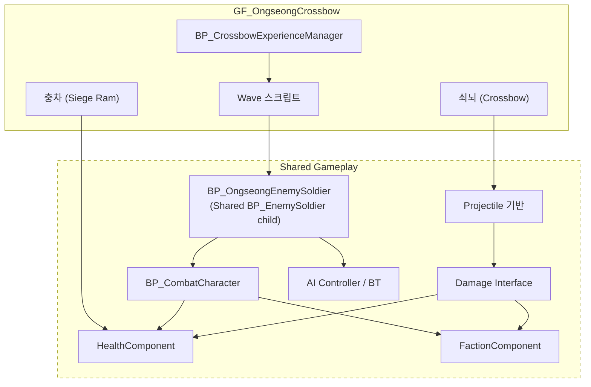

# OngseongCrossbow (옹성 · 쇠뇌) — 현재 상태

**조사 기준일**: 2026-08-22 · **코드 기준**: 현재 작업 트리
**계층**: Game Feature — `GF_OngseongCrossbow` (+ Shared Gameplay 의존)
**전체 상태**: `Status: Implemented (final content/HMD verification pending)` — 총통·쇠뇌·검병/궁병 180초 반복 Wave·충차·성문·방어/실패 재시도 흐름과 레벨 연결이 완료되었다. 최종 메시·애니메이션·VFX/SFX·녹음 음성 교체 및 실제 HMD 검증만 별도 범위로 남아 있다.

---

## 1. 담당 범위

요청된 범위는 다음과 같으나, **일부는 이 Feature가 아니라 Shared Gameplay에 속한다.**

| 요소 | 올바른 계층 | 사유 |
|---|---|---|
| 웅성(구조물) | `GF_OngseongCrossbow` | 이 체험 전용 |
| 쇠뇌 | `GF_OngseongCrossbow` | 이 체험 전용 |
| 충차 | `GF_OngseongCrossbow` | 이 체험 전용 (`Needs Verification` — 다른 체험에서 재사용 계획이 있으면 Shared) |
| 적 Wave 구성/연출 | `GF_OngseongCrossbow` | 이 체험의 진행 스크립트 |
| 체험 완료 조건 | `GF_OngseongCrossbow` | 이 체험 전용 |
| Phone 기능 | `GF_OngseongCrossbow/Content/Phone/` | 확장 Component |
| **Enemy Soldier** | **Shared Gameplay** | 신기전·공심돈 등 다른 체험에서도 사용 가능 |
| **Damage / Health / Faction** | **Shared Gameplay** | 전투가 있는 모든 체험이 공유 |
| **AI / Spawner 기반** | **Shared Gameplay** | 재사용 대상 |
| **Projectile 기반 클래스** | **Shared Gameplay** | 쇠뇌 볼트·신기전이 공유 |

> `CLAUDE.md` 5절: "적 병사는 여러 체험에서 사용할 수 있으므로 Shared Gameplay이다."
> 공통 적 동작은 `/Game/Gameplay/Characters/BP_EnemySoldier`에 유지한다. 옹성은 이 공용 BP를
> 상속한 Feature 전용 자식 BP만 두어 외형·애니메이션·밸런스를 독립적으로 교체한다.

---

## 2. 현재 구현 상태 (실제 조사 결과)

| 요소 | 상태 | 실제 확인 내용 |
|---|---|---|
| `GF_OngseongCrossbow` 플러그인 | `Implemented` | 콘텐츠 플러그인 및 Runtime C++ 모듈 존재 |
| `LV_Ongseong` Level | `Implemented (base)` | `/GF_OngseongCrossbow/Maps/LV_Ongseong` 존재 및 MCP 로드 확인 |
| 웅성 구조물 | `Implemented (runtime + placed)` | `BP_OngseongGate`/`AOngseongGateActor`; 기존 지화문 메시, Shared Health 1000/Faction/Damage, Health 비율·파괴 이벤트, 재시도 Reset. `LV_Ongseong`의 임시 성문 Actor 교체 완료 |
| 쇠뇌 Actor | `Implemented (runtime + placed)` | `AOngseongCrossbowActor`/`BP_OngseongCrossbow`; 거치형 양손 조준, 실제 볼트, 12발 탄약, 자동 재장전, 플레이어 Faction, 24발 고정 Pool |
| 충차 Actor | `Implemented (runtime; placeholder art)` | `AOngseongRamActor`; 완성 상태로 병력과 동시 전진, 성문 앞 대기 지점 도착 후 돌진·충돌 피해·복귀 반복, 파괴 시 정지. 임시 Cube 표현 |
| 적 Wave 시스템 | `Implemented` | Wave당 검병 10·궁병 10·충차 1, 보병과 충차 전멸 3초 후 같은 구성을 180초 동안 반복, 궁병 총통 우선 표적/보조 목표, 65% 명중·시각적 빗나감, 물리 화살 Pool, 사망/퇴각 시 반환 |
| 방어 Scenario Manager | `Implemented (runtime + placed)` | `BP_OngseongDefenseScenarioManager`; 180초 타이머, 충차 Spawn, 성문 파괴 실패, 명확한 MM:SS HUD, 실패 6초 자동 재시도, 적 퇴각 후 Experience 완료 |
| 검병·궁병 | `Implemented (placeholder art)` | `BP_OngseongSwordsman`/`BP_OngseongArcher`; 공용 병사 부모, 유형별 Pool/상태, 궁병 `ArcherAdvance/ArcherFiring` 원거리 전투 구현 |
| Health / Damage / Faction (Shared) | `Implemented` | 공통 Component/Interface 기반 |
| AI (BT / Blackboard / AIController) | `Implemented (base)` | 원거리 단순 이동 + 근거리 선택형 BT Controller. Feature BT/Spawner는 없음 |
| Projectile (전투용) | `Implemented (runtime)` | `AChongtongProjectileActor`; 중력 곡사, 직접 피해, 350cm 범위 피해, 임시 폭발 FX/사운드 |
| 총통 플레이어 조작 | `Implemented (runtime + BP)` | `BP_PlayableChongtong`; 자동 사격 비활성, 기본 메시 장전물, 화약 → 쑤시개 3회 → 대포알 상태 머신, 준비 신호, 조종 시점 고정, 양손 조준/트리거 발사, 5발 완료 이벤트 |
| 총통 Ally AI | `Implemented (runtime + BP)` | `BP_AllyChongtong`; `UChongtongAutomaticFireComponent` 조립, 우선순위 표적 자동 사격, 쿨타임 5초, 아군 조작병 자동 배치 |
| 교관 나레이션 | `Implemented (recording pending)` | 이미지 대본 23행 DataTable, 진행/상황 이벤트 큐, 총통·Wave·아군/성문 Health 델리게이트 연결. 실제 녹음 SoundWave 연결은 대기 |
| VR 공용 HUD 연결 | `Implemented (visual tuning pending)` | 총통/쇠뇌 장전, 적 저지 수, MM:SS 잔여 시간, 성문 경고, 성공/실패 및 자동 재시도 안내를 `UVRHUDComponent`에 연결 |

**검증**: Game/Editor 타깃 빌드 성공, 옹성 Automation 4종 통과, 자산·레벨 연결 검증 및 Map Check 오류 0건. `Fire_Cue` 임시 사운드 경고는 최종 SFX 교체 범위에 포함한다.

---

## 3. 이 Feature가 필요로 하는 Shared Gameplay 요소

이 체험은 **프로젝트에서 Shared Gameplay 전투 시스템을 처음으로 요구하는 체험**이다.
따라서 여기서 만들어지는 전투 구조가 이후 신기전·공심돈에 그대로 재사용된다. **설계를 신중히 해야 한다.**

점선 영역(Shared)은 **`GF_OngseongCrossbow`를 절대 참조해서는 안 된다.**

---

## 4. 확정된 정책 및 별도 범위

### 4.1 쇠뇌 조작 — 확정

* 거치형 양손 파지 조준
* 실제 물리 볼트와 플레이어 Faction 피해 정책
* 12발 탄약, 발사 후 1.25초 자동 재장전, 소진 시 HUD 보충 안내

총통 조작은 별도로 확정·구현되었다. `EChongtongLoadingState`가 순서를 강제하고,
`UChongtongAimGripComponent`가 양손 그립과 트리거 동시 입력을 판정한다. Core VR Pawn은
Feature를 참조하지 않고 reflection-compatible 그랩/트리거 및 mounted camera 계약만 제공한다.

### 4.2 적 Wave — 확정

* Wave당 검병 10·궁병 10·충차 1, 보병과 충차 전멸 3초 후 180초 종료까지 반복, 고정 크기 Enemy Pool 8과 최대 동시 보병 6
* 궁병은 총통 우선, 보조 목표 fallback, 65% 명중률과 물리 화살 사용
* 짧은 체험에 맞춘 단순 이동/사격 상태로 Feature BT 추가 불필요

### 4.3 충차 — 확정

* Shared Health/Faction을 가진 파괴 가능 목표
* 성문 앞 대기 지점과 충돌 지점을 반복 왕복하며 지정 성문에만 피해
* 병사가 미는 최종 연출과 메시 교체는 별도 콘텐츠 작업

### 4.4 Damage / Faction 설계 (Shared — 영향 범위 큼)

* Faction 정의: 조선군 / 적군 / 중립. Enum vs Gameplay Tag
* 데미지 적용 규칙: 구체 클래스 검사 **금지**, Faction + Damage Policy 기반 (`CLAUDE.md` 9절)
* 데미지 전달 방식: `UGameplayStatics::ApplyDamage` vs 자체 Damage Interface
* 부위 판정(헤드샷 등) 필요 여부

### 4.5 체험 완료 조건 — 확정

* 180초 동안 성문 생존 시 성공, 적 퇴각 후 `ExperienceSubsystem`으로 완료 보고
* 성문 Health 0이면 실패 HUD 표시 후 6초 자동 재시도; 수동 재시도 API도 유지

### 4.6 플레이어 이동

* 성벽 위 고정 위치 vs 정해진 몇 개 지점 이동
* 이동 제한 시 IMC 전환 필요

### 4.7 PlayerPhone 기능

* 남은 Wave 표시? 쇠뇌 사용법 안내? 웅성 구조 설명?

---

## 5. 완료된 선행 조건

1. Game Feature Plugin과 `ExperienceSubsystem` 연결 완료
2. Shared Health/Damage/Faction/Character/Projectile/Pool 계약 적용 완료
3. 기본 Wave 검병 10·궁병 10·충차 1 반복, Enemy Pool 8, 최대 동시 보병 6, 원거리 Projectile Pool 24로 확정
4. Runtime 모듈 의존성과 Game/Editor 빌드 확인 완료

---

## 6. 위험 요소

* 이 체험은 **가장 의존성이 많고 가장 복잡하다.** Shared 전투 시스템 전체가 여기에 걸려 있다.
* Shared 요소를 이 Feature 안에 만들면 이후 신기전·공심돈에서 재사용이 불가능해지고, 역의존을 유발한다.
  → 착수 전에 **어떤 것이 Shared이고 어떤 것이 Feature인지 반드시 합의**한다.
* 적 다수 + VR 스탠드얼론은 성능 부담이 크다. 동시 적 수 상한을 미리 정하는 것이 좋다.
