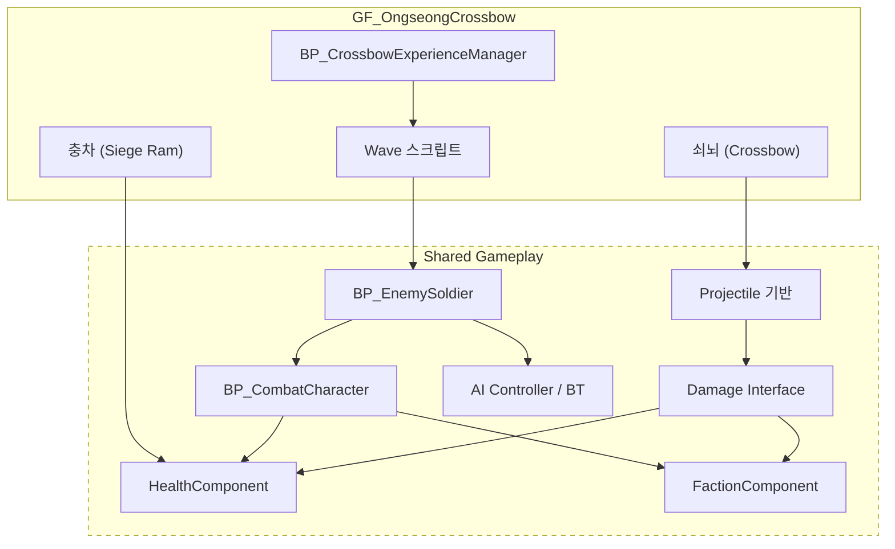

# OngseongCrossbow (웅성 · 쇠뇌) — 현재 상태

**조사 기준일**: 2026-08-11 · **조사 기준 커밋**: `57dd875`
**계층**: Game Feature — `GF_OngseongCrossbow` (+ Shared Gameplay 의존)
**전체 상태**: `Status: Planned` — **구현된 것이 없다. Game Feature Plugin 자체가 존재하지 않는다.**

---

## 1. 담당 범위

요청된 범위는 다음과 같으나, **일부는 이 Feature가 아니라 Shared Gameplay에 속한다.**

| 요소 | 올바른 계층 | 사유 |
|---|---|---|
| 웅성(구조물) | `GF_OngseongCrossbow` | 이 체험 전용 |
| 쇠뇌 | `GF_OngseongCrossbow` | 이 체험 전용 |
| 충차 | `GF_OngseongCrossbow` | 이 체험 전용 (`Needs Verification` — 다른 체험에서 재사용 계획이 있으면 Shared) |
| 적 Wave 구성/연출 | `GF_OngseongCrossbow` | 이 체험의 진행 스크립트 |
| 체험 완료 조건 | `GF_OngseongCrossbow` | 이 체험 전용 |
| Phone 기능 | `GF_OngseongCrossbow/Content/Phone/` | 확장 Component |
| **Enemy Soldier** | **Shared Gameplay** | 신기전·공심돈 등 다른 체험에서도 사용 가능 |
| **Damage / Health / Faction** | **Shared Gameplay** | 전투가 있는 모든 체험이 공유 |
| **AI / Spawner 기반** | **Shared Gameplay** | 재사용 대상 |
| **Projectile 기반 클래스** | **Shared Gameplay** | 쇠뇌 볼트·신기전이 공유 |

> `CLAUDE.md` 5절: "적 병사는 여러 체험에서 사용할 수 있으므로 Shared Gameplay이다."
> **적 병사를 `GF_OngseongCrossbow` 안에 만들지 않는다.**

---

## 2. 현재 구현 상태 (실제 조사 결과)

| 요소 | 상태 | 실제 확인 내용 |
|---|---|---|
| `GF_OngseongCrossbow` 플러그인 | `Planned` | `Plugins/` 디렉토리 자체가 없다 |
| `L_OngseongCrossbow` Level | `Planned` | 존재하지 않음 |
| 웅성 구조물 | `Planned` | 없음 |
| 쇠뇌 Actor | `Planned` | 없음 |
| 충차 Actor | `Planned` | 없음 |
| 적 Wave 시스템 | `Planned` | 없음 |
| `BP_CrossbowExperienceManager` | `Planned` | 없음 |
| Enemy Soldier (Shared) | `Planned` | 없음. 전투 캐릭터 에셋 전무 |
| Health / Damage / Faction (Shared) | `Planned` | 없음 |
| AI (BT / Blackboard / AIController) | `Planned` | 없음. `AIModule`이 `Build.cs`에 포함되지도 않음 |
| Projectile (전투용) | `Planned` | 템플릿 `BP_Projectile`은 **데미지 로직이 없는** 시각 샘플 |

**활용 가능한 기존 자산**: 템플릿 `BP_Pistol` + `BP_Projectile`의 "잡고 → 발사" 흐름은 쇠뇌 조작 프로토타입의 참고 구조로 쓸 수 있다. 다만 데미지·명중 판정은 전부 신규 구현이다.

---

## 3. 이 Feature가 필요로 하는 Shared Gameplay 요소

이 체험은 **프로젝트에서 Shared Gameplay 전투 시스템을 처음으로 요구하는 체험**이다.
따라서 여기서 만들어지는 전투 구조가 이후 신기전·공심돈에 그대로 재사용된다. **설계를 신중히 해야 한다.**

점선 영역(Shared)은 **`GF_OngseongCrossbow`를 절대 참조해서는 안 된다.**

---

## 4. 설계 결정 필요 사항 (TODO)

### 4.1 쇠뇌 조작

* 조준 방식: 양손 파지 후 조준 vs 거치형 회전 조작
* 장전(재장전) 연출 포함 여부 및 조작 방법
* 발사 방식: 히트스캔 vs 실제 투사체
  → 교육 콘텐츠이고 비행 궤적이 볼거리이므로 **투사체 권장**
* 탄약 개념 유무

### 4.2 적 Wave

* Wave 수, Wave당 적 수, 난이도 곡선
* 적 이동 경로: NavMesh 기반 AI vs 스플라인 고정 경로
  → 10분 콘텐츠 중 짧은 체험이면 **스플라인 고정 경로가 안정적이고 저비용**
* 스폰 위치 및 방식

### 4.3 충차

* 충차가 파괴 대상인지, 시간 제한 요소인지 (성문에 도달하면 실패?)
* HealthComponent를 가지는지 (가진다면 Shared 구조 사용)
* 병사가 충차를 미는 연출 여부

### 4.4 Damage / Faction 설계 (Shared — 영향 범위 큼)

* Faction 정의: 조선군 / 적군 / 중립. Enum vs Gameplay Tag
* 데미지 적용 규칙: 구체 클래스 검사 **금지**, Faction + Damage Policy 기반 (`CLAUDE.md` 9절)
* 데미지 전달 방식: `UGameplayStatics::ApplyDamage` vs 자체 Damage Interface
* 부위 판정(헤드샷 등) 필요 여부

### 4.5 체험 완료 조건

* 예: N Wave 방어 성공 / 충차 파괴 / 제한 시간 생존
* 실패 조건 존재 여부 (교육 콘텐츠이므로 **실패 없이 재시도** 권장, 확인 필요)
* 완료 보고 방식 → **Main의 `ExperienceSubsystem` 인터페이스 확정 대기**

### 4.6 플레이어 이동

* 성벽 위 고정 위치 vs 정해진 몇 개 지점 이동
* 이동 제한 시 IMC 전환 필요

### 4.7 PlayerPhone 기능

* 남은 Wave 표시? 쇠뇌 사용법 안내? 웅성 구조 설명?

---

## 5. 선행 조건

1. Game Feature Plugin 사용 여부 확정
2. `ExperienceSubsystem` 인터페이스 확정 (Main)
3. **Shared Gameplay 전투 구조 설계 확정** (Health / Damage / Faction / Character 계층)
4. AI 방식 결정 (NavMesh + BT vs 스플라인)
5. `Build.cs`에 필요한 모듈 추가 (`AIModule`, `GameplayTasks`, `NavigationSystem`, `GameplayTags` 등)

---

## 6. 위험 요소

* 이 체험은 **가장 의존성이 많고 가장 복잡하다.** Shared 전투 시스템 전체가 여기에 걸려 있다.
* Shared 요소를 이 Feature 안에 만들면 이후 신기전·공심돈에서 재사용이 불가능해지고, 역의존을 유발한다.
  → 착수 전에 **어떤 것이 Shared이고 어떤 것이 Feature인지 반드시 합의**한다.
* 적 다수 + VR 스탠드얼론은 성능 부담이 크다. 동시 적 수 상한을 미리 정하는 것이 좋다.
